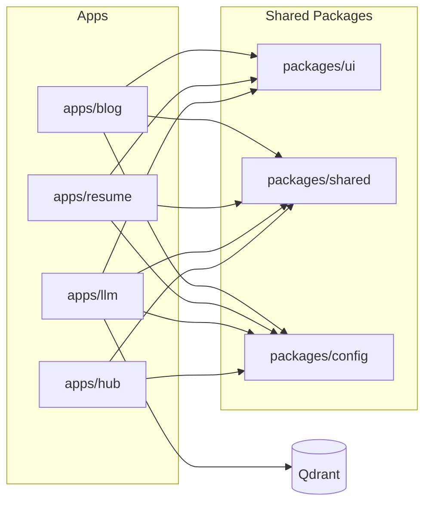
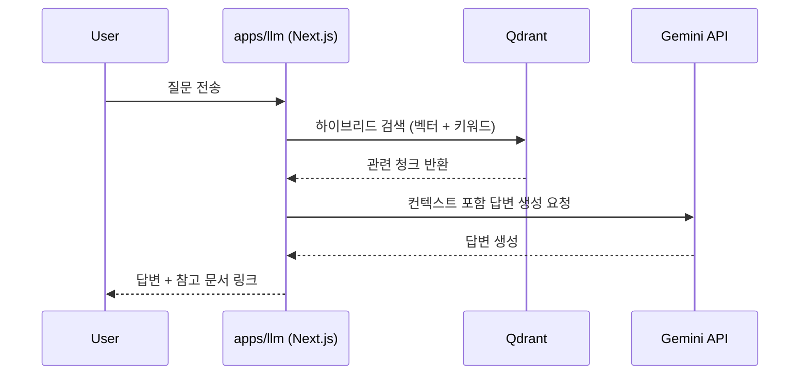

# itjustbong Platform Monorepo

개인 서비스를 하나의 Turborepo로 운영하는 모노레포입니다.
현재 `blog`, `resume`, `llm`, `hub` 4개 앱을 포함하며, 공통 패키지(`packages/ui`, `packages/shared`, `packages/config`)를 재사용합니다.

## 서비스 개요

| 서비스 | 경로          | 설명                                                     | 기본 포트 | 서비스 주소                    |
| ------ | ------------- | -------------------------------------------------------- | --------- | ------------------------------ |
| blog   | `apps/blog`   | MDX 기반 기술 블로그, 관리자/에디터, OG 이미지 생성      | `3000`    | https://log.itjustbong.com/    |
| resume | `apps/resume` | 웹 이력서 및 PDF 생성/다운로드                           | `3001`    | https://resume.itjustbong.com/ |
| llm    | `apps/llm`    | RAG 기반 Q&A 서비스 (Gemini + Qdrant)                    | `3002`    | https://chat.itjustbong.com/   |
| hub    | `apps/hub`    | 3D 카드 캐러셀 기반 링크 허브 (Vite + Vanilla TS + GSAP) | `3003`    | -                              |

## Hub 페이지 변경 반영

- 링크/소셜 데이터 소스는 `packages/shared/src/site-links.ts`에서 관리합니다.
- `apps/hub`는 카드 캐러셀, iframe 미리보기, 하단 정보 패널, 서비스 리스트 메뉴를 제공합니다.
- 모바일 카드 높이는 `apps/hub/src/main.ts`의 `getConfig()` (`w < 640` 분기)에서 계산합니다.

## 모노레포 구조

```text
.
├─ apps/
│  ├─ blog/
│  ├─ resume/
│  ├─ llm/
│  └─ hub/
├─ packages/
│  ├─ ui/        # 공용 UI 컴포넌트
│  ├─ shared/    # 공용 데이터/유틸
│  └─ config/    # ESLint/TS/Tailwind/PostCSS 공용 설정
├─ docker-compose.yml
├─ pnpm-workspace.yaml
└─ turbo.json
```

## 아키텍처 개요



## LLM 요청 흐름



## 로컬 실행

### 요구사항

- Node.js `20+`
- pnpm `9+`

### 설치

```bash
pnpm install
```

### 개발 서버

```bash
# 전체 앱 동시 실행
pnpm dev

# 개별 실행
pnpm dev:blog
pnpm dev:resume
pnpm dev:llm
pnpm dev:hub
```

### 빌드/검사

```bash
# 전체 빌드
pnpm build

# 앱별 빌드
pnpm build:blog
pnpm build:resume
pnpm build:llm
pnpm build:hub

# 정적 검사
pnpm lint
pnpm format:check
```

## Docker 실행

루트 `docker-compose.yml`에서 다음 서비스를 실행합니다.

- `blog-app` (`3000`)
- `resume-app` (`3001`)
- `llm-app` (`3002`)
- `hub-app` (`3003`)
- `qdrant` (`6333`, `6334`)

```bash
docker compose up --build
```

## 환경 변수

필수 환경 변수는 주로 `apps/llm/.env`에 있습니다.

```bash
cp apps/llm/.env.example apps/llm/.env
```

주요 항목:

- `GEMINI_API_KEY`
- `QDRANT_URL`
- `ADMIN_USERNAME`
- `ADMIN_PASSWORD`

## 공용 데이터 관리

- `packages/shared/src/site-links.ts`: hub 및 기타 서비스에서 사용하는 링크 원본 데이터
- `packages/shared/src/site-data.ts`: 아이콘 매핑 등을 포함한 확장 데이터

## 라이선스

MIT (`LICENSE`)
