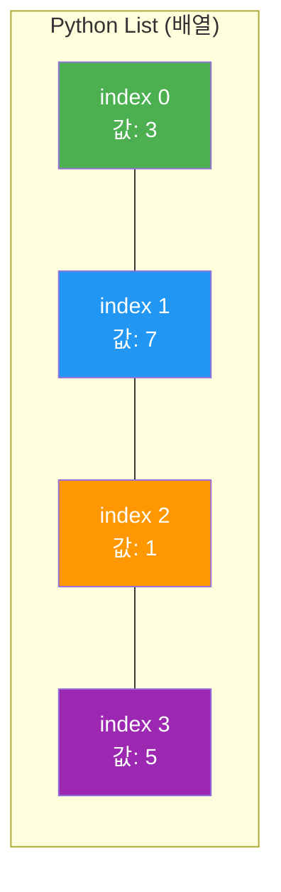
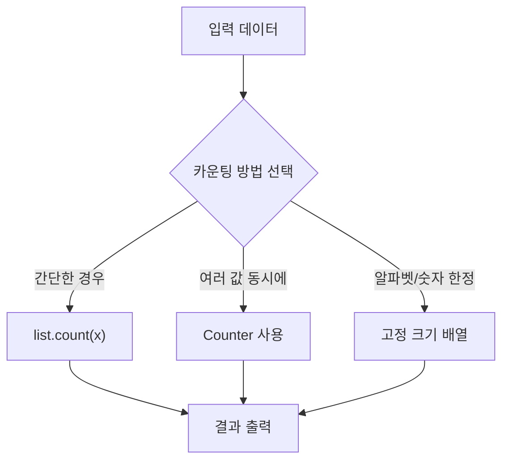
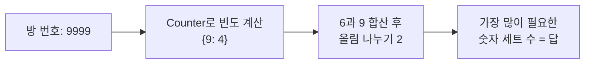
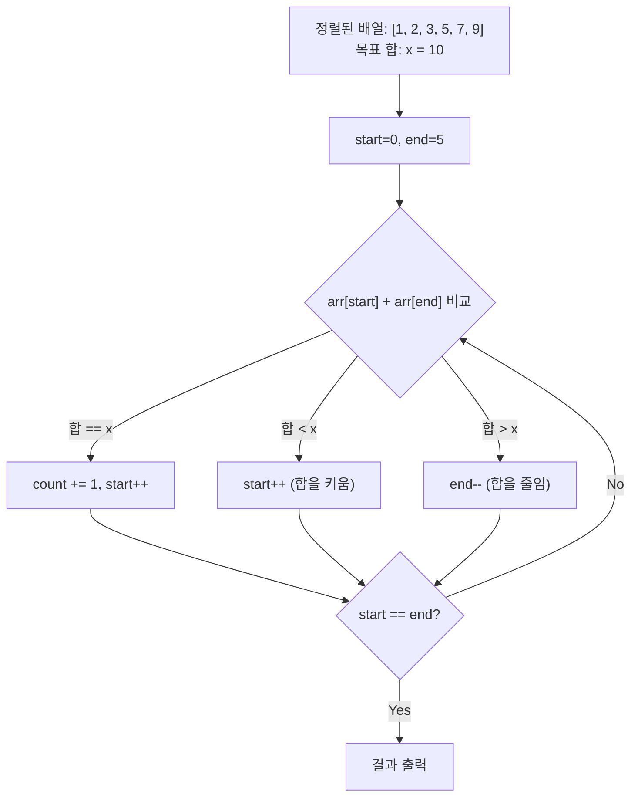
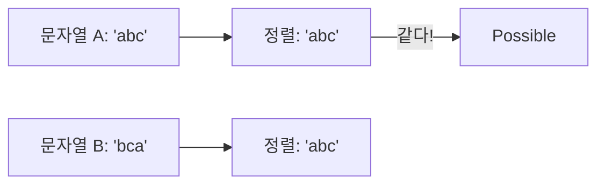

# 배열 (Array) - 코딩테스트 핵심 정리

## 개념 요약

배열은 같은 타입의 데이터를 연속된 메모리 공간에 저장하는 자료구조입니다.
Python에서는 `list`가 배열 역할을 하며, 코딩테스트에서 가장 기본이 되는 자료구조입니다.



## 시간복잡도

| 연산                     | 시간복잡도 | 설명                   |
| ------------------------ | ---------- | ---------------------- |
| 인덱스 접근 `arr[i]`     | O(1)       | 바로 접근 가능         |
| 끝에 추가 `append()`     | O(1)       | 평균                   |
| 중간 삽입 `insert(i, x)` | O(n)       | 뒤 요소 전부 이동      |
| 삭제 `pop()`             | O(1)       | 끝에서 제거            |
| 삭제 `pop(i)`            | O(n)       | 중간 제거 시 이동 발생 |
| 검색 `in`                | O(n)       | 순차 탐색              |
| 정렬 `sort()`            | O(n log n) | Timsort                |

---

## 문제 풀이 패턴

### 패턴 1: 카운팅 (빈도수 세기)

가장 자주 나오는 패턴입니다. 특정 값이 몇 번 등장하는지 세는 문제입니다.



#### 10807번 - 개수 세기 (Counter 활용)

배열에서 특정 값 v의 개수를 세는 문제입니다.

```python
from collections import Counter

n = int(input())
arr = list(map(int, input().split()))
x = int(input())

cnt = Counter(arr)
print(cnt[x])

# 또는 간단하게
# print(arr.count(x))
```

> 핵심: `Counter`는 딕셔너리처럼 동작하며, 존재하지 않는 키를 조회하면 `0`을 반환합니다.

#### 2577번 - 숫자의 개수

세 수의 곱에서 각 숫자(0~9)가 몇 번 나오는지 세는 문제입니다.

```python
a = int(input())
b = int(input())
c = int(input())

r = str(a * b * c)          # 곱한 결과를 문자열로 변환
for n in map(str, range(10)):  # "0" ~ "9"
    print(r.count(n))        # 각 숫자의 등장 횟수
```

> 핵심: 숫자를 `str()`로 변환하면 각 자릿수를 문자 단위로 쉽게 순회할 수 있습니다.

#### 10808번 - 알파벳 개수

문자열에서 각 알파벳(a~z)의 등장 횟수를 세는 문제입니다.

```python
import sys
input_list = sys.stdin.readline()

for c in map(chr, range(97, 123)):   # 'a'(97) ~ 'z'(122)
    print(input_list.count(c), end=" ")
```

> 핵심: `chr()`와 `range()`를 조합하면 알파벳 순회를 깔끔하게 할 수 있습니다.
> `ord('a')` = 97, `ord('z')` = 122

#### 10808번 - 알파벳 개수 (고정 크기 배열 풀이)

Counter 대신 크기 26 배열로 직접 카운팅하는 방법도 있습니다.

```python
# 방법 1: Counter 활용
from collections import Counter
text = "baekjoon"
counter = Counter(text)
print(" ".join(str(counter[c]) for c in "abcdefghijklmnopqrstuvwxyz"))

# 방법 2: 고정 크기 배열 (더 빠름)
n = input()
lst = [0] * 26
for i in n:
    lst[ord(i) - 97] += 1    # ord('a') = 97
for i in lst:
    print(i, end=" ")
```

> 꿀팁: 알파벳/숫자처럼 범위가 정해진 경우, 고정 크기 배열이 Counter보다 빠르고 메모리 효율적입니다.
> `ord(문자) - ord('a')`로 알파벳을 0~25 인덱스로 변환하는 패턴은 외워두세요.

---

### 패턴 2: 카운팅 + 응용 (Counter 심화)

#### 1475번 - 방 번호

방 번호에 필요한 숫자 세트 수를 구하는 문제입니다. 6과 9는 뒤집어서 사용 가능합니다.



```python
from collections import Counter
import math

room = input()
dic = Counter(room)

# 6과 9는 서로 대체 가능 → 합쳐서 반올림
dic["6"] = math.ceil((dic["6"] + dic["9"]) / 2)
dic["9"] = dic["6"]

print(dic[max(dic, key=dic.get)])
```

> 핵심: `math.ceil()`로 올림 처리하여 6+9 합산 개수를 2로 나눕니다.

---

### 패턴 3: 투 포인터 (Two Pointer)

정렬된 배열에서 두 개의 포인터를 이용해 조건을 만족하는 쌍을 찾는 기법입니다.

#### 3273번 - 두 수의 합

배열에서 합이 x가 되는 쌍의 개수를 구하는 문제입니다.



```python
n = int(input())
arr = list(map(int, input().split()))
x = int(input())

sorted_arr = sorted(arr)

start, end = 0, n - 1
count = 0

while start != end:
    v = sorted_arr[start] + sorted_arr[end]
    if v == x:
        count += 1
    if v <= x:
        start += 1
    if v > x:
        end -= 1

print(count)
```

> 핵심: 정렬 후 양쪽 끝에서 좁혀오면 O(n)에 해결됩니다. 브루트포스 O(n²) 대비 큰 성능 차이.

---

### 패턴 4: 문자열 비교 (정렬 활용)

#### 11328번 - Strfry

두 문자열이 같은 문자로 구성되어 있는지 판별하는 문제입니다. (애너그램 판별)



```python
num = int(input())
for _ in range(num):
    a, b = input().split()
    if sorted(a) == sorted(b):
        print("Possible")
    else:
        print("Impossible")
```

> 핵심: 두 문자열을 정렬하면 구성 문자가 같은지 O(n log n)에 판별 가능합니다.
> Counter로도 가능: `Counter(a) == Counter(b)`

#### 1919번 - 애너그램 만들기

두 문자열에서 최소 몇 글자를 지워야 애너그램이 되는지 구하는 문제입니다.

```python
from collections import Counter

l1_dict = Counter(input())
l2_dict = Counter(input())

count = 0
for i in l1_dict:
    if i not in l2_dict:
        count += l1_dict[i]
    else:
        count += abs(l1_dict[i] - l2_dict[i])

for i in l2_dict:
    if i not in l1_dict:
        count += l2_dict[i]

print(count)
```

> 핵심: 각 문자의 빈도 차이의 합이 지워야 할 글자 수입니다.

---

### 패턴 5: 그룹별 카운팅

#### 13300번 - 방 배정

학년과 성별로 그룹을 나누고, 각 그룹의 인원을 방 정원으로 나누어 올림하는 문제입니다.

```python
import collections
import math

num, x = input().split()
input_arr = [list(map(int, input().split())) for _ in range(int(num))]

# 성별 + 학년을 하나의 키로 합침
arr = [str(i[0]) + str(i[1]) for i in input_arr]
dic = collections.Counter(arr)

ans = 0
for i in dic.values():
    ans += math.ceil(i / int(x))

print(ans)
```

> 핵심: 여러 조건을 하나의 키로 합쳐서 Counter로 그룹핑하는 테크닉입니다.
> `str(성별) + str(학년)` → "11", "12", "21" 등으로 유니크한 키 생성.

---

## 주요 라이브러리 & 함수 정리

### collections.Counter

```python
from collections import Counter

arr = [1, 2, 2, 3, 3, 3]
cnt = Counter(arr)          # Counter({3: 3, 2: 2, 1: 1})

cnt[3]                      # 3 (해당 값의 개수)
cnt[999]                    # 0 (없는 키는 0 반환)
cnt.most_common(2)          # [(3, 3), (2, 2)] 상위 2개
cnt1 + cnt2                 # Counter끼리 덧셈 가능
cnt1 - cnt2                 # Counter끼리 뺄셈 가능
```

### 리스트 기본 메서드

```python
arr = [3, 1, 4, 1, 5]

arr.count(1)                # 2 (값 1의 개수)
arr.sort()                  # 오름차순 정렬 (원본 변경)
sorted(arr)                 # 정렬된 새 리스트 반환 (원본 유지)
arr.index(4)                # 2 (값 4의 인덱스)
arr.append(9)               # 끝에 추가
arr.pop()                   # 끝에서 제거 후 반환
```

### 유용한 내장 함수

```python
# 문자 ↔ 아스키코드 변환
chr(97)                     # 'a'
ord('a')                    # 97

# 올림/내림
import math
math.ceil(3.2)              # 4 (올림)
math.floor(3.8)             # 3 (내림)

# 빠른 입력 (대량 데이터 시 필수)
import sys
input = sys.stdin.readline
```

### sys.stdin.readline vs input()

```python
# input()은 느림 → 데이터가 많으면 시간초과 위험
# sys.stdin.readline()은 빠름 → 코테에서 기본으로 사용 권장

import sys
read = sys.stdin.readline
n = int(read())
arr = list(map(int, read().split()))
```

> 입력이 10만 건 이상이면 반드시 `sys.stdin.readline`을 사용하세요.

---

## 실전 꿀팁 & 자주 나오는 패턴

### 꿀팁 1: 슬라이싱은 생각보다 강력하다

Python 슬라이싱은 코테에서 엄청나게 자주 쓰입니다. 외워두면 시간을 많이 아낍니다.

```python
arr = [1, 2, 3, 4, 5]

arr[::-1]               # [5, 4, 3, 2, 1] 뒤집기
arr[::2]                # [1, 3, 5] 짝수 인덱스만
arr[1::2]               # [2, 4] 홀수 인덱스만
arr[-3:]                # [3, 4, 5] 뒤에서 3개

# 문자열도 동일하게 동작
"hello"[::-1]           # "olleh"
"12345"[::2]            # "135"
```

### 꿀팁 2: enumerate를 쓰면 인덱스 추적이 깔끔해진다

```python
# 안 좋은 패턴
for i in range(len(arr)):
    print(i, arr[i])

# 좋은 패턴
for i, v in enumerate(arr):
    print(i, v)

# 시작 인덱스 지정도 가능
for i, v in enumerate(arr, 1):   # 1부터 시작
    print(i, v)
```

### 꿀팁 3: zip으로 두 배열 동시 순회

```python
names = ["A", "B", "C"]
scores = [90, 80, 70]

for name, score in zip(names, scores):
    print(f"{name}: {score}")

# 두 리스트를 딕셔너리로 변환
d = dict(zip(names, scores))   # {'A': 90, 'B': 80, 'C': 70}
```

### 꿀팁 4: 리스트 컴프리헨션은 for문보다 빠르다

```python
# 일반 for문
result = []
for x in range(10):
    if x % 2 == 0:
        result.append(x ** 2)

# 리스트 컴프리헨션 (더 빠르고 간결)
result = [x ** 2 for x in range(10) if x % 2 == 0]

# 2차원 배열 초기화 (코테 필수)
# 주의: [[0]*m]*n 은 얕은 복사 문제 발생!
board = [[0] * m for _ in range(n)]   # 올바른 방법
```

### 꿀팁 5: defaultdict로 키 존재 여부 체크 생략

```python
from collections import defaultdict

# 일반 dict → KeyError 방지를 위해 매번 체크 필요
d = {}
for x in arr:
    if x not in d:
        d[x] = 0
    d[x] += 1

# defaultdict → 자동으로 기본값 생성
d = defaultdict(int)       # 기본값 0
for x in arr:
    d[x] += 1

d = defaultdict(list)      # 기본값 빈 리스트
d["key"].append(1)         # KeyError 없이 바로 append
```

### 꿀팁 6: 정렬의 key 파라미터 활용

코테에서 정렬 조건이 복잡한 문제가 정말 많이 나옵니다.

```python
# 다중 조건 정렬
students = [("Kim", 3, 90), ("Lee", 1, 80), ("Park", 3, 70)]

# 학년 오름차순 → 같으면 점수 내림차순
students.sort(key=lambda x: (x[1], -x[2]))

# 문자열 길이순 → 같으면 사전순
words = ["abc", "a", "ab", "ba"]
words.sort(key=lambda x: (len(x), x))
# ['a', 'ab', 'ba', 'abc']
```

> 핵심: `key`에 튜플을 반환하면 앞 조건부터 우선 비교합니다.
> 내림차순이 필요하면 숫자는 `-`를 붙이고, 문자열은 `reverse=True`를 별도로 처리합니다.

### 꿀팁 7: 2차원 배열 자주 쓰는 패턴

```python
# 상하좌우 이동 (BFS/DFS에서도 필수)
dx = [-1, 1, 0, 0]
dy = [0, 0, -1, 1]

for d in range(4):
    nx, ny = x + dx[d], y + dy[d]
    if 0 <= nx < n and 0 <= ny < m:   # 범위 체크
        # 처리

# 2차원 배열 입력 받기
n, m = map(int, input().split())
board = [list(map(int, input().split())) for _ in range(n)]

# 2차원 배열 90도 회전 (시계 방향)
rotated = list(zip(*board[::-1]))
```

### 꿀팁 8: set을 활용한 O(1) 검색

배열에서 `in` 연산은 O(n)이지만, set에서는 O(1)입니다.
검색이 빈번한 경우 set으로 변환하면 시간초과를 피할 수 있습니다.

```python
arr = [1, 2, 3, 4, 5]

# 느림: O(n)
if 3 in arr: pass

# 빠름: O(1)
arr_set = set(arr)
if 3 in arr_set: pass

# 실전 예: 두 배열의 공통 원소 찾기
a = {1, 2, 3, 4}
b = {3, 4, 5, 6}
a & b                   # {3, 4} 교집합
a | b                   # {1, 2, 3, 4, 5, 6} 합집합
a - b                   # {1, 2} 차집합
```

### 꿀팁 9: map과 언패킹 입력 패턴

코테에서 입력 받는 패턴은 거의 정해져 있습니다. 외워두세요.

```python
import sys
read = sys.stdin.readline

# 한 줄에 정수 하나
n = int(read())

# 한 줄에 정수 여러 개
a, b, c = map(int, read().split())

# 한 줄에 정수 배열
arr = list(map(int, read().split()))

# 여러 줄에 걸친 입력
data = [int(read()) for _ in range(n)]

# 출력도 빠르게
print('\n'.join(map(str, result)))   # 리스트를 줄바꿈으로 출력
print(*arr)                          # 리스트를 공백으로 출력
```

### 꿀팁 10: 자주 실수하는 함정들

```python
# 1. 얕은 복사 함정
a = [[0] * 3] * 3
a[0][0] = 1
# a = [[1,0,0], [1,0,0], [1,0,0]]  ← 전부 바뀜!
# 해결: a = [[0]*3 for _ in range(3)]

# 2. sort()와 sorted()의 차이
arr.sort()      # 원본을 변경, 반환값 None
new = sorted(arr)  # 원본 유지, 새 리스트 반환

# 3. 정수 나눗셈
7 / 2           # 3.5 (실수)
7 // 2          # 3 (정수, 내림)
-7 // 2         # -4 (음수는 주의! 내림이라 -4)
int(-7 / 2)     # -3 (0에 가까운 쪽으로 절삭)

# 4. 문자열은 불변(immutable)
s = "hello"
# s[0] = "H"   ← 에러!
s = "H" + s[1:]  # 새 문자열 생성 필요
# 문자열 조작이 많으면 list로 변환 후 작업
```
