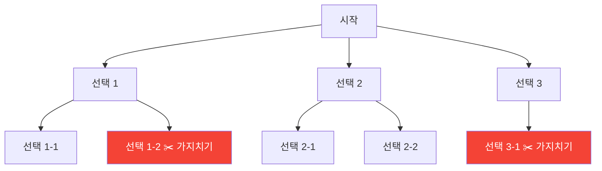
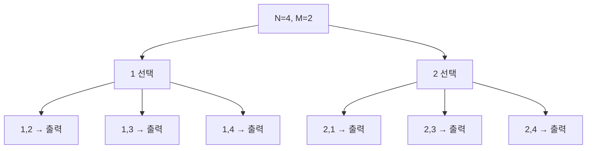
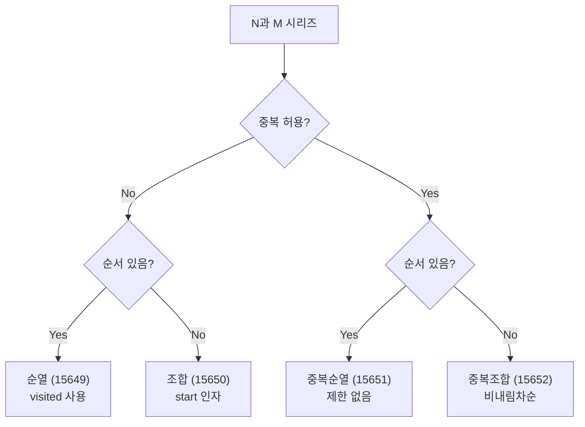
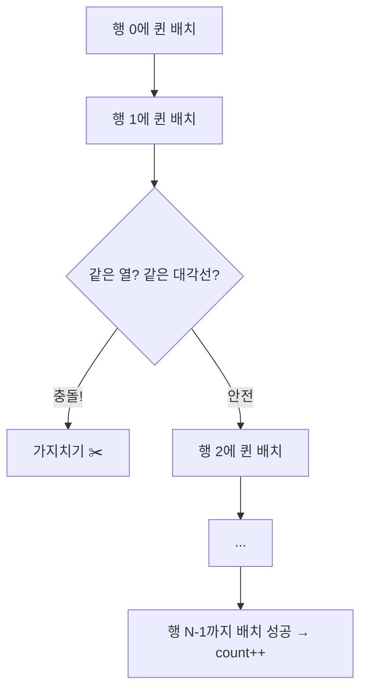

# 백트래킹 (Backtracking) - 코딩테스트 핵심 정리

## 개념 요약

백트래킹은 모든 경우의 수를 탐색하되, 조건에 맞지 않으면 즉시 되돌아가는(가지치기) 기법입니다.
DFS + 가지치기 = 백트래킹이라고 생각하면 됩니다.



## 백트래킹 기본 템플릿

거의 모든 백트래킹 문제가 이 틀에서 출발합니다.

```python
def backtrack():
    if 종료조건:
        결과 처리
        return

    for 선택지 in 후보군:
        if 유망하지 않으면:
            continue          # 가지치기 (pruning)
        선택               # 상태 변경
        backtrack()        # 재귀
        선택 취소           # 상태 복원
```

---

## 문제 풀이 패턴

### 패턴 1: 순열 (Permutation)

n개에서 m개를 뽑아 순서 있게 나열하는 문제입니다.

#### 15649번 - N과 M (1): 순열 기본



```python
# 방법 1: itertools
import itertools
N, M = map(int, input().split())
for p in itertools.permutations(range(1, N+1), M):
    print(*p)

# 방법 2: 백트래킹 (직접 구현)
N, M = map(int, input().split())
result = []
visited = [False] * (N + 1)

def dfs():
    if len(result) == M:
        print(*result)
        return
    for i in range(1, N + 1):
        if visited[i]:
            continue
        visited[i] = True
        result.append(i)
        dfs()
        visited[i] = False
        result.pop()

dfs()
```

> 핵심: `visited` 배열로 중복 사용을 방지합니다. 선택 → 재귀 → 선택 취소 패턴.

---

### 패턴 2: 조합 (Combination)

n개에서 m개를 뽑는 문제입니다. 순서가 없으므로 오름차순만 유지합니다.

#### 15650번 - N과 M (2): 조합 기본

```python
# 방법 1: itertools
import itertools
N, M = map(int, input().split())
for c in itertools.combinations(range(1, N+1), M):
    print(*c)

# 방법 2: 백트래킹
N, M = map(int, input().split())
result = []

def dfs(start):
    if len(result) == M:
        print(*result)
        return
    for i in range(start, N + 1):
        result.append(i)
        dfs(i + 1)        # i+1부터 시작 → 오름차순 보장
        result.pop()

dfs(1)
```

> 핵심: `dfs(i + 1)`로 시작점을 올려서 오름차순을 보장합니다.

---

### 패턴 3: 중복 순열 / 중복 조합

#### 15651번 - N과 M (3): 중복 순열

```python
N, M = map(int, input().split())
result = []

def dfs():
    if len(result) == M:
        print(*result)
        return
    for i in range(1, N + 1):
        result.append(i)
        dfs()              # visited 없음 → 중복 허용
        result.pop()

dfs()
```

#### 15652번 - N과 M (4): 중복 조합

```python
N, M = map(int, input().split())
result = []

def dfs():
    if len(result) == M:
        print(*result)
        return
    for i in range(1, N + 1):
        if not result or result[-1] <= i:   # 비내림차순 유지
            result.append(i)
            dfs()
            result.pop()

dfs()
```

---

### 패턴 4: N과 M 시리즈 총정리



| 문제  | 유형           | 핵심 차이              |
| ----- | -------------- | ---------------------- |
| 15649 | 순열           | `visited[i]` 체크      |
| 15650 | 조합           | `dfs(i + 1)`           |
| 15651 | 중복순열       | 제한 없음              |
| 15652 | 중복조합       | `result[-1] <= i`      |
| 15654 | 주어진 수 순열 | 입력 배열 정렬 후 순열 |
| 15663 | 중복 원소 순열 | `last_ele` 중복 방지   |

---

### 패턴 5: 중복 원소 처리 (15663)

입력에 같은 수가 있을 때, 같은 depth에서 같은 숫자를 두 번 선택하지 않는 기법입니다.

```python
N, M = map(int, input().split())
arr = sorted(list(map(int, input().split())))
result = []
visited = [False] * N

def dfs():
    if len(result) == M:
        print(*result)
        return
    last_ele = 0                    # 같은 depth에서 마지막으로 사용한 값
    for idx, ele in enumerate(arr):
        if visited[idx] or last_ele == ele:
            continue
        visited[idx] = True
        last_ele = ele
        result.append(ele)
        dfs()
        visited[idx] = False
        result.pop()

dfs()
```

> 핵심: `last_ele`로 같은 depth에서 동일한 값의 중복 탐색을 방지합니다.

---

### 패턴 6: 부분집합의 합 (1182)

```python
N, S = map(int, input().split())
arr = list(map(int, input().split()))
count = 0

def dfs(idx, total):
    global count
    if idx == N:
        return
    if total + arr[idx] == S:
        count += 1
    dfs(idx + 1, total + arr[idx])   # 현재 원소 포함
    dfs(idx + 1, total)               # 현재 원소 미포함

dfs(0, 0)
print(count)
```

> 핵심: 각 원소를 "포함/미포함" 두 갈래로 분기합니다. 시간복잡도 O(2^n).

---

### 패턴 7: N-Queen (9663)

N×N 체스판에 N개의 퀸을 서로 공격하지 않게 배치하는 문제입니다.



```python
N = int(input())
row_i = [-1] * N       # row_i[행] = 열 위치
count = 0
col_visited = [False] * N

def possible(row):
    for r in range(row):
        # 같은 대각선: 행 차이 == 열 차이
        if abs(row_i[row] - row_i[r]) == abs(row - r):
            return False
    return True

def dfs(row):
    global count
    if row == N:
        count += 1
        return
    for i in range(N):
        if col_visited[i]:
            continue
        row_i[row] = i
        if possible(row):
            col_visited[i] = True
            dfs(row + 1)
            col_visited[i] = False

dfs(0)
print(count)
```

> 핵심: 같은 열 체크는 `col_visited`, 대각선 체크는 `abs(행차) == abs(열차)`.
> PyPy로 제출해야 시간 내에 통과합니다.

---

### 패턴 8: 암호 만들기 (1759)

조합 + 조건 검증 패턴입니다.

```python
L, C = map(int, input().split())
arr = sorted(input().split())
result = []
visited = [False] * C

def dfs(s_idx):
    if len(result) == L:
        vowel = sum(1 for c in result if c in "aeiou")
        if vowel >= 1 and L - vowel >= 2:
            print("".join(result))
        return
    for idx in range(s_idx, C):
        if visited[idx]:
            continue
        result.append(arr[idx])
        visited[idx] = True
        dfs(idx)
        visited[idx] = False
        result.pop()

dfs(0)
```

> 핵심: 조합을 생성한 뒤, 모음 1개 이상 + 자음 2개 이상 조건을 검증합니다.

---

## 실전 꿀팁 & 자주 나오는 패턴

### 꿀팁 1: itertools vs 직접 구현

```python
# itertools가 편하지만, 직접 구현이 필요한 경우:
# 1. 가지치기가 필요할 때 (itertools는 전부 생성)
# 2. 중간 과정에서 조건 체크가 필요할 때
# 3. 상태를 변경/복원해야 할 때

# itertools는 "생성만" 하고, 백트래킹은 "탐색 중 판단"합니다.
```

### 꿀팁 2: 가지치기(Pruning)가 성능을 결정한다

```python
# 가지치기 없이: 모든 경우 탐색 → 시간초과
# 가지치기 있으면: 불필요한 탐색 제거 → 통과

# 대표적인 가지치기 기법:
# 1. 현재까지의 합이 이미 목표를 초과 → return
# 2. 남은 원소를 다 더해도 목표에 못 미침 → return
# 3. 이미 찾은 최적해보다 나빠질 수밖에 없음 → return

# 테트로미노 문제의 가지치기 예시:
if max_sum >= current_sum + max_value * (3 - depth):
    return    # 남은 칸을 최대값으로 채워도 현재 최적해보다 작음
```

### 꿀팁 3: global 변수 vs 매개변수

```python
# global 사용 (간단하지만 주의 필요)
count = 0
def dfs():
    global count
    count += 1

# 매개변수 사용 (더 안전)
def dfs(count):
    return count + 1

# 리스트는 global 없이도 수정 가능 (참조 전달)
result = []
def dfs():
    result.append(1)    # global 불필요
```

### 꿀팁 4: 자주 실수하는 함정들

```python
# 1. 선택 취소 누락
visited[i] = True
result.append(i)
dfs()
visited[i] = False    # 이거 빼먹으면 결과가 완전히 달라짐!
result.pop()          # 이것도!

# 2. 재귀 제한
import sys
sys.setrecursionlimit(10**6)   # 깊은 재귀 시 필수

# 3. 조합에서 시작 인덱스 실수
dfs(i + 1)    # 조합: 다음 인덱스부터
dfs(i)        # 중복조합: 현재 인덱스부터 (주의!)

# 4. 정렬 안 하고 사전순 출력 시도
arr = sorted(arr)   # 사전순 출력이 필요하면 먼저 정렬!
```
