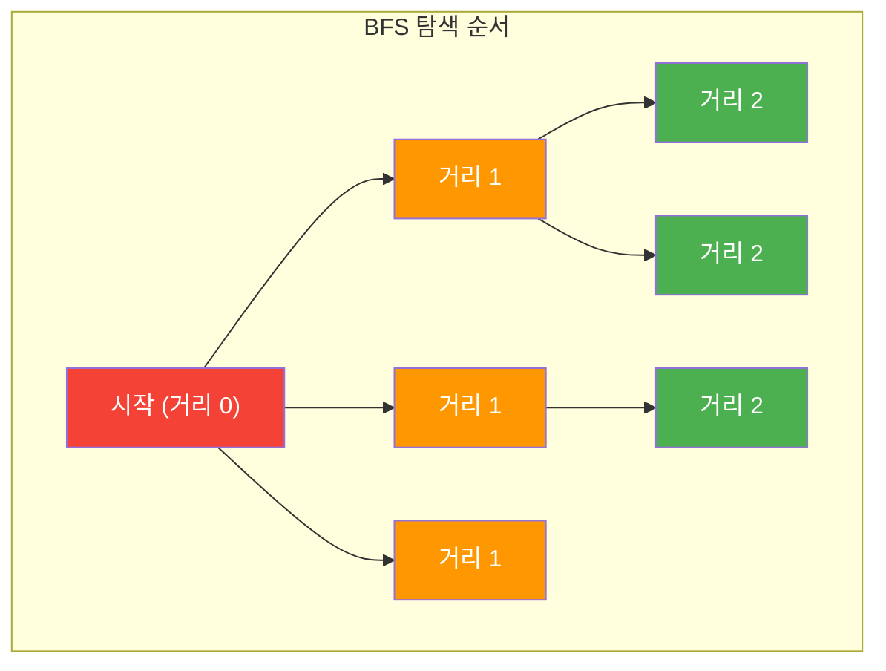
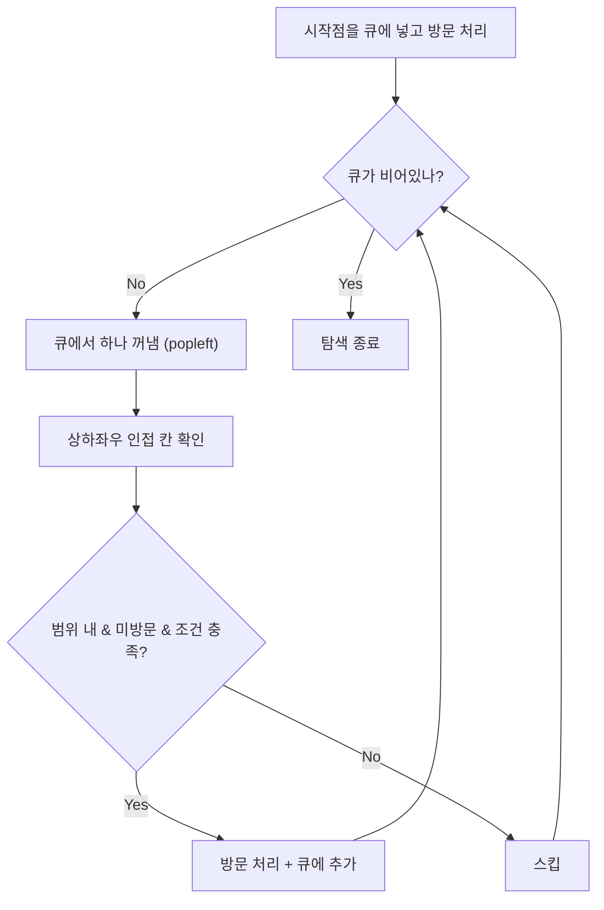
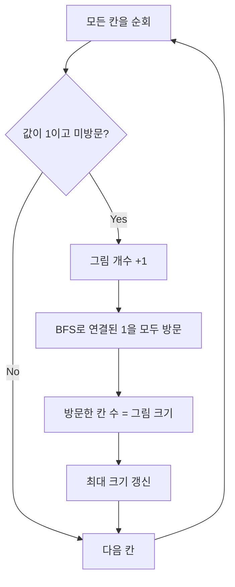
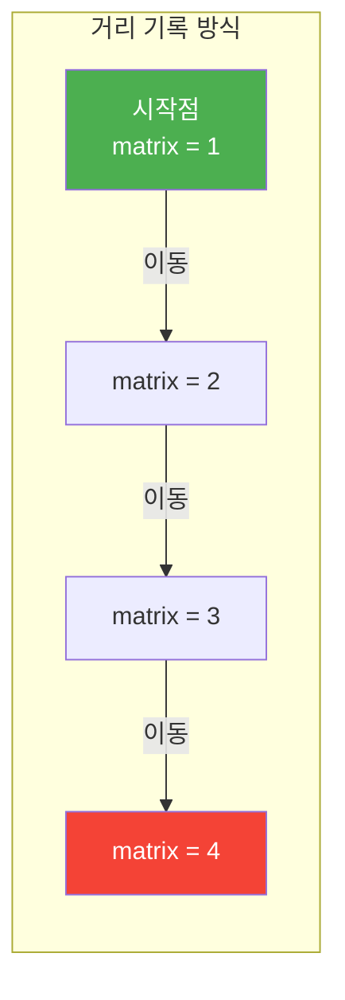
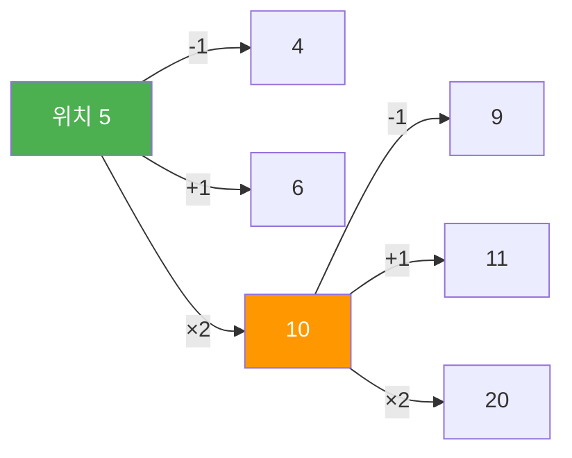
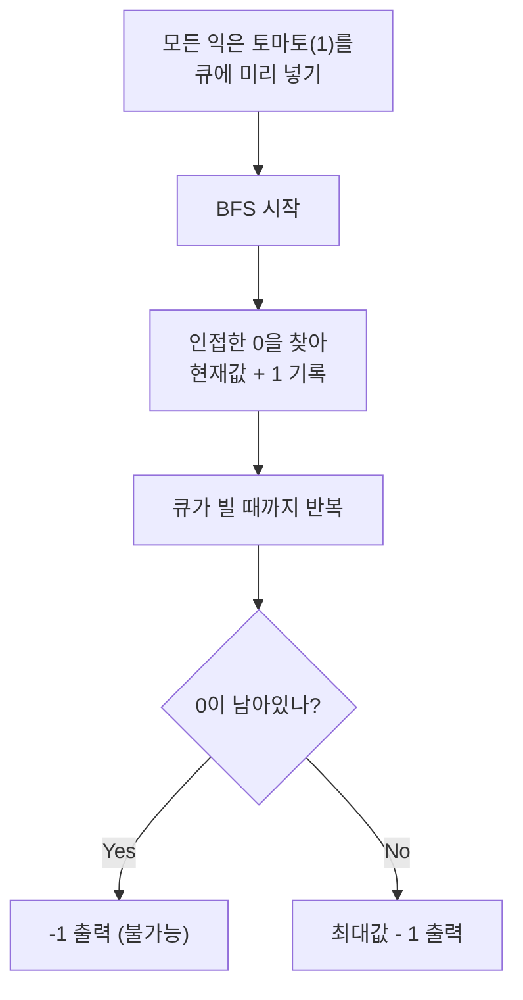
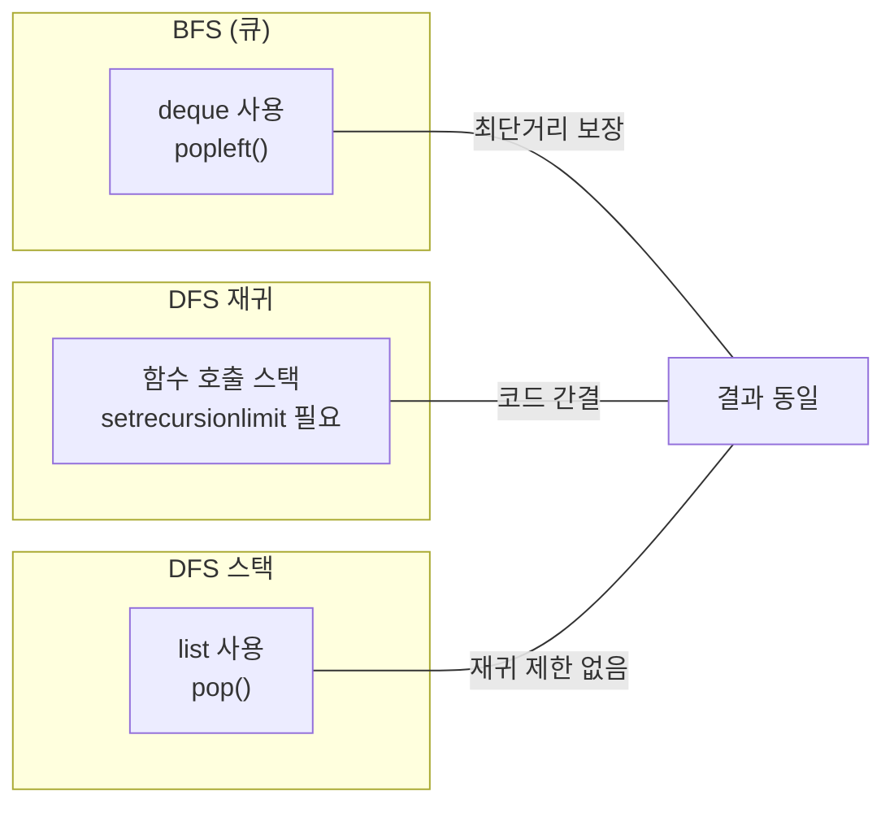
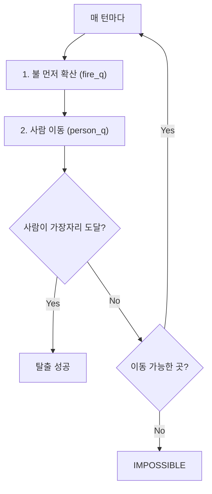
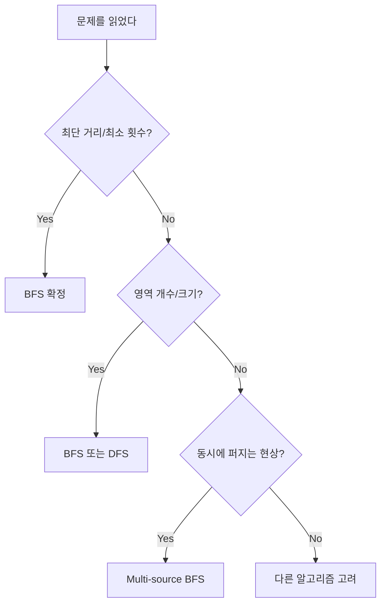
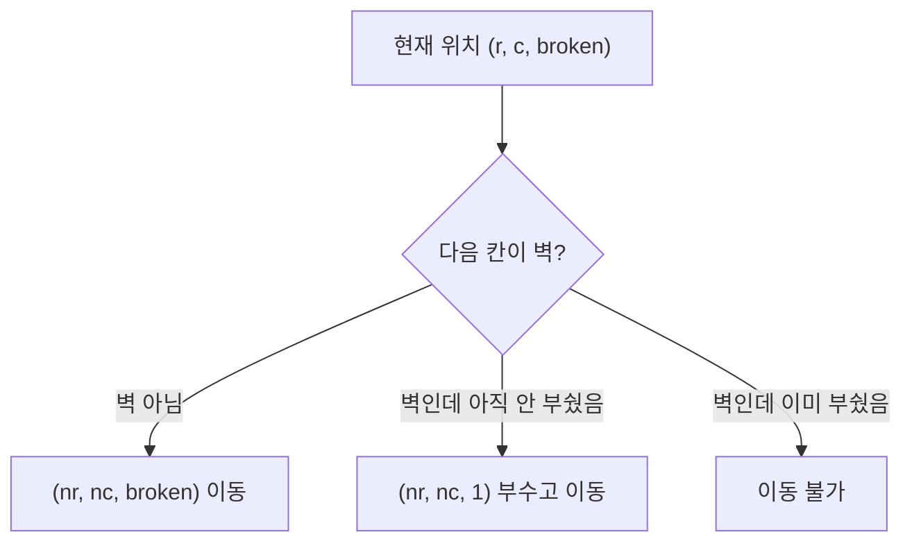

# BFS (너비 우선 탐색) - 코딩테스트 핵심 정리

## 개념 요약

BFS는 시작 노드에서 가까운 노드부터 차례대로 탐색하는 알고리즘입니다.
큐(Queue)를 사용하며, 최단 거리 문제에서 핵심적으로 사용됩니다.



> BFS는 "가까운 것부터" 탐색하므로, 처음 도달한 시점이 곧 최단 거리입니다.

## BFS vs DFS 비교

| 항목           | BFS                        | DFS                 |
| -------------- | -------------------------- | ------------------- |
| 자료구조       | 큐 (deque)                 | 스택 / 재귀         |
| 탐색 순서      | 가까운 것부터 (레벨 순)    | 깊은 것부터         |
| 최단 거리 보장 | O (가중치 없을 때)         | X                   |
| 메모리         | 많이 사용 (큐에 노드 저장) | 적게 사용           |
| 사용 시기      | 최단 거리, 레벨 탐색       | 경로 탐색, 백트래킹 |

## BFS 기본 템플릿 (2차원 격자)

거의 모든 BFS 문제가 이 틀에서 출발합니다. 외워두세요.

```python
from collections import deque

def bfs(matrix, start_i, start_j, visited):
    q = deque([(start_i, start_j)])
    visited[start_i][start_j] = True

    # 상하좌우
    directions = [(-1, 0), (1, 0), (0, -1), (0, 1)]

    while q:
        ci, cj = q.popleft()

        for di, dj in directions:
            ni, nj = ci + di, cj + dj

            if (0 <= ni < len(matrix) and 0 <= nj < len(matrix[0])
                    and not visited[ni][nj] and matrix[ni][nj] == 1):
                visited[ni][nj] = True
                q.append((ni, nj))
```



---

## 문제 풀이 패턴

### 패턴 1: 영역 개수 세기 (Connected Components)

격자에서 연결된 영역이 몇 개인지 세는 가장 기본적인 BFS 유형입니다.

#### 1926번 - 그림 (영역 개수 + 최대 크기)

1로 연결된 그림의 개수와 가장 큰 그림의 넓이를 구하는 문제입니다.



```python
from collections import deque

def bfs(graph, start_i, start_j, visited):
    queue = deque([(start_i, start_j)])
    visited[start_i][start_j] = True
    size = 1

    directions = [(-1, 0), (1, 0), (0, -1), (0, 1)]

    while queue:
        i, j = queue.popleft()
        for di, dj in directions:
            ni, nj = i + di, j + dj
            if (0 <= ni < len(graph) and 0 <= nj < len(graph[0])
                    and not visited[ni][nj] and graph[ni][nj] == 1):
                queue.append((ni, nj))
                visited[ni][nj] = True
                size += 1
    return size

n, m = map(int, input().split())
graph = [list(map(int, input().split())) for _ in range(n)]
visited = [[False] * m for _ in range(n)]

picture_count = 0
max_size = 0

for i in range(n):
    for j in range(m):
        if graph[i][j] == 1 and not visited[i][j]:
            picture_count += 1
            size = bfs(graph, i, j, visited)
            max_size = max(max_size, size)

print(picture_count)
print(max_size)
```

> 핵심: 전체 격자를 순회하면서, 미방문 1을 만나면 BFS를 돌려 하나의 영역을 전부 방문 처리합니다.

#### 1012번 - 유기농 배추 (영역 개수)

배추가 심어진 영역의 개수를 세는 문제입니다. 1926번과 동일한 패턴입니다.

```python
from collections import deque

dir = [(0,1), (0,-1), (1,0), (-1,0)]

def bfs(matrix, i, j):
    q = deque([(i, j)])
    while q:
        ci, cj = q.popleft()
        for d in dir:
            ni, nj = ci + d[0], cj + d[1]
            if 0 <= ni < len(matrix) and 0 <= nj < len(matrix[0]) and matrix[ni][nj] == 1:
                matrix[ni][nj] = 0    # 방문 처리 (원본 수정)
                q.append((ni, nj))

for _ in range(int(input())):
    ans = 0
    m, n, k = map(int, input().split())
    matrix = [[0] * m for _ in range(n)]

    for _ in range(k):
        x, y = map(int, input().split())
        matrix[y][x] = 1

    for i in range(n):
        for j in range(m):
            if matrix[i][j] == 1:
                ans += 1
                bfs(matrix, i, j)
    print(ans)
```

> 핵심: visited 배열 대신 원본 배열을 0으로 바꿔서 방문 처리하는 테크닉입니다. 메모리를 아낄 수 있습니다.

---

### 패턴 2: 최단 거리 구하기

BFS의 가장 강력한 특성입니다. 가중치가 없는(모두 1인) 그래프에서 BFS로 처음 도달한 거리가 곧 최단 거리입니다.

#### 2178번 - 미로 탐색 (격자 최단 거리)

(1,1)에서 (N,M)까지의 최단 거리를 구하는 문제입니다.



```python
from collections import deque

n, m = map(int, input().split())
matrix = [list(map(int, ''.join(input().split()))) for _ in range(n)]

dir = [(0,1), (0,-1), (1,0), (-1,0)]
q = deque([(0, 0)])

while q:
    ci, cj = q.popleft()
    for d in dir:
        ni, nj = ci + d[0], cj + d[1]
        if 0 <= ni < n and 0 <= nj < m and matrix[ni][nj] == 1:
            if ni == 0 and nj == 0:
                continue
            matrix[ni][nj] = matrix[ci][cj] + 1   # 거리 누적
            q.append((ni, nj))

print(matrix[-1][-1])
```

> 핵심: 별도의 dist 배열 없이, 원본 배열에 거리를 직접 기록합니다.
> `matrix[ni][nj] = matrix[ci][cj] + 1` 이 한 줄이 최단 거리의 핵심입니다.

#### 1697번 - 숨바꼭질 (1차원 BFS)

수직선 위에서 +1, -1, \*2 이동으로 목표 지점까지의 최소 이동 횟수를 구하는 문제입니다.



```python
from collections import deque

n, m = map(int, input().split())

line = [0] * 100_001
line[n] = 1
q = deque([n])

while q:
    ci = q.popleft()
    if ci == m:
        break

    for ni in [ci - 1, ci + 1, ci * 2]:
        if 0 <= ni < 100_001 and line[ni] == 0:
            line[ni] = line[ci] + 1
            q.append(ni)

print(line[m] - 1)
```

> 핵심: 2차원 격자가 아니라 1차원 수직선에서의 BFS입니다.
> 이동 방법이 상하좌우가 아니라 `[x-1, x+1, x*2]`인 것만 다르고, 나머지는 동일합니다.

---

### 패턴 3: 동시 다발 BFS (Multi-source BFS)

시작점이 여러 개인 BFS입니다. 모든 시작점을 큐에 미리 넣고 동시에 퍼뜨립니다.

#### 7576번 - 토마토

익은 토마토(1)가 인접한 안 익은 토마토(0)를 매일 익게 만들 때, 모두 익는 최소 일수를 구하는 문제입니다.



```python
from collections import deque
import sys
read = sys.stdin.readline

m, n = map(int, read().split())
matrix = []
q = deque()

# 입력 받으면서 익은 토마토(1)를 모두 큐에 넣기
for i in range(n):
    matrix.append(list(map(int, read().split())))
    for j in range(m):
        if matrix[i][j] == 1:
            q.append((i, j))

dir = [(0,1), (0,-1), (1,0), (-1,0)]

while q:
    ci, cj = q.popleft()
    for d in dir:
        ni, nj = ci + d[0], cj + d[1]
        if 0 <= ni < n and 0 <= nj < m and matrix[ni][nj] == 0:
            q.append((ni, nj))
            matrix[ni][nj] = matrix[ci][cj] + 1

# 결과 확인
err = False
max_v = 0
for ii in range(n):
    for jj in range(m):
        if matrix[ii][jj] == 0:
            err = True
            break
        max_v = max(max_v, matrix[ii][jj])
    if err:
        break

print(max_v - 1 if not err else -1)
```

> 핵심: 시작점이 여러 개일 때, 하나씩 BFS를 돌리면 안 됩니다.
> 모든 시작점을 큐에 미리 넣으면 "동시에 퍼지는" 효과를 얻습니다.

#### 7569번 - 토마토 (3차원)

7576번의 3차원 확장입니다. 상하좌우 + 위아래 6방향으로 퍼집니다.

```python
import sys
from collections import deque

M, N, H = map(int, input().split())
goto = [[0,0,1], [0,1,0], [1,0,0], [0,0,-1], [0,-1,0], [-1,0,0]]
q = deque()

matrix = []
for h in range(H):
    floor = []
    for n in range(N):
        floor.append(list(map(int, sys.stdin.readline().split())))
    matrix.append(floor)

# 모든 익은 토마토를 큐에 넣기
for h in range(H):
    for n in range(N):
        for m in range(M):
            if matrix[h][n][m] == 1:
                q.append([h, n, m])

while q:
    n_h, n_r, n_c = q.popleft()
    for coord in goto:
        next_r = n_r + coord[0]
        next_c = n_c + coord[1]
        next_h = n_h + coord[2]
        if (0 <= next_r < N and 0 <= next_c < M and 0 <= next_h < H
                and matrix[next_h][next_r][next_c] == 0):
            matrix[next_h][next_r][next_c] = matrix[n_h][n_r][n_c] + 1
            q.append([next_h, next_r, next_c])

max_value = 0
for h in range(H):
    for n in range(N):
        for m in range(M):
            if matrix[h][n][m] == 0:
                print(-1)
                exit(0)
            max_value = max(max_value, matrix[h][n][m])

print(max_value - 1)
```

> 핵심: 2차원 → 3차원 확장은 방향 배열에 z축만 추가하면 됩니다.
> 6방향: `[0,0,1], [0,1,0], [1,0,0], [0,0,-1], [0,-1,0], [-1,0,0]`

---

### 패턴 4: 조건부 BFS (색맹 문제)

같은 격자에서 조건을 다르게 적용하여 BFS를 두 번 돌리는 유형입니다.

#### 10026번 - 적록색약

일반인과 적록색약이 보는 영역 수를 각각 구하는 문제입니다.

```python
from collections import deque
import sys
read = sys.stdin.readline

n = int(read().strip())
dir = [(0,1), (0,-1), (1,0), (-1,0)]

def bfs1(matrix, visited, i, j, target):
    """일반인: 같은 색만 연결"""
    q = deque([(i, j)])
    visited[i][j] = 1
    while q:
        ci, cj = q.popleft()
        for d in dir:
            ni, nj = ci + d[0], cj + d[1]
            if (0 <= ni < n and 0 <= nj < n
                    and matrix[ni][nj] == target and visited[ni][nj] == 0):
                visited[ni][nj] = 1
                q.append((ni, nj))

def bfs2(matrix, visited, i, j, target):
    """색약: R과 G를 같은 색으로 취급"""
    q = deque([(i, j)])
    visited[i][j] = 1
    targ = ["B"] if target == "B" else ["R", "G"]
    while q:
        ci, cj = q.popleft()
        for d in dir:
            ni, nj = ci + d[0], cj + d[1]
            if (0 <= ni < n and 0 <= nj < n
                    and matrix[ni][nj] in targ and visited[ni][nj] == 0):
                visited[ni][nj] = 1
                q.append((ni, nj))

matrix = [list(read().strip()) for _ in range(n)]
visited1 = [[0] * n for _ in range(n)]
visited2 = [[0] * n for _ in range(n)]
count1 = count2 = 0

for i in range(n):
    for j in range(n):
        if visited1[i][j] == 0:
            count1 += 1
            bfs1(matrix, visited1, i, j, matrix[i][j])
        if visited2[i][j] == 0:
            count2 += 1
            bfs2(matrix, visited2, i, j, matrix[i][j])

print(count1, count2)
```

> 핵심: BFS 함수의 "연결 조건"만 바꿔서 두 번 돌리면 됩니다.

---

### 패턴 5: BFS vs DFS 같은 문제 세 가지 풀이 비교

1926번 그림 문제를 BFS, 재귀 DFS, 스택 DFS 세 가지로 풀 수 있습니다.



```python
# DFS 재귀 버전 (간결하지만 재귀 제한 주의)
import sys
sys.setrecursionlimit(10**6)

def dfs(graph, i, j, visited):
    if (i < 0 or i >= len(graph) or j < 0 or j >= len(graph[0])
            or visited[i][j] or graph[i][j] == 0):
        return 0
    visited[i][j] = True
    size = 1
    size += dfs(graph, i-1, j, visited)
    size += dfs(graph, i+1, j, visited)
    size += dfs(graph, i, j-1, visited)
    size += dfs(graph, i, j+1, visited)
    return size

# DFS 스택 버전 (재귀 제한 걱정 없음)
def dfs_iterative(graph, start_i, start_j):
    stack = [(start_i, start_j)]
    graph[start_i][start_j] = 0
    size = 1
    directions = [(-1,0), (1,0), (0,-1), (0,1)]

    while stack:
        i, j = stack.pop()
        for di, dj in directions:
            ni, nj = i + di, j + dj
            if 0 <= ni < len(graph) and 0 <= nj < len(graph[0]) and graph[ni][nj] == 1:
                stack.append((ni, nj))
                graph[ni][nj] = 0
                size += 1
    return size
```

> 영역 세기 = BFS든 DFS든 상관없음. 최단 거리 = 반드시 BFS.

---

### 패턴 6: 두 개의 BFS 동시 진행 (불/탈출 문제)

불과 사람이 동시에 이동하는 문제입니다. 두 개의 큐를 번갈아 처리합니다.

#### 4179번 - 불! / 5427번 - 불



```python
import sys
from collections import deque

n, m = map(int, input().split())
matrix = [list(sys.stdin.readline().strip()) for _ in range(n)]

jq = deque()   # 사람 큐
fq = deque()   # 불 큐

for row in range(n):
    for col in range(m):
        if matrix[row][col] == "J":
            jq.append([row, col])
            matrix[row][col] = 0
        elif matrix[row][col] == "F":
            fq.append([row, col])

gr = [0, 0, 1, -1]
gc = [1, -1, 0, 0]
cnt = -1

while jq or fq:
    if cnt != -1:
        break

    # 사람 이동
    temp_jq = []
    while jq:
        cr, cc = jq.popleft()
        if matrix[cr][cc] == "F":   # 불에 탄 위치면 스킵
            continue
        for idx in range(4):
            nr, nc = cr + gr[idx], cc + gc[idx]
            if 0 <= nr < n and 0 <= nc < m and matrix[nr][nc] == ".":
                matrix[nr][nc] = matrix[cr][cc] + 1
                temp_jq.append([nr, nc])

    # 불 확산
    temp_fq = []
    while fq:
        cr, cc = fq.popleft()
        for idx in range(4):
            nr, nc = cr + gr[idx], cc + gc[idx]
            if (0 <= nr < n and 0 <= nc < m
                    and matrix[nr][nc] != "#" and matrix[nr][nc] != "F"):
                matrix[nr][nc] = "F"
                temp_fq.append([nr, nc])

    jq.extend(temp_jq)
    fq.extend(temp_fq)

    # 가장자리 도달 확인
    for r in [0, n-1]:
        for c in range(m):
            if isinstance(matrix[r][c], int):
                cnt = matrix[r][c]
    for c in [0, m-1]:
        for r in range(n):
            if isinstance(matrix[r][c], int):
                cnt = matrix[r][c]

print(cnt + 1 if cnt != -1 else "IMPOSSIBLE")
```

> 핵심: 불을 먼저 확산시킨 후 사람을 이동시킵니다. 순서가 중요합니다.
> 사람이 가장자리에 도달하면 탈출 성공입니다.

---

### 패턴 7: 1차원 BFS 변형 (엘리베이터)

#### 5014번 - 스타트링크

엘리베이터로 UP/DOWN만 가능할 때 목표 층까지의 최소 버튼 횟수를 구하는 문제입니다.

```python
from collections import deque

F, S, G, UP, DOWN = map(int, input().split())
matrix = [-1] * (F + 1)
matrix[S] = 0
q = deque([S])

while q:
    floor = q.popleft()
    for next_floor in [floor + UP, floor - DOWN]:
        if 1 <= next_floor <= F and matrix[next_floor] == -1:
            matrix[next_floor] = matrix[floor] + 1
            q.append(next_floor)

print(matrix[G] if matrix[G] != -1 else "use the stairs")
```

> 핵심: 숨바꼭질(1697)과 동일한 1차원 BFS입니다.
> 이동 방법만 `[+UP, -DOWN]`으로 다를 뿐, 나머지는 완전히 같습니다.

---

### 패턴 8: 3차원 BFS (빌딩 탈출)

#### 6593번 - 상범 빌딩

3차원 격자(층, 행, 열)에서 S→E 최단 거리를 구하는 문제입니다.

```python
from collections import deque

# 6방향: 상하좌우 + 위층/아래층
dz = [0, 0, 1, -1, 0, 0]
dy = [0, 0, 0, 0, 1, -1]
dx = [1, -1, 0, 0, 0, 0]

while True:
    L, R, C = map(int, input().split())
    if L == 0:
        break

    matrix = []
    heat = [[[-1]*C for _ in range(R)] for _ in range(L)]
    start = []

    for floor in range(L):
        floor_matrix = []
        for r in range(R):
            floor_matrix.append(list(input().strip()))
        matrix.append(floor_matrix)
        input()  # 빈 줄

    # 시작점 찾기
    for l in range(L):
        for r in range(R):
            for c in range(C):
                if matrix[l][r][c] == "S":
                    start = [l, r, c]
                    heat[l][r][c] = 0

    q = deque([start])
    result = -1

    while q:
        fl, row, col = q.popleft()
        for i in range(6):
            nf, nr, nc = fl + dz[i], row + dy[i], col + dx[i]
            if (0 <= nf < L and 0 <= nr < R and 0 <= nc < C
                    and matrix[nf][nr][nc] != "#" and heat[nf][nr][nc] == -1):
                heat[nf][nr][nc] = heat[fl][row][col] + 1
                q.append([nf, nr, nc])
                if matrix[nf][nr][nc] == "E":
                    result = heat[nf][nr][nc]

    if result == -1:
        print("Trapped!")
    else:
        print(f"Escaped in {result} minute(s).")
```

> 핵심: 2차원 BFS에 z축(층)만 추가하면 3차원 BFS가 됩니다.

---

### 패턴 9: 나이트 이동 (비표준 방향)

#### 7562번 - 나이트의 이동

체스 나이트의 이동 규칙으로 최소 이동 횟수를 구하는 문제입니다.

```python
from collections import deque

# 나이트 8방향
go_coord = [[2,-1],[1,-2],[-1,-2],[-2,-1],[-2,1],[-1,2],[1,2],[2,1]]

for _ in range(int(input())):
    i = int(input())
    matrix = [[0] * i for _ in range(i)]
    sx, sy = map(int, input().split())
    tx, ty = map(int, input().split())
    q = deque([[sx, sy]])

    while q:
        nx, ny = q.popleft()
        if [nx, ny] == [tx, ty]:
            print(matrix[ny][nx])
            break
        for go in go_coord:
            nnx, nny = nx + go[0], ny + go[1]
            if 0 <= nny < i and 0 <= nnx < i and matrix[nny][nnx] == 0:
                matrix[nny][nnx] = matrix[ny][nx] + 1
                q.append([nnx, nny])
```

> 핵심: 방향 배열만 나이트 규칙으로 바꾸면 됩니다. BFS 틀은 동일합니다.

---

### 패턴 10: 조건 변화 BFS (안전 영역)

#### 2468번 - 안전 영역

비의 양에 따라 잠기는 영역이 달라지고, 각 경우의 안전 영역 수의 최대값을 구하는 문제입니다.

```python
from collections import deque

N = int(input())
matrix = []
max_num = 1
for i in range(N):
    row = list(map(int, input().split()))
    matrix.append(row)
    max_num = max(max_num, max(row))

dx = [0, 0, 1, -1]
dy = [1, -1, 0, 0]

max_count = 0
for M in range(max_num):       # 비의 양 0 ~ 최대높이-1
    count = 0
    heat = [[0] * N for _ in range(N)]

    for row in range(N):
        for col in range(N):
            if matrix[row][col] > M and heat[row][col] == 0:
                count += 1
                heat[row][col] = 1
                q = deque([[row, col]])

                while q:
                    cr, cc = q.popleft()
                    for i in range(4):
                        nr, nc = cr + dx[i], cc + dy[i]
                        if (0 <= nr < N and 0 <= nc < N
                                and heat[nr][nc] == 0 and matrix[nr][nc] > M):
                            heat[nr][nc] = 1
                            q.append([nr, nc])

    max_count = max(max_count, count)

print(max_count)
```

> 핵심: 조건(비의 양)을 바꿔가며 BFS를 여러 번 돌리는 패턴입니다.
> 브루트포스 + BFS 조합으로, 가능한 모든 경우를 탐색합니다.

---

## 실전 꿀팁 & 자주 나오는 패턴

### 꿀팁 1: BFS 문제인지 판별하는 법



이 키워드가 보이면 BFS를 떠올리세요:

- "최단 거리", "최소 횟수", "최소 시간"
- "몇 번 만에 도달", "가장 빠른"
- "동시에 퍼진다", "매 초마다 확산"
- "연결된 영역", "덩어리 개수"

### 꿀팁 2: 방문 처리 타이밍이 핵심

BFS에서 가장 흔한 실수는 방문 처리 타이밍입니다.

```python
# 올바른 방법: 큐에 넣을 때 방문 처리
if not visited[ni][nj]:
    visited[ni][nj] = True     # 여기서 처리!
    q.append((ni, nj))

# 잘못된 방법: 큐에서 꺼낼 때 방문 처리
ci, cj = q.popleft()
visited[ci][cj] = True         # 이미 중복으로 큐에 들어갔을 수 있음!
```

> 큐에 넣을 때 방문 처리하지 않으면, 같은 노드가 여러 번 큐에 들어가서 시간초과 또는 오답이 발생합니다.

### 꿀팁 3: visited 배열 vs 원본 수정

```python
# 방법 1: visited 배열 사용 (원본 보존)
visited = [[False] * m for _ in range(n)]
visited[ni][nj] = True

# 방법 2: 원본 배열 수정 (메모리 절약)
matrix[ni][nj] = 0    # 또는 -1 등 방문 표시

# 방법 3: 거리를 직접 기록 (최단 거리 문제)
matrix[ni][nj] = matrix[ci][cj] + 1
```

> 원본을 다시 사용해야 하면 방법 1, 아니면 방법 2나 3이 더 효율적입니다.

### 꿀팁 4: 방향 배열은 전역으로 선언

```python
# 4방향 (상하좌우)
dx = [-1, 1, 0, 0]
dy = [0, 0, -1, 1]

# 또는 튜플 리스트 (더 깔끔)
dir = [(-1,0), (1,0), (0,-1), (0,1)]

# 8방향 (대각선 포함)
dir8 = [(-1,-1), (-1,0), (-1,1), (0,-1), (0,1), (1,-1), (1,0), (1,1)]
```

> 함수 안에 매번 선언하지 말고, 전역에 한 번만 선언하세요.

### 꿀팁 5: 범위 체크 한 줄 패턴

```python
# 길지만 명확한 방법
if 0 <= ni and ni < n and 0 <= nj and nj < m:

# Python 체이닝 (짧고 깔끔)
if 0 <= ni < n and 0 <= nj < m:

# 함수로 분리 (여러 곳에서 사용 시)
def in_range(i, j):
    return 0 <= i < n and 0 <= j < m
```

### 꿀팁 6: 상태 추가 BFS (벽 부수기 — 2206번)

"벽을 최대 1개 부술 수 있다"처럼 상태가 추가되면 visited 차원을 늘립니다.



```python
import sys
from collections import deque

N, M = map(int, sys.stdin.readline().split())
board = [list(map(int, list(sys.stdin.readline().strip()))) for _ in range(N)]

# dist_map[r][c][부쉈는지] — 3차원
dist_map = [[[0, 0] for _ in range(M)] for _ in range(N)]

q = deque([(0, 0, 0)])   # (행, 열, 벽 부순 횟수)
dist = -1

while q:
    now_r, now_c, bb = q.popleft()

    if now_r == N - 1 and now_c == M - 1:
        dist = dist_map[now_r][now_c][bb] + 1
        break

    for dr, dc in [(0,1), (0,-1), (1,0), (-1,0)]:
        nr, nc = now_r + dr, now_c + dc
        if 0 <= nr < N and 0 <= nc < M:
            # 벽을 부수고 가는 경우
            if board[nr][nc] == 1 and dist_map[nr][nc][1] == 0 and bb == 0:
                dist_map[nr][nc][1] = dist_map[now_r][now_c][bb] + 1
                q.append((nr, nc, 1))
            # 빈 칸으로 가는 경우
            elif board[nr][nc] == 0 and dist_map[nr][nc][bb] == 0:
                dist_map[nr][nc][bb] = dist_map[now_r][now_c][bb] + 1
                q.append((nr, nc, bb))

print(dist)
```

> 핵심: "조건이 추가되면 visited 차원을 늘린다"는 공식을 기억하세요.
> 벽 부수기 → `[r][c][0 or 1]`, 열쇠 줍기 → `[r][c][열쇠 비트마스크]`

### 꿀팁 7: deque vs list — BFS에서는 반드시 deque

```python
# list로 큐 흉내 → pop(0)은 O(n)이라 시간초과!
q = []
q.append(x)
q.pop(0)        # O(n) — 절대 사용 금지

# deque → popleft()는 O(1)
from collections import deque
q = deque()
q.append(x)
q.popleft()     # O(1) — 항상 이것을 사용
```

### 꿀팁 8: 자주 실수하는 BFS 함정들

```python
# 1. 시작점 방문 처리 누락
q = deque([(si, sj)])
visited[si][sj] = True    # 이거 빼먹으면 시작점 재방문!

# 2. 입력에서 x, y 순서 혼동
x, y = map(int, input().split())
matrix[y][x] = 1          # 보통 (행, 열) = (y, x) 순서!

# 3. Multi-source BFS에서 시작점 거리 초기화
# 토마토 문제처럼 시작점이 이미 1이면 → 최종 답에서 -1 해야 함

# 4. 격자 크기 n, m 혼동
m, n = map(int, input().split())   # 문제마다 순서가 다름!
# 항상 "가로(열) = m, 세로(행) = n"인지 확인

# 5. 문자열 격자 입력
# "11101" 같은 입력은 split()이 아니라 한 글자씩 분리
row = list(map(int, input()))      # [1, 1, 1, 0, 1]
row = list(input())                # ['1', '1', '1', '0', '1']
```

### 꿀팁 9: BFS 문제 유형 총정리

| 유형              | 핵심               | 대표 문제              |
| ----------------- | ------------------ | ---------------------- |
| 영역 개수         | 전체 순회 + BFS    | 1926, 1012, 2667, 2583 |
| 최단 거리 (격자)  | 거리 누적 기록     | 2178                   |
| 최단 거리 (1차원) | 이동 규칙만 다름   | 1697, 5014             |
| Multi-source      | 시작점 여러 개     | 7576, 7569             |
| 두 BFS 동시       | 불+사람 번갈아     | 4179, 5427             |
| 조건부 영역       | 조건 바꿔가며 반복 | 10026, 2468            |
| 상태 추가         | visited 차원 확장  | 2206                   |
| 3차원             | z축 추가           | 6593, 7569             |
| 비표준 방향       | 방향 배열만 변경   | 7562 (나이트)          |

### 꿀팁 10: exit() vs break — 조기 종료 패턴

```python
# 목표 지점 도달 시 즉시 종료
while q:
    ci, cj = q.popleft()
    if ci == target_r and cj == target_c:
        print(dist[ci][cj])
        exit(0)                # 프로그램 즉시 종료
    # ... BFS 계속

# 또는 함수로 감싸서 return
def solve():
    while q:
        ci, cj = q.popleft()
        if ci == target_r and cj == target_c:
            return dist[ci][cj]
    return -1
```

> 최단 거리 문제에서 목표 도달 시 바로 종료하면 불필요한 탐색을 줄일 수 있습니다.
