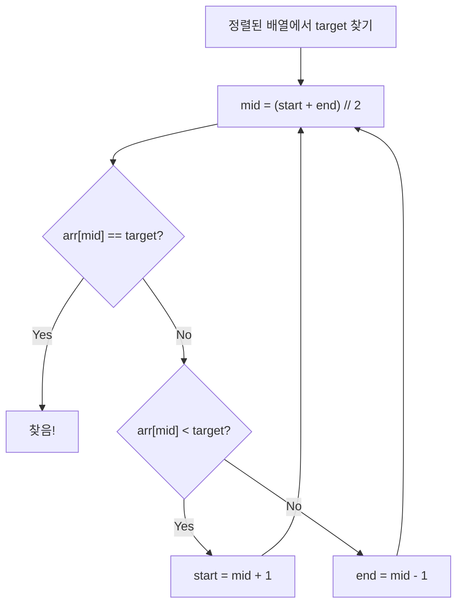

# 이분탐색 (Binary Search) - 코딩테스트 핵심 정리

## 개념 요약

정렬된 배열에서 탐색 범위를 절반씩 줄여가며 O(log n)에 값을 찾는 알고리즘입니다.



---

## 문제 풀이 패턴

### 패턴 1: 존재 여부 판별 (1920)

```python
N = int(input())
arr = sorted(list(map(int, input().split())))

def bisect(arr, target):
    s, e = 0, len(arr) - 1
    while s <= e:
        mid = (s + e) // 2
        if arr[mid] == target:
            return 1
        elif arr[mid] < target:
            s = mid + 1
        else:
            e = mid - 1
    return 0

M = int(input())
for x in map(int, input().split()):
    print(bisect(arr, x))
```

### 패턴 2: 개수 세기 — bisect 모듈 (10816)

```python
from bisect import bisect_left, bisect_right

N = int(input())
arr = sorted(list(map(int, input().split())))
M = int(input())

for x in map(int, input().split()):
    print(bisect_right(arr, x) - bisect_left(arr, x))
```

> `bisect_right - bisect_left` = 해당 값의 개수.

### 패턴 3: 매개변수 탐색 (Parametric Search — 1654)

"최대 길이를 구하라" → "길이 X로 잘랐을 때 N개 이상 만들 수 있는가?"로 변환.

```python
K, N = map(int, input().split())
arr = sorted([int(input()) for _ in range(K)])

s, e = 0, arr[-1]
result = 0

while s <= e:
    mid = (s + e) // 2
    if mid == 0:
        s = 1
        continue
    count = sum(x // mid for x in arr)
    if count >= N:
        result = mid
        s = mid + 1
    else:
        e = mid - 1

print(result)
```

> 핵심: "최적값을 구하라" → "X가 가능한가?" Yes/No 문제로 변환하는 것이 매개변수 탐색입니다.

---

## 실전 꿀팁

### 꿀팁 1: bisect 모듈 정리

```python
from bisect import bisect_left, bisect_right, insort

arr = [1, 3, 3, 3, 5]
bisect_left(arr, 3)    # 1 (3이 들어갈 가장 왼쪽 위치)
bisect_right(arr, 3)   # 4 (3이 들어갈 가장 오른쪽 위치)
insort(arr, 4)         # [1, 3, 3, 3, 4, 5] (정렬 유지하며 삽입)
```

### 꿀팁 2: 이분탐색 vs set 검색

```python
# 단순 존재 여부: set이 더 간단 O(1)
s = set(arr)
print(1 if x in s else 0)

# 개수, 범위, 매개변수 탐색: 이분탐색 필수
```

### 꿀팁 3: while 조건 — `s <= e` vs `s < e`

```python
# s <= e: 값을 정확히 찾을 때 (존재 여부)
# s < e: 범위를 좁힐 때 (lower bound)
# 헷갈리면 s <= e를 기본으로 사용하세요
```

---

## 닫힌 구간 vs 반열린 구간

이분탐색에서 `while s <= e`와 `while s < e`가 나뉘는 이유는 탐색 범위를 닫힌 구간으로 잡느냐, 반열린 구간으로 잡느냐의 차이입니다.

### 닫힌 구간 `[s, e]` — `while s <= e`

- s와 e 둘 다 탐색 범위에 포함
- s == e일 때도 그 원소를 검사해야 하므로 `<=`
- 검사한 mid는 이미 확인했으므로 양쪽 다 제외 → `[s, mid-1]` 또는 `[mid+1, e]`
- 범위가 비는 순간(s > e) 종료
- 용도: 특정 값의 정확한 위치를 찾을 때

```python
while s <= e:
    mid = (s + e) // 2
    if arr[mid] == target:
        return mid        # 찾았다! 바로 리턴
    elif arr[mid] < target:
        s = mid + 1       # mid 검사 완료 → 제외
    else:
        e = mid - 1       # mid 검사 완료 → 제외
return -1  # 없음
```

> 만약 여기서 `e = mid`로 하면? s == e == mid인 상황에서 조건이 계속 참이고, mid 값도 안 변하니까 무한루프에 빠집니다.

### 반열린 구간 `[s, e)` — `while s < e`

- s는 포함, e는 미포함 (혹은 "e는 아직 후보")
- s == e이면 범위에 원소가 하나(또는 없음)이므로 종료
- e 쪽을 줄일 때 `e = mid` → mid를 범위 안에 남겨두는 게 자연스러움
- 범위가 한 점으로 수렴하면 종료
- 용도: 조건을 만족하는 경계점(최솟값/최댓값)을 찾을 때

```python
# 조건을 만족하는 최솟값 찾기
while s < e:
    mid = (s + e) // 2
    if check(mid):    # mid가 조건 충족
        e = mid       # 더 작은 쪽에도 답이 있을 수 있으니 남겨둠
    else:
        s = mid + 1   # mid는 안 됨 → 버림
return s  # s == e == 경계점
```

### 비교 정리

|               | `while s <= e` (닫힌 구간)    | `while s < e` (반열린 구간)           |
| ------------- | ----------------------------- | ------------------------------------- |
| 탐색 범위     | `[s, e]`                      | `[s, e)`                              |
| 종료 시점     | 범위가 빌 때 (s > e)          | 한 점으로 수렴 (s == e)               |
| mid 처리      | 검사 완료 → 제외              | 후보로 남길 수 있음                   |
| e 갱신        | `e = mid - 1`                 | `e = mid`                             |
| 무한루프 방지 | mid 제외로 범위가 항상 줄어듦 | s < e이고 mid < e이므로 범위가 줄어듦 |
| 대표 용도     | 특정 값 검색                  | 경계점/시작점 찾기                    |

> 핵심: "왜 `e = mid`야? 왜 `e = mid - 1`이야?"를 외우는 게 아니라, "내 탐색 범위를 닫힌 구간으로 잡았나, 반열린 구간으로 잡았나"를 먼저 정하면 나머지가 논리적으로 따라옵니다.

---

## 반열린 구간 — 최솟값 찾기 vs 최댓값 찾기

### 최솟값 찾기 (Lower Bound)

조건을 만족하는 가장 작은 값을 찾습니다.

```python
while s < e:
    mid = (s + e) // 2       # 내림
    if check(mid):            # mid가 조건 충족
        e = mid               # 더 작은 쪽에도 답이 있을 수 있으니 남겨둠
    else:
        s = mid + 1           # mid는 안 됨 → 버림
return s  # s == e == 경계점
```

### 최댓값 찾기 (Upper Bound)

조건을 만족하는 가장 큰 값을 찾습니다.

```python
while s < e:
    mid = (s + e + 1) // 2   # 올림!
    if check(mid):            # mid가 조건 충족
        s = mid               # 더 큰 쪽에도 답이 있을 수 있으니 남겨둠
    else:
        e = mid - 1           # mid는 안 됨 → 버림
return s  # s == e == 경계점
```

### 왜 최댓값 찾기에서 `+1` 올림이 필수인가?

`s = 3, e = 4`인 상황에서 비교:

```
# +1 없이 내림하는 경우
mid = (3 + 4) // 2 = 3
check(3)이 True → s = mid = 3
→ s = 3, e = 4  ← 아무것도 안 변함! 무한루프

# +1 올림하는 경우
mid = (3 + 4 + 1) // 2 = 4
check(4)가 True  → s = mid = 4 → s = 4, e = 4 → 수렴! 종료
check(4)가 False → e = mid - 1 = 3 → s = 3, e = 3 → 수렴! 종료
```

> 정수 나눗셈은 항상 내림이라 s와 e가 1 차이날 때 mid가 항상 s쪽으로 붙습니다. `s = mid`를 하면 s가 자기 자신으로 갱신되어 범위가 줄어들지 않습니다.

### 비교 정리

|                | 최솟값 찾기 (Lower Bound) | 최댓값 찾기 (Upper Bound)   |
| -------------- | ------------------------- | --------------------------- |
| mid 계산       | `(s + e) // 2` (내림)     | `(s + e + 1) // 2` (올림)   |
| 조건 충족 시   | `e = mid` (왼쪽으로 좁힘) | `s = mid` (오른쪽으로 좁힘) |
| 조건 불충족 시 | `s = mid + 1`             | `e = mid - 1`               |

> 규칙: mid를 남기는 쪽의 반대 방향으로 올림/내림을 맞춰줍니다.
>
> - `e = mid` 패턴 → 내림 `(s+e) // 2`
> - `s = mid` 패턴 → 올림 `(s+e+1) // 2`

---

## bisect_left / bisect_right 상세 정리

Python `bisect` 모듈의 두 함수는 정렬된 배열에서 값을 삽입할 위치를 이분탐색으로 찾습니다.

### 동작 예시

```
배열:   [1, 3, 3, 3, 5]
인덱스:  0  1  2  3  4
             ↑        ↑
        bisect_left=1  bisect_right=4
```

- `bisect_left(arr, 3)` → 1 (3이 시작되는 위치)
- `bisect_right(arr, 3)` → 4 (3이 끝난 다음 위치)

### 구현

```python
# bisect_left: arr[mid] < x 이면 왼쪽 버림
# → "x 이상인 값이 시작되는 최소 위치"
def bisect_left(arr, x, lo=0, hi=None):
    if hi is None:
        hi = len(arr)
    while lo < hi:
        mid = (lo + hi) // 2
        if arr[mid] < x:      # mid가 x보다 작으면
            lo = mid + 1      # 왼쪽 버림
        else:                  # arr[mid] >= x
            hi = mid           # mid는 후보로 남김
    return lo

# bisect_right: arr[mid] <= x 이면 왼쪽 버림
# → "x보다 큰 값이 시작되는 최소 위치"
def bisect_right(arr, x, lo=0, hi=None):
    if hi is None:
        hi = len(arr)
    while lo < hi:
        mid = (lo + hi) // 2
        if arr[mid] > x:      # mid가 x보다 크면
            hi = mid           # mid는 후보로 남김
        else:                  # arr[mid] <= x
            lo = mid + 1      # 왼쪽 버림
    return lo
```

### 핵심 차이

|                  | bisect_left               | bisect_right                    |
| ---------------- | ------------------------- | ------------------------------- |
| lo를 올리는 조건 | `arr[mid] < x`            | `arr[mid] <= x`                 |
| 같은 값을 만나면 | hi를 내림 (왼쪽으로 이동) | lo를 올림 (오른쪽으로 이동)     |
| 반환값 의미      | x가 처음 나타나는 위치    | x가 마지막으로 나타난 다음 위치 |

> 둘 다 `while lo < hi` + `hi = mid` 패턴(최솟값 찾기 구조)만 사용합니다. bisect_right도 "x보다 큰 값이 시작되는 최소 위치"를 찾는 것이라 올림 패턴(`s = mid`)은 쓰지 않습니다.

### 활용 패턴

```python
from bisect import bisect_left, bisect_right

arr = [1, 3, 3, 3, 5]

# 1. x가 배열에 존재하는지
i = bisect_left(arr, 3)
exists = i < len(arr) and arr[i] == 3  # True

# 2. x의 개수
count = bisect_right(arr, 3) - bisect_left(arr, 3)  # 3개

# 3. x 미만인 원소 개수
less_than = bisect_left(arr, 3)  # 1개

# 4. x 이하인 원소 개수
less_equal = bisect_right(arr, 3)  # 4개
```

---

## 문제 풀이 회고: 1654 랜선 자르기

### 처음 작성한 코드 (오답)

```python
import sys
read = sys.stdin.readline

K, N = map(int, read().split())
lans = sorted([int(read()) for _ in range(K)])

s, e = 0, lans[0]

def getCnt(leng):
    cnt = 0
    for l in lans:
        cnt += (l // leng)
    return cnt

while s < e:
    mid = (s + e + 1) // 2
    cnt = getCnt(mid)
    if cnt >= N:
        s = mid
    else:
        e = mid - 1

print(mid)
```

### 버그 1: `e = lans[0]` — 탐색 상한이 잘못됨

정렬 후 `lans[0]`은 가장 짧은 랜선이다. 하지만 정답은 가장 짧은 랜선보다 클 수 있다.
예: 랜선이 `[1, 1000000]`이고 N=2이면, 정답은 500000인데 `e=1`이라 찾을 수 없다.

→ `e = lans[-1]` (가장 긴 랜선)로 수정해야 한다.

### 버그 2: `s = 0` — 0으로 나누기 위험

`s = 0`이면 `mid`가 0이 될 수 있고, `getCnt`에서 `l // 0`으로 ZeroDivisionError가 발생한다.

→ `s = 1`로 수정.

### 버그 3: `print(mid)` — 왜 `mid`가 아니라 `s`를 출력해야 하는가?

이게 가장 헷갈렸던 부분이다.

`while s < e` 루프가 끝나면 항상 `s == e`로 수렴한다. 이 값이 정답이다.
반면 `mid`는 마지막 반복에서 "시도해 본 값"일 뿐이다.

마지막 반복에서 두 가지 경우:

- `cnt >= N` → `s = mid` → `mid == s`라서 우연히 맞음
- `cnt < N` → `e = mid - 1` → `mid`는 탈락한 값이고, 정답은 `e`(== `s`) = `mid - 1`

예제로 추적하면:

```
s=200, e=202 → mid=201, getCnt(201)=10 < 11 → e=200
s=200, e=200 → 루프 종료
print(mid) → 201 (오답)
print(s)   → 200 (정답)
```

→ `print(s)` 또는 `print(e)`로 수정.

### 수정된 코드

```python
import sys
read = sys.stdin.readline

K, N = map(int, read().split())
lans = sorted([int(read()) for _ in range(K)])

s, e = 1, lans[-1]

def getCnt(leng):
    cnt = 0
    for l in lans:
        cnt += (l // leng)
    return cnt

while s < e:
    mid = (s + e + 1) // 2
    cnt = getCnt(mid)
    if cnt >= N:
        s = mid
    else:
        e = mid - 1

print(s)
```

### 추가 고민: `while s <= e`로 바꾸면?

현재 구조(`s = mid`)에서 `s <= e`로 바꾸면 무한 루프에 빠진다.
`s == e`일 때 `mid = s`가 되고, `s = mid = s`로 값이 안 변하기 때문이다.

`s <= e` 스타일을 쓰려면 구조 자체를 바꿔야 한다:

```python
while s <= e:
    mid = (s + e) // 2
    if getCnt(mid) >= N:
        ans = mid       # 정답 후보 따로 저장
        s = mid + 1
    else:
        e = mid - 1

print(ans)
```

여기서 `ans`를 따로 저장하는 이유:

- `s = mid + 1`로 `mid`를 범위 밖으로 밀어내기 때문에, 기록하지 않으면 정답을 잃어버린다.
- `s < e` 스타일은 `s = mid`로 정답 후보를 범위 안에 남겨두니까 `s`가 곧 정답이 된다.
- `s <= e` 스타일은 `s = mid + 1`로 정답이 범위 밖으로 나가니까 `ans`에 따로 저장해야 한다.
