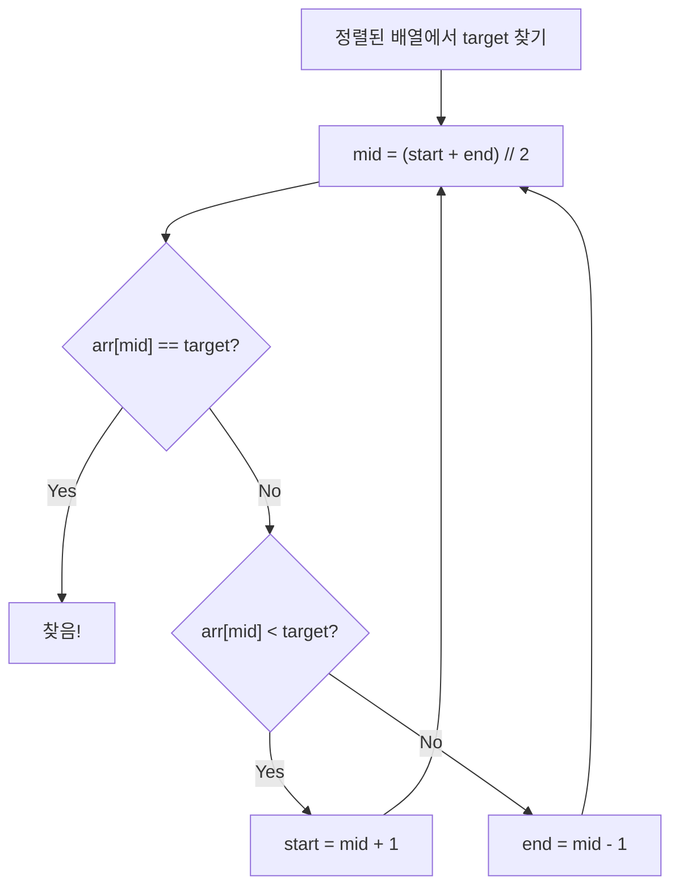

# 이분탐색 (Binary Search) - 코딩테스트 핵심 정리

## 개념 요약

정렬된 배열에서 탐색 범위를 절반씩 줄여가며 O(log n)에 값을 찾는 알고리즘입니다.



---

## 문제 풀이 패턴

### 패턴 1: 존재 여부 판별 (1920)

```python
N = int(input())
arr = sorted(list(map(int, input().split())))

def bisect(arr, target):
    s, e = 0, len(arr) - 1
    while s <= e:
        mid = (s + e) // 2
        if arr[mid] == target:
            return 1
        elif arr[mid] < target:
            s = mid + 1
        else:
            e = mid - 1
    return 0

M = int(input())
for x in map(int, input().split()):
    print(bisect(arr, x))
```

### 패턴 2: 개수 세기 — bisect 모듈 (10816)

```python
from bisect import bisect_left, bisect_right

N = int(input())
arr = sorted(list(map(int, input().split())))
M = int(input())

for x in map(int, input().split()):
    print(bisect_right(arr, x) - bisect_left(arr, x))
```

> `bisect_right - bisect_left` = 해당 값의 개수.

### 패턴 3: 매개변수 탐색 (Parametric Search — 1654)

"최대 길이를 구하라" → "길이 X로 잘랐을 때 N개 이상 만들 수 있는가?"로 변환.

```python
K, N = map(int, input().split())
arr = sorted([int(input()) for _ in range(K)])

s, e = 0, arr[-1]
result = 0

while s <= e:
    mid = (s + e) // 2
    if mid == 0:
        s = 1
        continue
    count = sum(x // mid for x in arr)
    if count >= N:
        result = mid
        s = mid + 1
    else:
        e = mid - 1

print(result)
```

> 핵심: "최적값을 구하라" → "X가 가능한가?" Yes/No 문제로 변환하는 것이 매개변수 탐색입니다.

---

## 실전 꿀팁

### 꿀팁 1: bisect 모듈 정리

```python
from bisect import bisect_left, bisect_right, insort

arr = [1, 3, 3, 3, 5]
bisect_left(arr, 3)    # 1 (3이 들어갈 가장 왼쪽 위치)
bisect_right(arr, 3)   # 4 (3이 들어갈 가장 오른쪽 위치)
insort(arr, 4)         # [1, 3, 3, 3, 4, 5] (정렬 유지하며 삽입)
```

### 꿀팁 2: 이분탐색 vs set 검색

```python
# 단순 존재 여부: set이 더 간단 O(1)
s = set(arr)
print(1 if x in s else 0)

# 개수, 범위, 매개변수 탐색: 이분탐색 필수
```

### 꿀팁 3: while 조건 — `s <= e` vs `s < e`

```python
# s <= e: 값을 정확히 찾을 때 (존재 여부)
# s < e: 범위를 좁힐 때 (lower bound)
# 헷갈리면 s <= e를 기본으로 사용하세요
```
