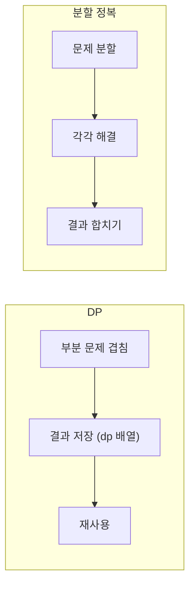
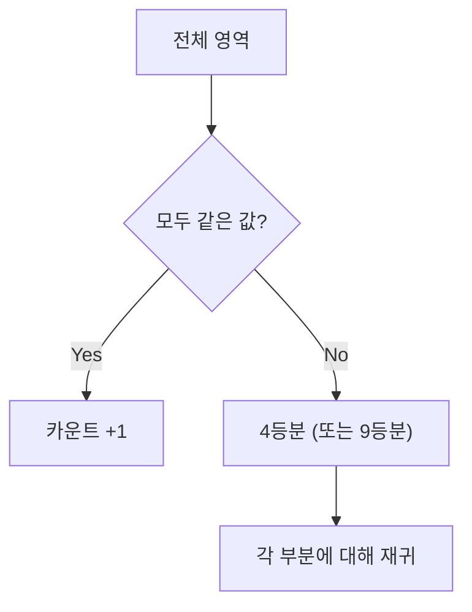

# DP (동적 프로그래밍) & 분할 정복 - 코딩테스트 핵심 정리

## 개념 요약

DP는 큰 문제를 작은 부분 문제로 나누고, 결과를 저장(메모이제이션)하여 중복 계산을 피하는 기법입니다.
분할 정복은 문제를 독립적인 부분으로 나누어 각각 해결한 뒤 합치는 기법입니다.



## DP 점화식 세우는 법

1. dp[i]가 무엇을 의미하는지 정의
2. dp[i]를 이전 값들로 표현 (점화식)
3. 초기값 설정
4. 반복문으로 채우기

---

## 문제 풀이 패턴

### 패턴 1: 1차원 DP (계단 오르기)

#### 계단 오르기

연속 3계단을 밟을 수 없는 조건에서 점수 합 최대화.

```python
N = int(input())
board = [int(input()) for _ in range(N)]

if N == 1:
    print(board[0])
elif N == 2:
    print(board[0] + board[1])
else:
    dp = [0] * N
    dp[0] = board[0]
    dp[1] = board[0] + board[1]
    dp[2] = max(board[2] + board[0], board[2] + board[1])

    for i in range(3, N):
        # i-2에서 점프 OR i-1 + i-3에서 점프
        dp[i] = max(board[i] + dp[i-2], board[i] + board[i-1] + dp[i-3])

    print(dp[-1])
```

> 점화식: `dp[i] = max(board[i] + dp[i-2], board[i] + board[i-1] + dp[i-3])`
> "연속 3개 금지" → 2칸 점프 또는 1칸+2칸 점프 두 가지 경우.

#### 포도주 시식

계단 오르기와 비슷하지만, "안 마시는" 선택지가 추가됩니다.

```python
N = int(input())
board = [int(input()) for _ in range(N)]

if N <= 2:
    print(sum(board))
else:
    dp = [0] * N
    dp[0] = board[0]
    dp[1] = board[0] + board[1]
    dp[2] = max(board[2] + dp[0], board[2] + board[1], dp[1])

    for i in range(3, N):
        dp[i] = max(dp[i-1],                              # 안 마심
                     board[i] + dp[i-2],                   # 1잔째
                     board[i] + board[i-1] + dp[i-3])      # 2잔째

    print(max(dp))
```

> 핵심 차이: 계단은 마지막 계단을 반드시 밟아야 하지만, 포도주는 안 마셔도 됩니다.
> 그래서 `dp[i-1]` (현재 안 마심) 선택지가 추가됩니다.

---

### 패턴 2: 분할 정복 (색종이/쿼드트리)

#### 2630번 - 색종이 만들기 / 1780번 - 종이의 개수

전체가 같은 값이면 카운트, 아니면 4등분(또는 9등분)하여 재귀하는 패턴입니다.



```python
N = int(input())
graph = [list(map(int, input().split())) for _ in range(N)]

def is_all_same(arr):
    val = arr[0][0]
    return all(cell == val for row in arr for cell in row)

cnt = {0: 0, 1: 0}

def divide(g):
    if is_all_same(g):
        cnt[g[0][0]] += 1
        return

    size = len(g) // 2
    for sr in [0, size]:
        for sc in [0, size]:
            sub = [row[sc:sc+size] for row in g[sr:sr+size]]
            divide(sub)

divide(graph)
print(cnt[0])
print(cnt[1])
```

> 핵심: 2등분 → 4조각, 3등분 → 9조각. 재귀 종료 조건은 "모두 같은 값".

#### 1992번 - 쿼드트리 (괄호 포함 출력)

```python
N = int(input())
graph = [list(map(int, input().strip())) for _ in range(N)]
answer = ""

def divide(g):
    global answer
    if is_all_same(g):
        answer += str(g[0][0])
        return

    size = len(g) // 2
    answer += "("
    for sr in [0, size]:
        for sc in [0, size]:
            sub = [row[sc:sc+size] for row in g[sr:sr+size]]
            divide(sub)
    answer += ")"

divide(graph)
print(answer)
```

---

### 패턴 3: Z 탐색 (분할 정복 + 좌표 계산)

#### 1074번 - Z

2^N × 2^N 격자를 Z 순서로 방문할 때, (r, c)의 방문 순서를 구하는 문제입니다.

```python
N, r, c = map(int, input().split())
cnt = 0

while N > 1:
    size = 2 ** (N - 1)
    if r < size and c < size:       # 2사분면 (좌상)
        pass
    elif r < size and c >= size:    # 1사분면 (우상)
        cnt += size * size
        c -= size
    elif r >= size and c < size:    # 3사분면 (좌하)
        cnt += size * size * 2
        r -= size
    elif r >= size and c >= size:   # 4사분면 (우하)
        cnt += size * size * 3
        r -= size
        c -= size
    N -= 1

# 2x2 기저 사례
if [r, c] == [0, 0]: print(cnt)
elif [r, c] == [0, 1]: print(cnt + 1)
elif [r, c] == [1, 0]: print(cnt + 2)
elif [r, c] == [1, 1]: print(cnt + 3)
```

> 핵심: 어느 사분면에 있는지 판단하고, 건너뛴 칸 수를 누적합니다.

---

## 실전 꿀팁

### 꿀팁 1: DP vs 분할 정복 구분

|           | DP                   | 분할 정복                  |
| --------- | -------------------- | -------------------------- |
| 부분 문제 | 겹침 (중복)          | 독립적                     |
| 저장      | dp 배열 필수         | 불필요                     |
| 방향      | Bottom-up / Top-down | Top-down (재귀)            |
| 예시      | 계단, 배낭, LIS      | 색종이, 쿼드트리, 병합정렬 |

### 꿀팁 2: DP 점화식 패턴

```python
# 1. 선택/미선택
dp[i] = max(dp[i-1], dp[i-2] + arr[i])

# 2. 연속 제한
dp[i] = max(arr[i] + dp[i-2], arr[i] + arr[i-1] + dp[i-3])

# 3. 최소 비용
dp[i] = min(dp[i-1], dp[i-2]) + cost[i]
```

### 꿀팁 3: 초기값 설정이 핵심

```python
# N이 1, 2일 때 별도 처리 필수!
if N == 1: print(board[0])
elif N == 2: print(board[0] + board[1])
else:
    dp[0] = board[0]
    dp[1] = board[0] + board[1]
    # ...
```

> DP 문제에서 런타임 에러의 90%는 초기값 처리 누락입니다.
