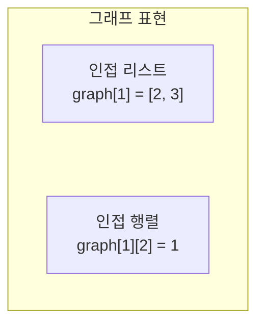
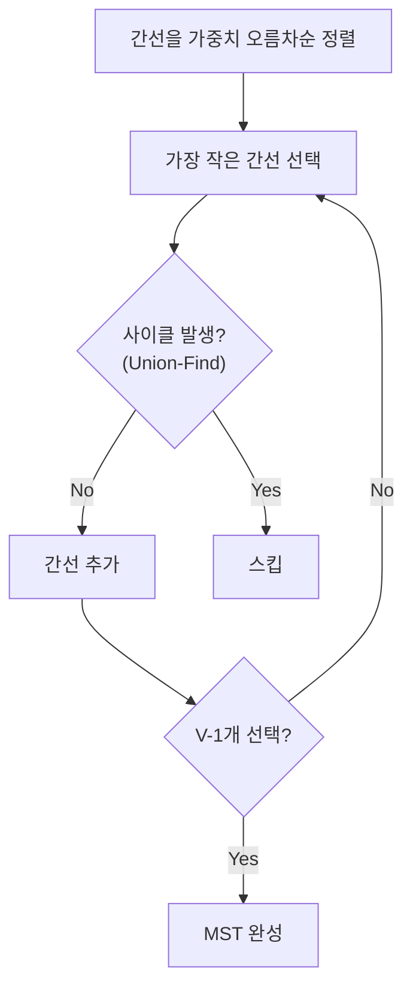

# 그래프 - 코딩테스트 핵심 정리

## 개념 요약

그래프는 정점(노드)과 간선으로 이루어진 자료구조입니다.
BFS/DFS의 기반이 되며, MST, 최단경로, 위상정렬 등 다양한 알고리즘의 토대입니다.



## 그래프 표현 방법

```python
# 인접 리스트 (메모리 효율적, 대부분 이것 사용)
V, E = map(int, input().split())
graph = [[] for _ in range(V + 1)]
for _ in range(E):
    u, v = map(int, input().split())
    graph[u].append(v)
    graph[v].append(u)    # 무방향 그래프

# 인접 행렬 (플로이드 워셜에서 사용)
graph = [[INF] * (V + 1) for _ in range(V + 1)]
```

---

## 문제 풀이 패턴

### 패턴 1: 연결 요소 (Connected Components)

#### 11724번 - 연결 요소의 개수

```python
from collections import deque

N, M = map(int, input().split())
graph = [[] for _ in range(N + 1)]
for _ in range(M):
    u, v = map(int, input().split())
    graph[u].append(v)
    graph[v].append(u)

visited = [False] * (N + 1)
count = 0

for v in range(1, N + 1):
    if not visited[v]:
        count += 1
        q = deque([v])
        visited[v] = True
        while q:
            node = q.popleft()
            for next_v in graph[node]:
                if not visited[next_v]:
                    visited[next_v] = True
                    q.append(next_v)
print(count)
```

#### 2606번 - 바이러스 (DFS)

```python
def dfs(start):
    global count
    visited[start] = True
    for v in graph[start]:
        if not visited[v]:
            count += 1
            dfs(v)

dfs(1)
print(count)
```

---

### 패턴 2: 이분 그래프 판별 (1707)

```python
def dfs(node, color):
    global error
    if error: return
    for next_v in graph[node]:
        if visited[next_v] == 0:
            visited[next_v] = -color
            dfs(next_v, -color)
        elif visited[next_v] == color:   # 같은 색이면 이분 그래프 아님
            error = True
            return
```

> 핵심: 인접 노드에 반대 색을 칠하다가, 같은 색이 나오면 이분 그래프가 아닙니다.

---

### 패턴 3: 최소 신장 트리 (MST — 크루스칼)



```python
V, E = map(int, input().split())
edges = sorted([list(map(int, input().split())) for _ in range(E)], key=lambda x: x[2])
parents = list(range(V + 1))

def find(v):
    if parents[v] == v: return v
    parents[v] = find(parents[v])   # 경로 압축
    return parents[v]

def union(a, b):
    a, b = find(a), find(b)
    if a < b: parents[b] = a
    else: parents[a] = b

total = 0
selected = 0
for a, b, cost in edges:
    if selected == V - 1: break
    if find(a) != find(b):
        union(a, b)
        total += cost
        selected += 1
print(total)
```

> 핵심: Union-Find로 사이클 판별. `find()`에 경로 압축 필수.

---

### 패턴 4: 플로이드 워셜 (모든 쌍 최단 경로)

```python
INF = 1e9
n = int(input())
m = int(input())
graph = [[INF] * (n+1) for _ in range(n+1)]

for i in range(n+1): graph[i][i] = 0
for _ in range(m):
    a, b, c = map(int, input().split())
    graph[a][b] = min(graph[a][b], c)

# 핵심: k를 경유지로 하는 3중 루프
for k in range(1, n+1):
    for i in range(1, n+1):
        for j in range(1, n+1):
            graph[i][j] = min(graph[i][j], graph[i][k] + graph[k][j])
```

> 핵심: `k`가 가장 바깥 루프. O(V³)이므로 V ≤ 500 정도에서만 사용.

---

### 패턴 5: 다익스트라 (단일 출발 최단 경로)

```python
import heapq

def dijkstra(start):
    dist = [INF] * (V + 1)
    dist[start] = 0
    heap = [(0, start)]

    while heap:
        w, v = heapq.heappop(heap)
        if dist[v] < w: continue      # 이미 더 짧은 경로 발견됨
        for next_v, next_w in graph[v]:
            cost = w + next_w
            if cost < dist[next_v]:
                dist[next_v] = cost
                heapq.heappush(heap, (cost, next_v))
    return dist
```

> 핵심: `if dist[v] < w: continue` 한 줄이 성능의 핵심입니다.

---

### 패턴 6: 위상 정렬

```python
from collections import deque

N, M = map(int, input().split())
graph = [[] for _ in range(N + 1)]
indegree = [0] * (N + 1)

for _ in range(M):
    a, b = map(int, input().split())
    graph[a].append(b)
    indegree[b] += 1

q = deque([i for i in range(1, N+1) if indegree[i] == 0])
result = []

while q:
    node = q.popleft()
    result.append(node)
    for next_n in graph[node]:
        indegree[next_n] -= 1
        if indegree[next_n] == 0:
            q.append(next_n)

print(*result)
```

> 핵심: 진입차수 0인 노드부터 처리. DAG(비순환 방향 그래프)에서만 가능.

---

## 실전 꿀팁

### 꿀팁 1: 알고리즘 선택 가이드

| 상황                              | 알고리즘        | 시간복잡도      |
| --------------------------------- | --------------- | --------------- |
| 가중치 없는 최단 경로             | BFS             | O(V+E)          |
| 가중치 있는 최단 경로 (단일 출발) | 다익스트라      | O(E log V)      |
| 모든 쌍 최단 경로                 | 플로이드 워셜   | O(V³)           |
| 최소 비용 연결                    | 크루스칼 (MST)  | O(E log E)      |
| 순서 결정                         | 위상 정렬       | O(V+E)          |
| 도달 가능성                       | 플로이드 or DFS | O(V³) or O(V+E) |

### 꿀팁 2: Union-Find 경로 압축

```python
# 경로 압축 없이 → O(n) per find
def find(v):
    if parents[v] == v: return v
    return find(parents[v])

# 경로 압축 있으면 → 거의 O(1) per find
def find(v):
    if parents[v] == v: return v
    parents[v] = find(parents[v])   # 이 한 줄이 핵심!
    return parents[v]
```
