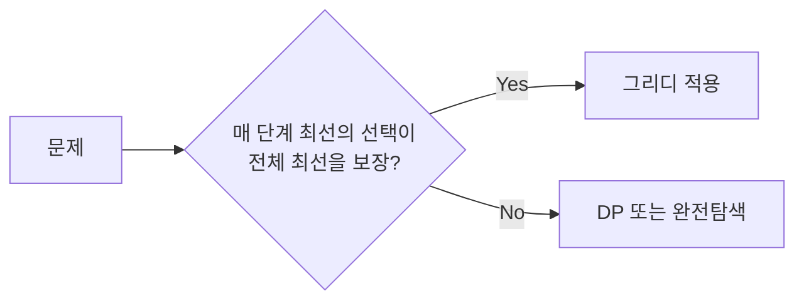
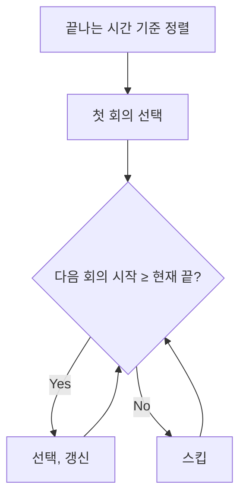
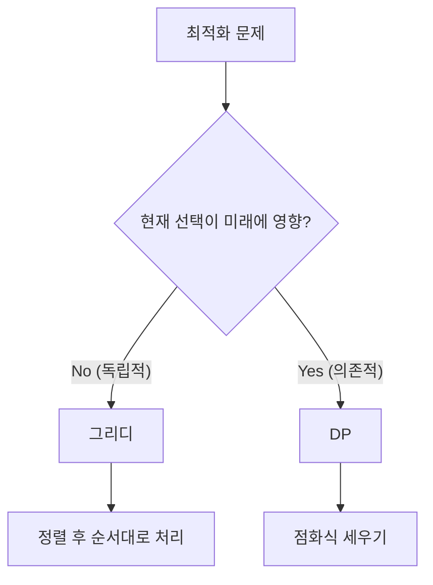

# 그리디 (Greedy) - 코딩테스트 핵심 정리

## 개념 요약

그리디는 매 순간 가장 좋아 보이는 선택을 하는 알고리즘입니다.
"현재 최선 = 전체 최선"이 보장될 때만 사용할 수 있습니다.



## 그리디 문제 판별법

- "최소 횟수", "최대 이익" 같은 최적화 문제
- 정렬 후 앞/뒤에서 순서대로 처리하면 풀리는 문제
- 반례를 찾기 어려운 직관적인 풀이가 떠오르는 문제

> 그리디는 증명이 어렵습니다. 반례가 없으면 일단 시도해보세요.

---

## 문제 풀이 패턴

### 패턴 1: 동전/거스름돈 (큰 것부터)

#### 11047번 - 동전 0

가장 큰 동전부터 사용하여 최소 동전 수를 구하는 문제입니다.

```python
import sys
input = sys.stdin.readline

N, K = map(int, input().split())
coins = [int(input()) for _ in range(N)]
coins.reverse()    # 큰 동전부터

count = 0
for coin in coins:
    count += K // coin    # 몫 = 사용 개수
    K %= coin             # 나머지
print(count)
```

> 핵심: `//`(몫)과 `%`(나머지)로 한 번에 처리합니다. while 반복보다 훨씬 빠릅니다.

---

### 패턴 2: 정렬 후 순서대로 처리

#### 11399번 - ATM (대기 시간 최소화)

```python
N = int(input())
arr = sorted(list(map(int, input().split())))

total = 0
ex_time = 0
for i in range(N):
    ex_time += arr[i]
    total += ex_time
print(total)
```

> 핵심: 시간이 짧은 사람부터 처리하면 전체 대기 시간이 최소가 됩니다.

#### 1026번 - 보물 (곱의 합 최소화)

A를 오름차순, B를 내림차순으로 정렬 후 곱하면 합이 최소가 됩니다.

```python
N = int(input())
a = sorted(list(map(int, input().split())))
b = sorted(list(map(int, input().split())), reverse=True)
print(sum(a[i] * b[i] for i in range(N)))
```

---

### 패턴 3: 활동 선택 (끝나는 시간 기준 정렬)

#### 1931번 - 회의실 배정

겹치지 않게 최대한 많은 회의를 배정하는 문제입니다.



```python
import sys
input = sys.stdin.readline

N = int(input())
arr = [list(map(int, input().split())) for _ in range(N)]
arr.sort(key=lambda x: (x[1], x[0]))   # 끝나는 시간 → 시작 시간

count = 1
end_time = arr[0][1]
for i in range(1, N):
    if arr[i][0] >= end_time:
        count += 1
        end_time = arr[i][1]
print(count)
```

> 핵심: 끝나는 시간이 빠른 순으로 정렬하면, 가장 많은 활동을 선택할 수 있습니다.

---

### 패턴 4: 뒤에서부터 탐색

#### 11501번 - 주식 (뒤에서부터 최대값 추적)

```python
T = int(input())
for _ in range(T):
    N = int(input())
    stock = list(map(int, input().split()))

    total = 0
    max_price = stock[-1]
    for idx in range(N - 1, -1, -1):
        if max_price < stock[idx]:
            max_price = stock[idx]
        else:
            total += max_price - stock[idx]
    print(total)
```

> 핵심: 뒤에서부터 최대값을 추적하면서, 현재 가격과의 차이를 누적합니다.

#### 2847번 - 게임을 만든 , (뒤에서부터 감소 보장)

```python
N = int(input())
arr = [int(input()) for _ in range(N)]

max_value = arr[-1]
total = 0
for idx in range(N - 2, -1, -1):
    if arr[idx] >= max_value:
        total += arr[idx] - (max_value - 1)
        max_value = max_value - 1
    else:
        max_value = arr[idx]
print(total)
```

---

### 패턴 5: 문자열 파싱 그리디

#### 1541번 - 잃어버린 괄호 (최소값 만들기)

`-` 뒤의 모든 수를 빼면 최소가 됩니다.

```python
arr = input().split("-")
total = 0
for idx, ele in enumerate(arr):
    temp_sum = sum(int(e) for e in ele.split("+"))
    if idx == 0:
        total = temp_sum
    else:
        total -= temp_sum
print(total)
```

> 핵심: `-`로 먼저 분리하면, 첫 그룹은 더하고 나머지는 모두 빼면 됩니다.

#### 1439번 - 뒤집기 (그룹 카운팅)

```python
arr = list(map(int, input()))
block_cnt = {0: 0, 1: 0}

ex = arr[0]
for now in arr:
    if now != ex:
        block_cnt[ex] += 1
    ex = now
block_cnt[arr[-1]] += 1

print(min(block_cnt[0], block_cnt[1]))
```

> 핵심: 0 그룹과 1 그룹 중 적은 쪽을 뒤집으면 최소 횟수입니다.

---

### 패턴 6: 구간 합치기 (Line Sweep)

#### 2170번 - 선 긋기

겹치는 선분을 합쳐서 총 길이를 구하는 문제입니다.

```python
import sys
read = sys.stdin.readline

N = int(read())
dots = sorted([list(map(int, read().split())) for _ in range(N)])

line = [dots[0]]
cursor = 0
for start, end in dots[1:]:
    if line[cursor][1] >= start:
        line[cursor][1] = max(end, line[cursor][1])
    else:
        line.append([start, end])
        cursor += 1

print(sum(end - start for start, end in line))
```

> 핵심: 시작점 기준 정렬 후, 겹치면 합치고 안 겹치면 새 구간을 추가합니다.

---

### 패턴 7: 로프/무게 (정렬 후 곱하기)

#### 2217번 - 로프

```python
N = int(input())
loop = sorted([int(input()) for _ in range(N)], reverse=True)

max_w = 0
for i in range(N):
    max_w = max(max_w, loop[i] * (i + 1))
print(max_w)
```

> 핵심: 내림차순 정렬 후, `i번째 로프 × (i+1)개`의 최대값이 답입니다.

---

## 실전 꿀팁 & 자주 나오는 패턴

### 꿀팁 1: 그리디 정렬 기준 정리

| 문제 유형      | 정렬 기준              | 대표 문제 |
| -------------- | ---------------------- | --------- |
| 활동 선택      | 끝나는 시간 오름차순   | 1931      |
| 대기 시간 최소 | 소요 시간 오름차순     | 11399     |
| 곱의 합 최소   | A 오름차순, B 내림차순 | 1026      |
| 구간 합치기    | 시작점 오름차순        | 2170      |
| 무게/로프      | 내림차순               | 2217      |
| 주식 매매      | 뒤에서부터 역순 탐색   | 11501     |

### 꿀팁 2: "정렬하면 풀리나?" 먼저 생각하기

그리디 문제의 80%는 적절한 기준으로 정렬하면 풀립니다.
정렬 기준을 못 찾겠으면 끝나는 시간, 시작 시간, 크기 순으로 시도해보세요.

### 꿀팁 3: 그리디 vs DP 구분법



### 꿀팁 4: heapq로 그리디 최적화

정렬 후 순차 처리 대신, 힙으로 동적으로 최솟값/최댓값을 관리하면 더 효율적인 경우가 있습니다.

```python
import heapq

# 최소 힙 (기본)
heapq.heappush(heap, value)
heapq.heappop(heap)          # 최솟값 꺼내기

# 최대 힙 (음수 트릭)
heapq.heappush(heap, -value)
-heapq.heappop(heap)         # 최댓값 꺼내기
```

### 꿀팁 5: 자주 실수하는 함정들

```python
# 1. 정렬 기준이 2개 이상일 때
arr.sort(key=lambda x: (x[1], x[0]))   # 끝 시간 → 시작 시간

# 2. 뒤에서부터 탐색할 때 range 방향
for i in range(N - 1, -1, -1):   # N-1부터 0까지

# 3. // vs / 차이
K // coin    # 정수 나눗셈 (몫)
K / coin     # 실수 나눗셈

# 4. 그리디인 줄 알았는데 반례가 있는 경우
# → 작은 예제로 반례를 먼저 찾아보세요
# → 반례가 있으면 DP나 완전탐색으로 전환
```
