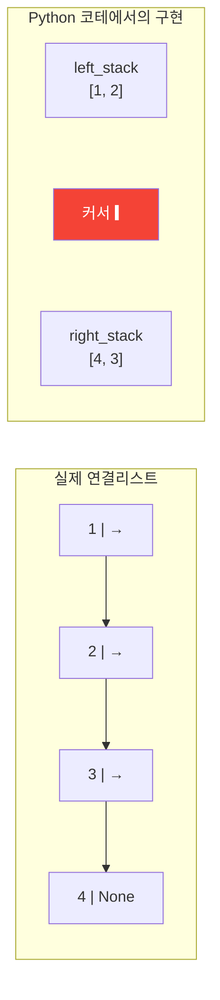
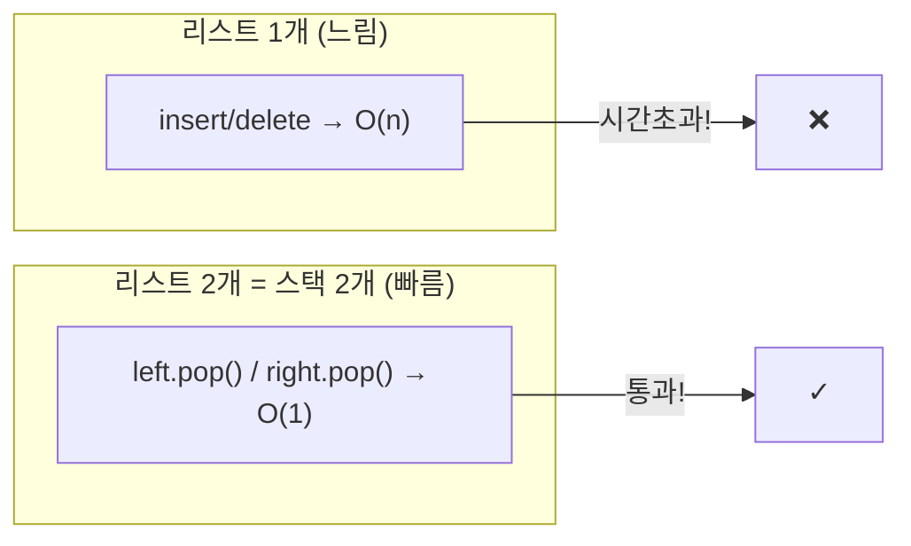
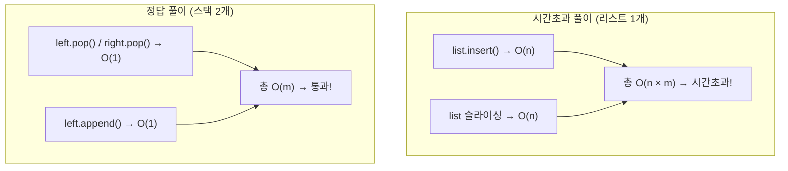
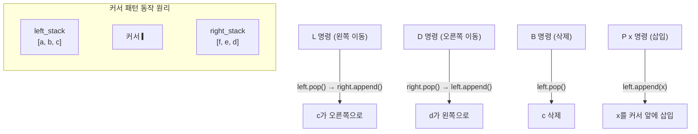
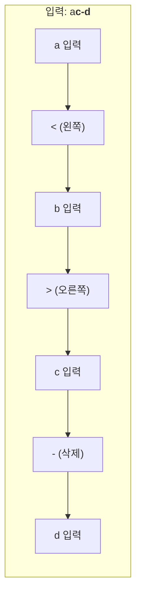
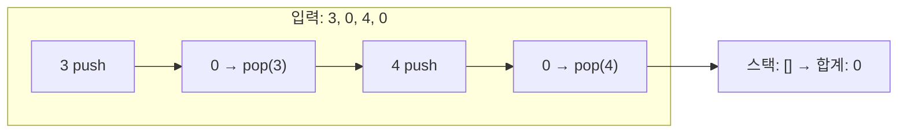
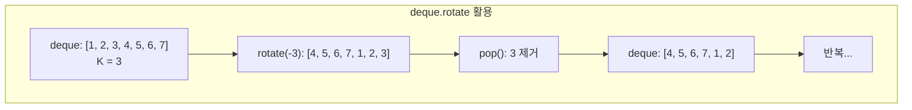
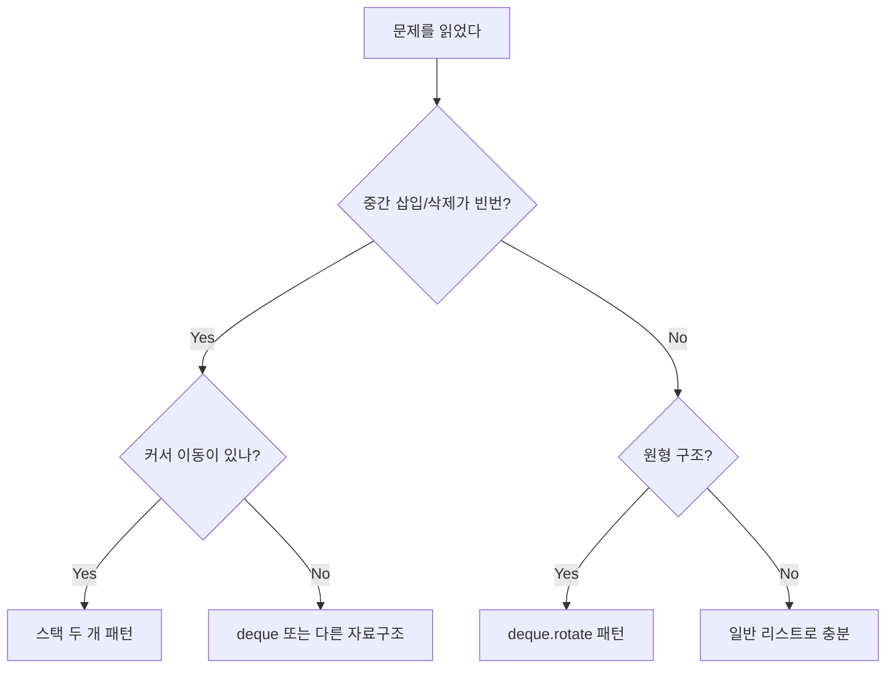

# 연결리스트 (Linked List) - 코딩테스트 핵심 정리

## 개념 요약

연결리스트는 각 노드가 데이터와 다음 노드의 참조를 가지는 자료구조입니다.
Python 코테에서는 실제 연결리스트를 구현하기보다, 리스트 두 개(커서 패턴)나 deque로 연결리스트의 동작을 흉내내는 것이 핵심입니다.



## 왜 리스트 두 개로 구현하는가?

Python의 `list`는 중간 삽입/삭제가 O(n)입니다.
커서 이동이 빈번한 문제에서 리스트 하나로 풀면 시간초과가 납니다.



| 연산             | list 1개 | 스택 2개 (커서 패턴)               |
| ---------------- | -------- | ---------------------------------- |
| 커서 왼쪽 이동   | O(1)     | O(1) — left.pop() → right.append() |
| 커서 오른쪽 이동 | O(1)     | O(1) — right.pop() → left.append() |
| 커서 위치에 삽입 | O(n)     | O(1) — left.append()               |
| 커서 왼쪽 삭제   | O(n)     | O(1) — left.pop()                  |

---

## 문제 풀이 패턴

### 패턴 1: 커서 에디터 (스택 두 개)

커서를 기준으로 왼쪽 스택, 오른쪽 스택으로 나누는 핵심 패턴입니다.

#### 1406번 - 에디터

문자열에서 커서를 이동하며 삽입/삭제하는 문제입니다.
시간초과를 피하려면 반드시 스택 두 개 패턴을 사용해야 합니다.





```python
import sys

l_text = list(sys.stdin.readline().strip())   # 커서 왼쪽
r_text = []                                    # 커서 오른쪽 (역순)

for c in range(int(input())):
    cmds = sys.stdin.readline().strip().split()

    if cmds[0] == "L":
        len(l_text) > 0 and r_text.append(l_text.pop())
    elif cmds[0] == "D":
        len(r_text) > 0 and l_text.append(r_text.pop())
    elif cmds[0] == "B":
        len(l_text) > 0 and l_text.pop()
    else:
        l_text.append(cmds[1])

print("".join(l_text + list(reversed(r_text))))
```

> 핵심: 커서 왼쪽 = left_stack, 커서 오른쪽 = right_stack (역순 저장).
> 최종 출력 시 `left + reversed(right)`로 합칩니다.

---

### 패턴 2: 키로거 (에디터 변형)

#### 5397번 - 키로거

키보드 입력에서 `<`, `>`, `-` 를 처리하여 최종 비밀번호를 구하는 문제입니다.
1406번 에디터와 완전히 동일한 패턴입니다.



```python
import sys

for c in range(int(input())):
    t = list(sys.stdin.readline().strip())
    l = []    # 커서 왼쪽
    r = []    # 커서 오른쪽

    for c in t:
        if c == "<":
            len(l) > 0 and r.append(l.pop())
        elif c == ">":
            len(r) > 0 and l.append(r.pop())
        elif c == "-":
            len(l) > 0 and l.pop()
        else:
            l.append(c)

    print("".join(l) + "".join(reversed(r)))
```

> 핵심: 에디터 문제와 명령어만 다르고 구조는 동일합니다.
> `L`→`<`, `D`→`>`, `B`→`-`, `P x`→문자 입력

---

### 패턴 3: 되돌리기 (Undo)

#### 10773번 - 제로

숫자를 입력받다가 0이 나오면 가장 최근 수를 지우는 문제입니다.



```python
k = int(input())
s = []

for i in range(k):
    num = int(input())
    if num == 0:
        s.pop()
    else:
        s.append(num)

print(sum(s))
```

> 핵심: 가장 단순한 스택 활용입니다. 0이면 pop, 아니면 push.

---

### 패턴 4: 원형 큐 (요세푸스)

#### 1158번 - 요세푸스 문제

N명이 원형으로 앉아 K번째 사람을 제거하는 문제입니다.



```python
from collections import deque

n, k = map(int, input().split())
q = deque(range(1, n + 1))
o = []

while q:
    q.rotate(-k)       # 왼쪽으로 k칸 회전
    o.append(q.pop())   # 맨 뒤(= k번째) 제거

print(f'<{", ".join(map(str, o))}>')
```

인덱스 계산 방식으로도 풀 수 있습니다:

```python
# 방법 2: 인덱스 계산 (deque 없이)
n, k = map(int, input().split())
c_arr = list(range(1, n + 1))
answer = []
start = 0

while c_arr:
    curr = (start + k - 1) % len(c_arr)
    answer.append(str(c_arr.pop(curr)))
    start = curr

print("<" + ", ".join(answer) + ">")
```

> 핵심: `deque.rotate(-k+1)` + `popleft()` 또는 `(start + k - 1) % len` 인덱스 계산.
> rotate 방식이 더 직관적이고, 인덱스 방식은 deque 없이도 가능합니다.

---

## 실전 꿀팁 & 자주 나오는 패턴

### 꿀팁 1: "커서가 있는 문제"는 무조건 스택 두 개

문제에서 커서 이동, 삽입, 삭제가 나오면 스택 두 개 패턴을 바로 적용하세요.

```python
# 커서 패턴 기본 틀 (외워두세요)
left = []     # 커서 왼쪽
right = []    # 커서 오른쪽 (역순)

# 왼쪽 이동
if left:
    right.append(left.pop())

# 오른쪽 이동
if right:
    left.append(right.pop())

# 커서 앞에 삽입
left.append(x)

# 커서 앞 글자 삭제
if left:
    left.pop()

# 최종 결과
result = ''.join(left + list(reversed(right)))
# 또는
result = ''.join(left) + ''.join(reversed(right))
```

### 꿀팁 2: `and` 연산자로 조건부 실행 (Python 트릭)

코드에서 보셨듯이, Python의 `and` 단축 평가를 활용한 패턴입니다.

```python
# 일반적인 방법
if len(l_text) > 0:
    r_text.append(l_text.pop())

# 단축 평가 활용 (한 줄)
len(l_text) > 0 and r_text.append(l_text.pop())

# 더 Pythonic한 방법
if l_text:
    r_text.append(l_text.pop())
```

> `and`의 왼쪽이 False면 오른쪽은 실행되지 않습니다 (단축 평가).
> 가독성 면에서는 `if` 문이 더 낫지만, 코테에서는 한 줄로 쓰는 것도 흔합니다.

### 꿀팁 3: deque.rotate() 활용법

```python
from collections import deque

d = deque([1, 2, 3, 4, 5])

d.rotate(2)     # 오른쪽으로 2칸 → [4, 5, 1, 2, 3]
d.rotate(-2)    # 왼쪽으로 2칸 → [3, 4, 5, 1, 2]

# 원형 큐에서 k번째 원소 접근
d.rotate(-k)    # k번째를 맨 뒤로
d.pop()         # 제거
```

> `rotate(n)`: 양수면 오른쪽, 음수면 왼쪽으로 회전합니다.
> 요세푸스, 원형 버퍼 등 원형 구조 문제에서 유용합니다.

### 꿀팁 4: 연결리스트 문제인지 판별하는 법



### 꿀팁 5: reversed() vs [::-1]

```python
r_text = [3, 2, 1]

# reversed() — 이터레이터 반환, 메모리 효율적
list(reversed(r_text))        # [1, 2, 3]
''.join(reversed(['a','b']))  # "ba"

# [::-1] — 새 리스트 생성
r_text[::-1]                  # [1, 2, 3]

# 성능 차이
# reversed(): O(1) 메모리 (이터레이터)
# [::-1]: O(n) 메모리 (새 리스트 복사)
# join과 함께 쓸 때는 reversed()가 더 효율적
```

### 꿀팁 6: sys.stdin.readline이 필수인 이유

커서/에디터 문제는 명령어가 수십만 개 들어옵니다.
`input()` 대신 `sys.stdin.readline()`을 쓰지 않으면 거의 확실히 시간초과입니다.

```python
import sys
read = sys.stdin.readline

# 주의: readline()은 끝에 \n 포함
cmd = read().strip()           # strip() 필수
cmds = read().strip().split()  # 공백 분리 시에도 strip() 먼저
```

### 꿀팁 7: 자주 실수하는 함정들

```python
# 1. 빈 스택에서 pop 시도
left.pop()    # left가 비어있으면 IndexError!
# 항상 if left: 체크

# 2. right_stack의 역순 출력 잊기
# right는 역순으로 저장되므로 출력 시 reversed() 필수
print(''.join(left + list(reversed(right))))

# 3. 요세푸스에서 rotate 방향 혼동
q.rotate(-k)   # 왼쪽으로 k칸 = k번째가 맨 뒤로
q.rotate(k)    # 오른쪽으로 k칸 = 반대 방향!

# 4. f-string 포맷팅
# 요세푸스 출력: <1, 2, 3> 형태
print(f'<{", ".join(map(str, o))}>')
# map(str, o)로 정수를 문자열로 변환 필수

# 5. 에디터 문제에서 명령어 파싱
cmds = read().strip().split()
# "P abc" → cmds = ["P", "abc"]
# "L" → cmds = ["L"]
# cmds[1]에 접근 시 인덱스 에러 주의

# 6. 에디터에서 left/right 방향 혼동
# 1406번 bong 풀이에서는 r_text가 커서 왼쪽, l_text가 커서 오른쪽
# 변수명에 속지 말고 로직을 정확히 이해하세요
```

### 꿀팁 8: 시간초과 원인 분석 (에디터 문제)

에디터 문제에서 시간초과가 나는 이유를 정확히 이해하면 다른 문제에도 적용할 수 있습니다.

```python
# 시간초과 풀이: 리스트 슬라이싱으로 커서 이동
text = list("abcde")
cursor = 3
# 삽입: text = text[:cursor] + [x] + text[cursor:]  → O(n)
# 삭제: text = text[:cursor-1] + text[cursor:]       → O(n)
# 명령 m개 × 각 O(n) = O(n*m) → 시간초과

# 정답 풀이: 스택 두 개
left = list("abc")    # 커서 왼쪽
right = list("ed")    # 커서 오른쪽 (역순)
# 삽입: left.append(x)  → O(1)
# 삭제: left.pop()      → O(1)
# 명령 m개 × 각 O(1) = O(m) → 통과
```

> 리스트 중간 삽입/삭제가 O(n)이라는 것을 항상 기억하세요.
> "커서가 있는 문제"에서 리스트 하나로 풀면 거의 확실히 시간초과입니다.
