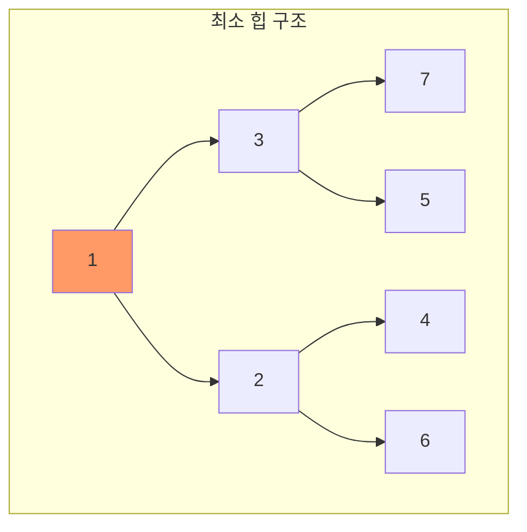
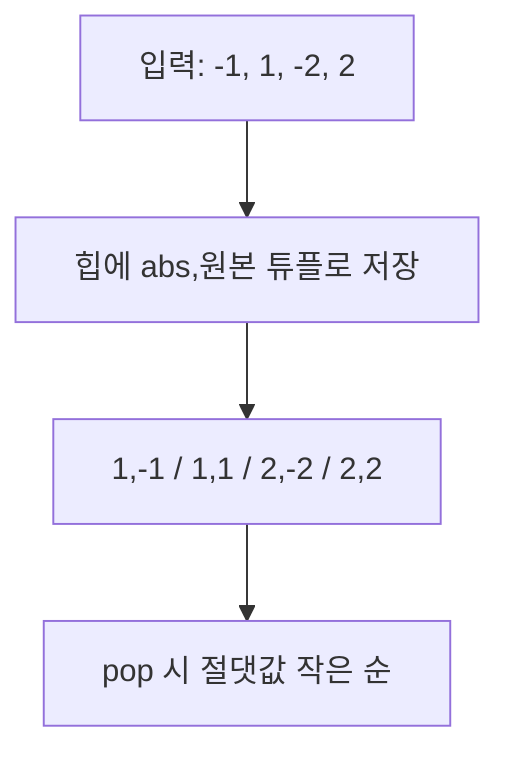
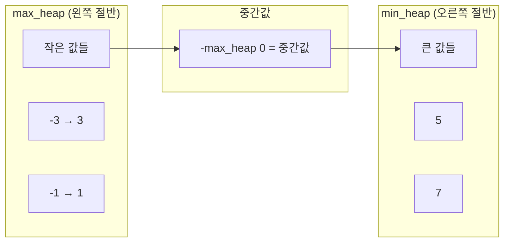
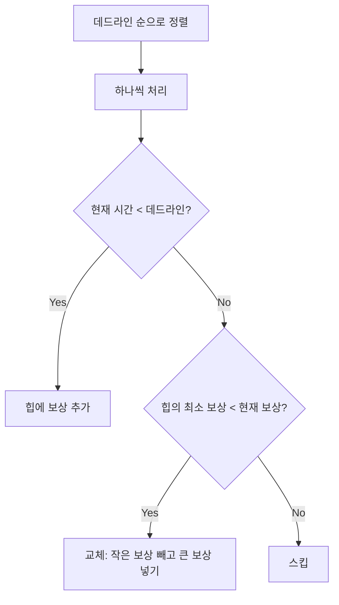
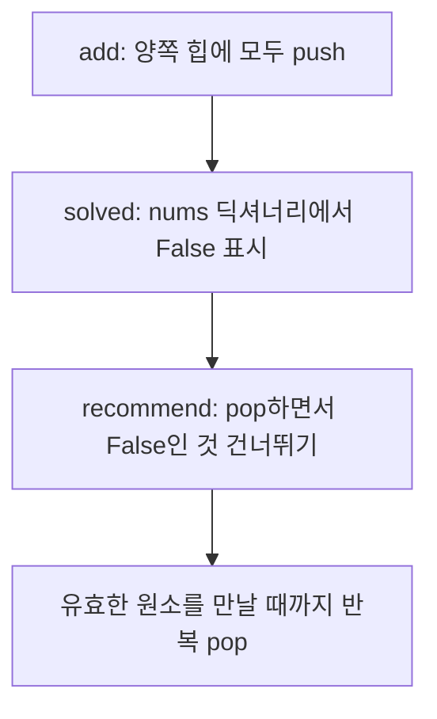

# 우선순위 큐 (Priority Queue) - 코딩테스트 핵심 정리

## 개념 요약

우선순위 큐는 삽입 순서와 관계없이 우선순위가 높은 원소가 먼저 나오는 자료구조입니다.
Python의 `heapq`는 최소 힙(min-heap)을 제공하며, 삽입/삭제 모두 O(log n)입니다.



### heapq 핵심 메서드

| 메서드              | 설명                     | 시간복잡도 |
| ------------------- | ------------------------ | ---------- |
| `heappush(h, x)`    | 원소 삽입                | O(log n)   |
| `heappop(h)`        | 최솟값 제거 및 반환      | O(log n)   |
| `h[0]`              | 최솟값 확인 (제거 안 함) | O(1)       |
| `heapify(lst)`      | 리스트를 힙으로 변환     | O(n)       |
| `heappushpop(h, x)` | push 후 pop (최적화)     | O(log n)   |

---

## 문제 풀이 패턴

### 패턴 1: 절댓값 힙 (11286)

절댓값이 작은 순, 같으면 원래 값이 작은 순으로 꺼내는 힙입니다.



```python
import heapq
import sys

N = int(sys.stdin.readline())
q = []

for _ in range(N):
    x = int(sys.stdin.readline())
    if x == 0:
        if q:
            print(heapq.heappop(q)[1])  # 원본 값 출력
        else:
            print(0)
    else:
        heapq.heappush(q, (abs(x), x))  # (절댓값, 원본) 튜플
```

> 핵심: 튜플을 넣으면 첫 번째 원소 기준 정렬, 같으면 두 번째 원소 기준. 이 성질을 활용해 커스텀 정렬을 구현합니다.

### 패턴 2: 중간값 구하기 - 이중 힙 (1655)

숫자가 하나씩 들어올 때마다 중간값을 O(log n)에 구하는 테크닉입니다.



```python
import heapq
import sys

N = int(sys.stdin.readline())
max_q = []  # 왼쪽 절반 (최대힙 → 음수로 저장)
min_q = []  # 오른쪽 절반 (최소힙)

for _ in range(N):
    x = int(sys.stdin.readline())

    # 번갈아가며 삽입 (max_q 크기 >= min_q 크기 유지)
    if len(max_q) <= len(min_q):
        heapq.heappush(max_q, -x)
    else:
        heapq.heappush(min_q, x)

    # max_q의 최대 > min_q의 최소이면 교환
    if min_q and max_q and -max_q[0] > min_q[0]:
        max_v = -heapq.heappop(max_q)
        min_v = heapq.heappop(min_q)
        heapq.heappush(min_q, max_v)
        heapq.heappush(max_q, -min_v)

    print(-max_q[0])  # 중간값은 항상 max_q의 top
```

> 핵심: 왼쪽 절반(max_heap)과 오른쪽 절반(min_heap)으로 나누어 관리. max_heap의 top이 항상 중간값입니다.

### 패턴 3: 그리디 + 힙 - 데드라인 문제 (1781)

데드라인이 있는 작업에서 최대 보상을 얻는 문제입니다.



```python
import heapq
import sys

N = int(sys.stdin.readline())
q = []

for _ in range(N):
    d, cnt = map(int, sys.stdin.readline().split())
    heapq.heappush(q, (d, cnt))

answer = []
while q:
    d, cnt = heapq.heappop(q)
    if len(answer) < d:
        heapq.heappush(answer, cnt)       # 여유 있으면 추가
    else:
        if answer[0] < cnt:
            heapq.heappop(answer)          # 작은 보상 제거
            heapq.heappush(answer, cnt)    # 큰 보상으로 교체

print(sum(answer))
```

> 핵심: 힙의 크기를 데드라인 이하로 유지하면서, 항상 최소 보상을 교체 대상으로 삼습니다.

### 패턴 4: N번째 큰 수 (2075)

N×N 행렬에서 N번째 큰 수를 메모리 효율적으로 구합니다.

```python
import heapq
import sys

N = int(sys.stdin.readline())
q = []

for _ in range(N):
    for ele in map(int, sys.stdin.readline().split()):
        if len(q) >= N:
            if q[0] < ele:
                heapq.heappop(q)       # 가장 작은 것 제거
                heapq.heappush(q, ele) # 더 큰 값 추가
        else:
            heapq.heappush(q, ele)

print(q[0])  # 힙의 최솟값 = N번째 큰 수
```

> 핵심: 힙 크기를 N으로 제한하면, 힙의 top이 곧 N번째 큰 수입니다. 전체를 정렬하지 않아도 됩니다.

### 패턴 5: Lazy Deletion - 이중 힙 (21939)

삭제 연산이 있는 우선순위 큐에서, 실제 삭제 대신 "삭제 표시"만 하고 pop 시점에 걸러내는 기법입니다.



```python
import heapq

N = int(input())
max_heap = []
min_heap = []
nums = {}  # {문제번호: 존재여부}

for _ in range(N):
    P, L = map(int, input().split())
    heapq.heappush(max_heap, (-L, -P))
    heapq.heappush(min_heap, (L, P))
    nums[P] = True

M = int(input())
for _ in range(M):
    cmds = input().split()

    if cmds[0] == "add":
        p, l = int(cmds[1]), int(cmds[2])
        # 삭제된 원소 정리
        while max_heap and not nums.get(-max_heap[0][1], False):
            heapq.heappop(max_heap)
        while min_heap and not nums.get(min_heap[0][1], False):
            heapq.heappop(min_heap)
        heapq.heappush(max_heap, (-l, -p))
        heapq.heappush(min_heap, (l, p))
        nums[p] = True

    elif cmds[0] == "solved":
        nums[int(cmds[1])] = False  # 실제 삭제 안 함, 표시만

    elif cmds[0] == "recommend":
        t = int(cmds[1])
        if t == 1:
            while max_heap and not nums.get(-max_heap[0][1], False):
                heapq.heappop(max_heap)
            print(-max_heap[0][1])
        else:
            while min_heap and not nums.get(min_heap[0][1], False):
                heapq.heappop(min_heap)
            print(min_heap[0][1])
```

> 핵심: 힙에서 임의 원소 삭제는 O(n)이지만, Lazy Deletion으로 O(log n)에 처리합니다. 딕셔너리로 유효성을 관리하고, pop 시점에 무효한 원소를 건너뜁니다.

---

## 꿀팁 모음

### 1. 최대 힙 구현

Python `heapq`는 최소 힙만 지원합니다. 최대 힙은 음수 트릭으로:

```python
import heapq
h = []
heapq.heappush(h, -value)       # 삽입 시 음수
max_val = -heapq.heappop(h)     # 꺼낼 때 다시 음수
```

### 2. 튜플로 복합 정렬

```python
# (우선순위, 값) 형태로 넣으면 우선순위 기준 정렬
heapq.heappush(h, (priority, value))

# 우선순위 같으면 value 기준 정렬
# value가 비교 불가능한 객체면 카운터 추가
heapq.heappush(h, (priority, counter, value))
```

### 3. heapify vs 반복 push

```python
# O(n) - 리스트가 이미 있을 때
lst = [5, 3, 1, 4, 2]
heapq.heapify(lst)

# O(n log n) - 하나씩 push
h = []
for x in [5, 3, 1, 4, 2]:
    heapq.heappush(h, x)
```

이미 리스트가 있다면 `heapify`가 더 빠릅니다.

### 4. Top-K 문제 패턴

K번째 큰/작은 수를 구할 때:

```python
# K번째 큰 수: 크기 K의 최소 힙 유지
h = []
for x in data:
    heapq.heappush(h, x)
    if len(h) > K:
        heapq.heappop(h)
# h[0]이 K번째 큰 수

# K번째 작은 수: 크기 K의 최대 힙 유지
h = []
for x in data:
    heapq.heappush(h, -x)
    if len(h) > K:
        heapq.heappop(h)
# -h[0]이 K번째 작은 수
```

### 5. 힙 vs 정렬 선택 기준

| 상황                            | 추천                  |
| ------------------------------- | --------------------- |
| 전체 정렬 필요                  | `sorted()`            |
| 최솟값/최댓값만 반복 필요       | `heapq`               |
| 동적으로 삽입하면서 최솟값 필요 | `heapq`               |
| 상위 K개만 필요                 | `heapq` (크기 K 유지) |
| 중간값 실시간 추적              | 이중 힙               |

### 6. 자주 하는 실수

- `heapq`는 모듈이지 클래스가 아닙니다. `h = heapq()`가 아니라 `h = []`로 시작
- `heappop` 전에 빈 리스트 체크: `if h:` 필수
- 최대 힙에서 음수 넣고 꺼낼 때 음수 빼먹기
- Lazy Deletion 시 딕셔너리 업데이트 누락
