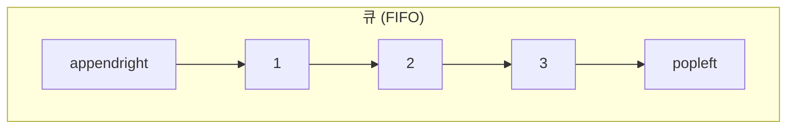
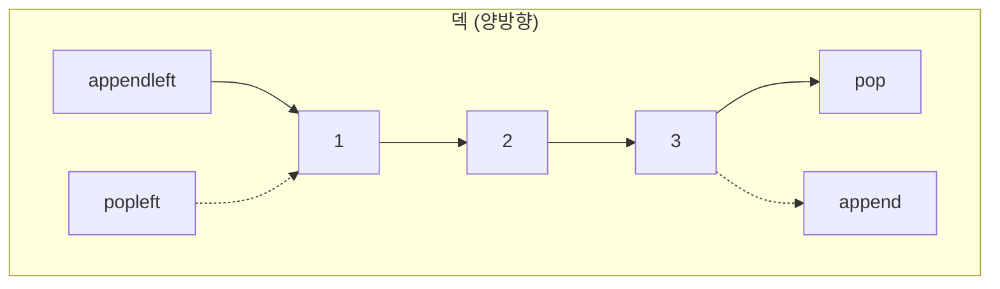
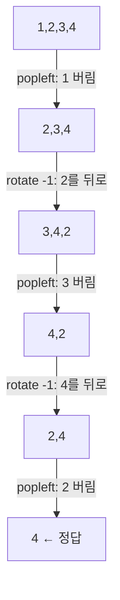
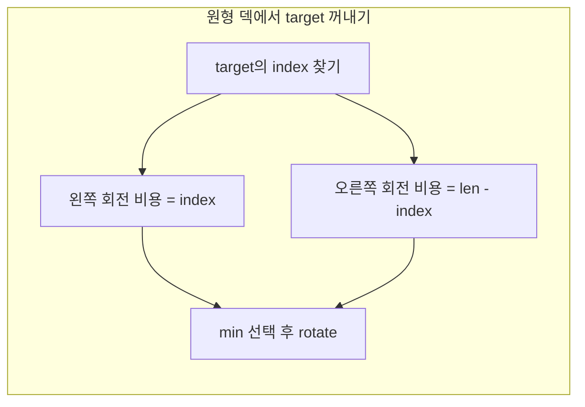
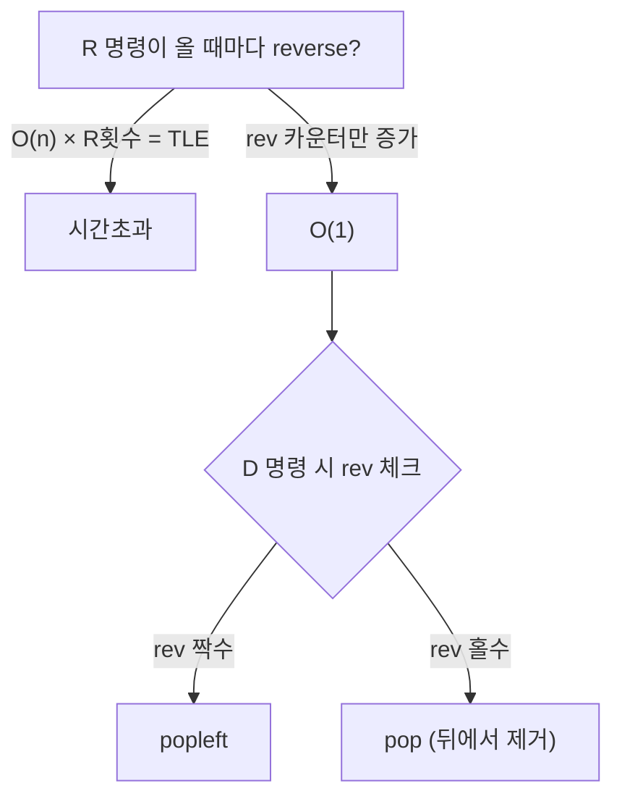

# 큐와 덱 (Queue & Deque) - 코딩테스트 핵심 정리

## 개념 요약

큐(Queue)는 FIFO(First In First Out), 덱(Deque)은 양쪽 끝에서 삽입/삭제가 가능한 자료구조입니다.
Python에서는 `collections.deque`로 둘 다 구현합니다. `list`의 `pop(0)`은 O(n)이므로 절대 쓰지 마세요.





### deque 핵심 메서드 정리

| 메서드          | 설명                              | 시간복잡도 |
| --------------- | --------------------------------- | ---------- |
| `append(x)`     | 오른쪽 끝에 추가                  | O(1)       |
| `appendleft(x)` | 왼쪽 끝에 추가                    | O(1)       |
| `pop()`         | 오른쪽 끝 제거                    | O(1)       |
| `popleft()`     | 왼쪽 끝 제거                      | O(1)       |
| `rotate(n)`     | 오른쪽으로 n칸 회전 (음수면 왼쪽) | O(n)       |
| `q[0]`, `q[-1]` | front, back 접근                  | O(1)       |

---

## 문제 풀이 패턴

### 패턴 1: 큐 기본 구현 (10845, 18258)

명령어 기반 큐 구현. `deque`로 모든 연산을 O(1)에 처리합니다.

```python
from collections import deque
import sys

n = int(input())
q = deque()
answer = []

for i in range(n):
    cmds = sys.stdin.readline().split()
    if cmds[0] == "push":
        q.append(cmds[1])
    elif cmds[0] == "pop":
        answer.append(q.popleft() if q else -1)
    elif cmds[0] == "size":
        answer.append(len(q))
    elif cmds[0] == "empty":
        answer.append(0 if q else 1)
    elif cmds[0] == "front":
        answer.append(q[0] if q else -1)
    elif cmds[0] == "back":
        answer.append(q[-1] if q else -1)

print("\n".join(map(str, answer)))
```

> 핵심: 출력을 리스트에 모아서 한 번에 `"\n".join()`으로 출력하면 I/O 시간을 크게 줄일 수 있습니다.

### 패턴 2: 카드 시뮬레이션 - rotate 활용 (2164)

N장의 카드에서 맨 위를 버리고, 그 다음 카드를 맨 아래로 보내는 과정을 반복합니다.



```python
from collections import deque

n = int(input())
q = deque(i + 1 for i in range(n))

while len(q) > 1:
    q.popleft()       # 맨 위 카드 버리기
    q.rotate(-1)      # 다음 카드를 맨 아래로

print(q[0])
```

> 핵심: `rotate(-1)`은 왼쪽 원소를 오른쪽 끝으로 보냅니다. 원형 큐 시뮬레이션에 매우 유용합니다.

### 패턴 3: 덱 기본 구현 (10866)

양방향 삽입/삭제를 모두 지원하는 덱 구현입니다.

```python
from collections import deque
import sys

n = int(input())
q = deque()
answer = []

for i in range(n):
    cmds = sys.stdin.readline().split()
    if cmds[0] == "push_front":
        q.appendleft(cmds[1])
    elif cmds[0] == "push_back":
        q.append(cmds[1])
    elif cmds[0] == "pop_front":
        answer.append(q.popleft() if q else -1)
    elif cmds[0] == "pop_back":
        answer.append(q.pop() if q else -1)
    elif cmds[0] == "size":
        answer.append(len(q))
    elif cmds[0] == "empty":
        answer.append(0 if q else 1)
    elif cmds[0] == "front":
        answer.append(q[0] if q else -1)
    elif cmds[0] == "back":
        answer.append(q[-1] if q else -1)

print("\n".join(map(str, answer)))
```

### 패턴 4: 회전 최소 비용 (1021)

원형 큐에서 특정 원소를 꺼낼 때, 왼쪽/오른쪽 회전 중 최소 비용을 선택합니다.



```python
from collections import deque

size, n = map(int, input().split())
targets = list(map(int, input().split()))
q = deque(i + 1 for i in range(size))

answer = 0
for t in targets:
    if q[0] != t:
        move_right = q.index(t)           # 왼쪽 회전 비용
        move_left = len(q) - move_right   # 오른쪽 회전 비용
        if move_right <= move_left:
            q.rotate(-move_right)
            answer += move_right
        else:
            q.rotate(move_left)
            answer += move_left
    q.popleft()

print(answer)
```

> 핵심: `deque.index()`로 위치를 찾고, `len(q) - index`로 반대 방향 비용을 계산합니다.

### 패턴 5: reverse 최적화 - AC (5430)

`R`(뒤집기)과 `D`(앞에서 제거) 명령을 처리할 때, 실제로 reverse하면 시간초과입니다.



```python
from collections import deque

n = int(input())
for _ in range(n):
    fail = False
    cmds = input()
    n_size = int(input())
    q = deque(input()[1:-1].split(","))
    if n_size == 0:
        q = deque()

    rev = 0
    for cmd in cmds:
        if cmd == "R":
            rev += 1
        elif cmd == "D":
            if not q:
                fail = True
            else:
                if rev % 2 == 0:
                    q.popleft()
                else:
                    q.pop()

    if fail:
        print("error")
    elif rev % 2 == 0:
        print("[" + ",".join(q) + "]")
    else:
        q.reverse()
        print("[" + ",".join(q) + "]")
```

> 핵심: reverse를 실제로 하지 않고 카운터로 관리. D 명령 시 카운터에 따라 앞/뒤를 결정합니다.

---

## 꿀팁 모음

### 1. list vs deque 성능 차이

```python
# BAD - O(n)
lst = [1, 2, 3]
lst.pop(0)          # 모든 원소가 한 칸씩 이동

# GOOD - O(1)
from collections import deque
dq = deque([1, 2, 3])
dq.popleft()        # 포인터만 이동
```

큐 문제에서 `list`를 쓰면 거의 100% 시간초과입니다.

### 2. deque 초기화 팁

```python
# 1~N 까지의 덱
q = deque(range(1, N + 1))

# 문자열을 덱으로
q = deque("abcde")

# 제너레이터로 초기화
q = deque(i * 2 for i in range(10))
```

### 3. rotate로 원형 큐 구현

```python
q = deque([1, 2, 3, 4, 5])
q.rotate(2)    # [4, 5, 1, 2, 3]  오른쪽으로 2칸
q.rotate(-2)   # [1, 2, 3, 4, 5]  왼쪽으로 2칸
```

양수는 오른쪽, 음수는 왼쪽 회전. 원형 큐 시뮬레이션에서 인덱스 계산 없이 깔끔하게 처리됩니다.

### 4. maxlen으로 슬라이딩 윈도우

```python
q = deque(maxlen=3)
q.append(1)  # [1]
q.append(2)  # [1, 2]
q.append(3)  # [1, 2, 3]
q.append(4)  # [2, 3, 4]  ← 자동으로 왼쪽 제거
```

### 5. BFS에서의 큐 활용

큐는 BFS의 핵심 자료구조입니다. 레벨별 탐색이 필요할 때:

```python
from collections import deque

q = deque([(start, 0)])  # (위치, 거리)
while q:
    cur, dist = q.popleft()
    for next_node in graph[cur]:
        if not visited[next_node]:
            visited[next_node] = True
            q.append((next_node, dist + 1))
```

### 6. 덱으로 슬라이딩 윈도우 최솟값 (11003 패턴)

윈도우 내 최솟값을 O(n)에 구하는 모노톤 덱 패턴:

```python
from collections import deque

dq = deque()  # (값, 인덱스) 저장
for i in range(n):
    # 윈도우 범위 벗어난 원소 제거
    while dq and dq[0][1] < i - L + 1:
        dq.popleft()
    # 현재 값보다 큰 원소는 필요 없음
    while dq and dq[-1][0] >= nums[i]:
        dq.pop()
    dq.append((nums[i], i))
    print(dq[0][0])  # 윈도우 내 최솟값
```

### 7. 자주 하는 실수

- `deque`에서 인덱스 접근 `q[i]`는 O(n)입니다. 중간 원소 접근이 잦으면 리스트를 쓰세요.
- `q.popleft()` 할 때 빈 덱 체크를 잊지 마세요 → `if q:` 먼저
- `rotate`의 방향 헷갈림: 양수 = 오른쪽(시계), 음수 = 왼쪽(반시계)
