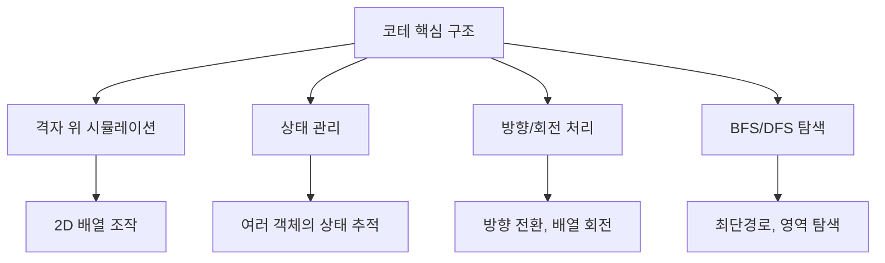
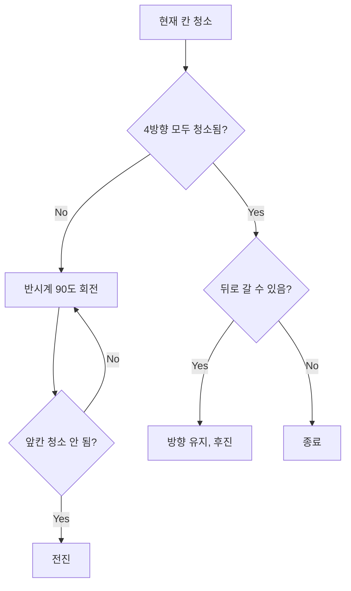
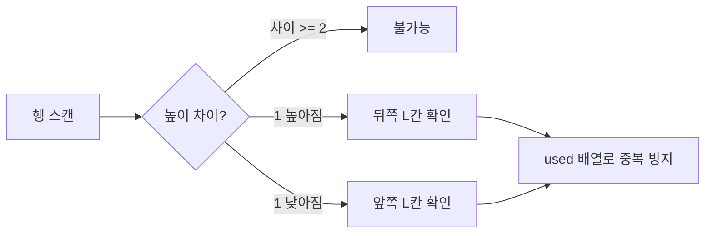
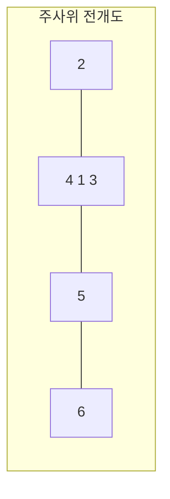
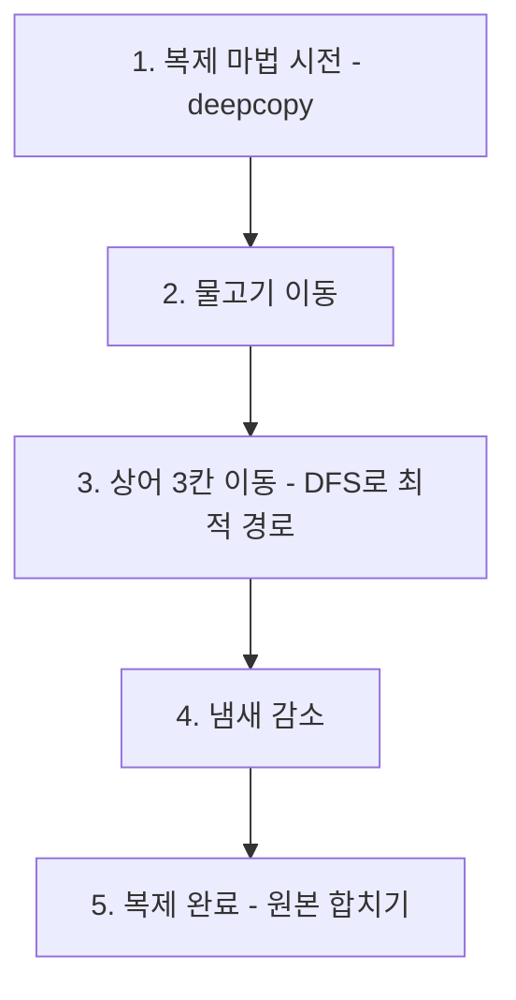
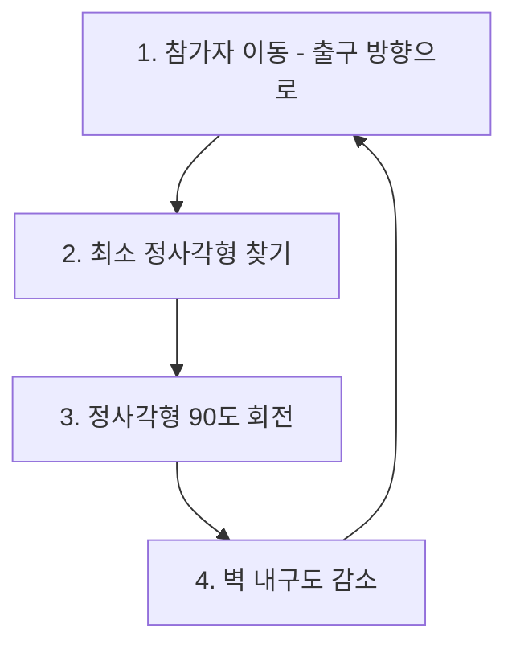
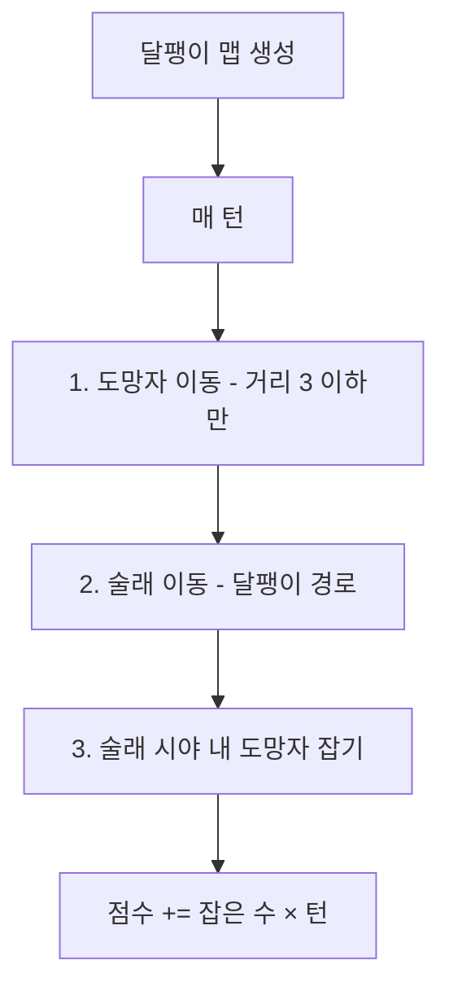
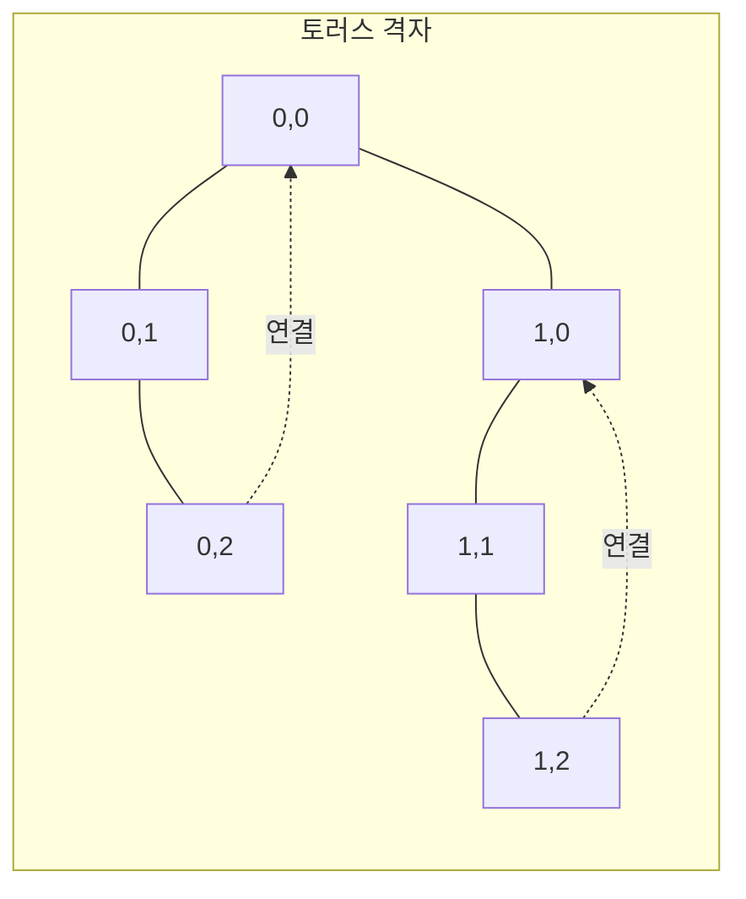

# 코테 실전 - 코딩테스트 핵심 정리

## 개념 요약

문제 자체의 알고리즘은 BFS/DFS + 구현이지만, 여러 단계의 로직을 정확히 조합하는 능력이 핵심입니다.



### 코테 문제의 공통 패턴

1. 격자(NxN) 위에서 객체들이 움직임
2. 매 턴마다 여러 단계의 로직을 순서대로 수행
3. 방향 전환, 충돌 처리, 경계 처리가 핵심
4. 구현량이 많아 함수 분리가 필수

---

## 문제 풀이 패턴

### 패턴 1: 로봇 청소기 - 상태 기반 시뮬레이션 (14503)

로봇이 규칙에 따라 격자를 청소하는 문제. 방향 전환과 후진 로직이 핵심입니다.



```python
import sys
read = sys.stdin.readline

N, M = map(int, read().split())
r, c, d = map(int, read().split())

# 0 북, 1 동, 2 남, 3 서
goto = [(-1,0), (0,1), (1,0), (0,-1)]
back_to = [(1,0), (0,-1), (-1,0), (0,1)]
clean_map = [[False] * M for _ in range(N)]
graph = [list(map(int, read().split())) for _ in range(N)]

def is_4way_clean(g_map, c_map, r, c):
    for go in goto:
        nr, nc = r + go[0], c + go[1]
        if 0 <= nr < N and 0 <= nc < M:
            if g_map[nr][nc] == 0 and not c_map[nr][nc]:
                return False
    return True

count = 0
while True:
    if not clean_map[r][c]:
        count += 1
        clean_map[r][c] = True

    if is_4way_clean(graph, clean_map, r, c):
        br, bc = r + back_to[d][0], c + back_to[d][1]
        if 0 <= br < N and 0 <= bc < M and graph[br][bc] == 0:
            r, c = br, bc
        else:
            break
    else:
        d = d - 1 if d != 0 else 3  # 반시계 회전
        nr, nc = r + goto[d][0], c + goto[d][1]
        if 0 <= nr < N and 0 <= nc < M and graph[nr][nc] == 0 and not clean_map[nr][nc]:
            r, c = nr, nc
print(count)
```

> 핵심 테크닉:
>
> - 방향 배열 `goto`와 후진 배열 `back_to`를 분리
> - 반시계 회전: `d = (d - 1) % 4` 또는 `d = d - 1 if d != 0 else 3`

### 패턴 2: 경사로 - 1차원 스캔 (14890)

행/열을 1차원으로 스캔하면서 경사로를 놓을 수 있는지 판단합니다.



```python
N, L = map(int, input().split())
graph = [list(map(int, input().split())) for _ in range(N)]

count = 0
for _ in range(2):  # 행 검사 후 전치하여 열 검사
    for row in range(N):
        used = [False] * N
        ok = True
        for col in range(1, N):
            diff = graph[row][col] - graph[row][col-1]
            if abs(diff) >= 2:
                ok = False; break
            if diff == 1:  # 올라감 → 뒤쪽 L칸 체크
                start = col - L
                if start < 0: ok = False; break
                if all(graph[row][start:col][i] == graph[row][col-1] for i in range(L)) \
                   and not any(used[start:col]):
                    for i in range(start, col): used[i] = True
                else: ok = False; break
            elif diff == -1:  # 내려감 → 앞쪽 L칸 체크
                end = col + L - 1
                if end >= N: ok = False; break
                if all(graph[row][col:end+1][i] == graph[row][col] for i in range(L)) \
                   and not any(used[col:end+1]):
                    for i in range(col, end+1): used[i] = True
                else: ok = False; break
        if ok: count += 1
    graph = [list(l) for l in zip(*graph)]  # 전치!

print(count)
```

> 핵심 테크닉:
>
> - `zip(*graph)`로 행렬 전치 → 행 검사 로직 하나로 행/열 모두 처리
> - `used` 배열로 경사로 중복 배치 방지

### 패턴 3: 주사위 굴리기 - 3D 상태 관리 (23288)

주사위의 6면 상태를 2D 배열로 관리하고, 방향별 면 이동을 구현합니다.



```python
dice = [[0,2,0], [4,1,3], [0,5,0], [0,6,0]]

def play_dice(dice, dir):
    if dir == 1:  # 동
        dice[1][0], dice[1][1], dice[1][2], dice[3][1] = \
            dice[3][1], dice[1][0], dice[1][1], dice[1][2]
    elif dir == 2:  # 서
        dice[1][0], dice[1][1], dice[1][2], dice[3][1] = \
            dice[1][1], dice[1][2], dice[3][1], dice[1][0]
    elif dir == 3:  # 남
        dice[0][1], dice[1][1], dice[2][1], dice[3][1] = \
            dice[3][1], dice[0][1], dice[1][1], dice[2][1]
    elif dir == 4:  # 북
        dice[0][1], dice[1][1], dice[2][1], dice[3][1] = \
            dice[1][1], dice[2][1], dice[3][1], dice[0][1]
```

> 핵심: 주사위 전개도를 2D 배열로 표현하고, 방향별로 면의 값을 순환 교환합니다.

### 패턴 4: 물고기 시뮬레이션 - 복제 + DFS (23290)

매 턴마다 복제 → 이동 → 상어 DFS → 냄새 처리 → 복제 완료의 순서입니다.



```python
from copy import deepcopy

# 핵심: 상어의 3칸 이동에서 최대 물고기를 잡는 경로를 DFS로 탐색
def dfs(graph, s_loc, depth, total, path, visited):
    global max_fish, max_fish_path
    if depth == 3:
        if max_fish < total:
            max_fish_path = path
            max_fish = total
        return

    for g_idx in range(4):  # 상, 좌, 하, 우
        go = [(-1,0), (0,-1), (1,0), (0,1)][g_idx]
        nr, nc = s_loc[0] + go[0], s_loc[1] + go[1]
        if 0 <= nr < 4 and 0 <= nc < 4:
            if visited[nr][nc]:
                dfs(graph, [nr,nc], depth+1, total, path+[(nr,nc)], visited)
            else:
                visited[nr][nc] = True
                dfs(graph, [nr,nc], depth+1,
                    total + len(graph[nr][nc]), path+[(nr,nc)], visited)
                visited[nr][nc] = False
```

> 핵심 테크닉:
>
> - `deepcopy`로 턴 시작 시 상태 저장 → 턴 끝에 합치기
> - DFS에서 visited로 같은 칸 물고기 중복 카운트 방지
> - 방향 순서(상좌하우)가 사전순을 보장

### 패턴 5: 격자 회전 + BFS - 메이즈러너

정사각형 영역을 찾아 90도 회전하는 패턴입니다.



```python
def rotate_square(graph, p_graph, exit_loc, s_info):
    loc, size = s_info
    # 부분 배열 추출
    sub = [r[loc[1]:loc[1]+size] for r in graph[loc[0]:loc[0]+size]]
    # 90도 시계 회전: 전치 후 좌우 반전
    sub = [list(reversed(i)) for i in zip(*sub)]
    # 원래 격자에 덮어쓰기 (벽 내구도 -1)
    for rr in range(loc[0], loc[0]+size):
        for cc in range(loc[1], loc[1]+size):
            val = sub[rr-loc[0]][cc-loc[1]]
            graph[rr][cc] = val - 1 if val > 0 else 0
```

> 핵심: `[list(reversed(i)) for i in zip(*matrix)]`는 90도 시계 회전의 정석 코드입니다.

### 패턴 6: 달팽이 맵 + 술래잡기

달팽이 순서로 이동하는 술래와, 조건부로 움직이는 도망자를 시뮬레이션합니다.



```python
# 달팽이 맵 생성 (바깥→안쪽)
find_map = [[0] * N for _ in range(N)]
cell_turn = N * N - 1
cr, cc = 0, 0
dd = 0
find_goto = [(1,0), (0,1), (-1,0), (0,-1)]
find_map[0][0] = cell_turn
cell_turn -= 1

while cell_turn > 0:
    nr, nc = cr + find_goto[dd%4][0], cc + find_goto[dd%4][1]
    if not (0 <= nr < N and 0 <= nc < N) or find_map[nr][nc] != 0:
        dd += 1
    else:
        find_map[nr][nc] = cell_turn
        cr, cc = nr, nc
        cell_turn -= 1
```

### 패턴 7: 포탑 공격 - 토러스 격자 + BFS

격자의 끝과 끝이 연결된 토러스(torus) 구조에서의 BFS입니다.



```python
# 토러스 BFS: 좌표를 % 연산으로 순환
q = deque([(start_r, start_c, [])])
while q:
    _r, _c, path = q.popleft()
    if _r == rr and _c == rc:
        min_path = path
        break
    for go in [(0,1), (1,0), (0,-1), (-1,0)]:
        nr, nc = (_r + go[0]) % N, (_c + go[1]) % M  # 핵심!
        if graph[nr][nc][0] == 0 or visited[nr][nc]:
            continue
        visited[nr][nc] = True
        q.append((nr, nc, path + [(nr, nc)]))
```

> 핵심: `% N`, `% M`으로 격자 경계를 순환 처리합니다. 음수 인덱스도 Python의 `%` 연산이 자동 처리합니다.

---

## 코테 필수 테크닉 모음

### 1. 방향 전환 패턴 정리

```python
# 반시계 90도 회전
d = (d - 1) % 4

# 시계 90도 회전
d = (d + 1) % 4

# 반대 방향
d = (d + 2) % 4
# 또는 딕셔너리/리스트로
opposite = [2, 3, 0, 1]  # 상↔하, 좌↔우
d = opposite[d]

# 시계 방향 순서 (상 우 하 좌)
goto = [(-1,0), (0,1), (1,0), (0,-1)]
```

### 2. 2D 배열 회전

```python
# 90도 시계 회전
rotated = [list(reversed(i)) for i in zip(*matrix)]

# 90도 반시계 회전
rotated = list(reversed([list(i) for i in zip(*matrix)]))

# 180도 회전
rotated = [row[::-1] for row in matrix[::-1]]
```

### 3. 함수 분리 전략

문제는 구현량이 많으므로 반드시 함수를 분리하세요:

```python
def move_objects():    # 객체 이동
    pass
def check_collision(): # 충돌 처리
    pass
def rotate_board():    # 격자 회전
    pass
def calculate_score(): # 점수 계산
    pass

for turn in range(K):
    move_objects()
    check_collision()
    rotate_board()
    score += calculate_score()
```

### 4. deepcopy 주의사항

```python
from copy import deepcopy

# 2D 리스트 복사
backup = deepcopy(graph)          # 안전하지만 느림
backup = [row[:] for row in graph] # 1차원 원소면 이게 더 빠름

# 3D 리스트는 deepcopy 필수
backup = deepcopy(graph_3d)
```

### 5. 다중 조건 정렬로 대상 선정

문제에서 "가장 약한/강한 대상 선정" 시:

```python
# 공격력 최소 → 최근 공격 → 행+열 합 최대 → 열 최대
candidates.sort(key=lambda x: (x.power, -x.last_turn, -(x.r+x.c), -x.c))
attacker = candidates[0]
```

### 6. 경계 처리 패턴

```python
# 기본 경계 체크
if 0 <= nr < N and 0 <= nc < M:

# 벽에 부딪히면 반대 방향
if not (0 <= nr < N and 0 <= nc < M):
    d = opposite[d]
    nr, nc = r + goto[d][0], c + goto[d][1]

# 토러스 (끝과 끝 연결)
nr, nc = (r + dr) % N, (c + dc) % M
```

### 7. 디버깅 팁

```python
# 격자 상태 출력 함수
def print_board(board):
    for row in board:
        print(' '.join(f'{x:3d}' for x in row))
    print()

# 턴별 상태 확인
for turn in range(K):
    process()
    if turn < 3:  # 처음 몇 턴만 확인
        print(f"=== Turn {turn} ===")
        print_board(graph)
```

### 8. 자주 하는 실수

- 이동 후 원본 배열을 수정하면서 다른 객체에 영향 → 복사본에 기록 후 교체
- 방향 인덱스 0~3 vs 1~4 혼동 → 문제에서 주는 방향 체계를 먼저 정리
- 좌표 (r,c) vs (x,y) 혼동 → r=행=y, c=열=x 통일
- 여러 객체가 같은 칸에 있을 때 처리 순서 → 문제 조건 꼼꼼히 읽기
- `sys.stdin = open("input.txt", "r")` 제출 시 제거 잊지 않기
