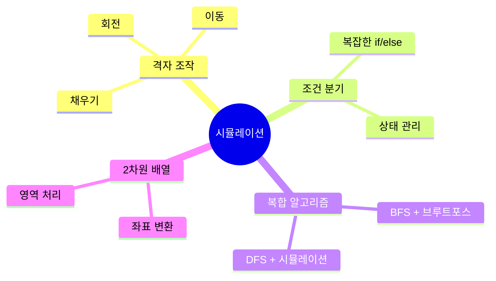
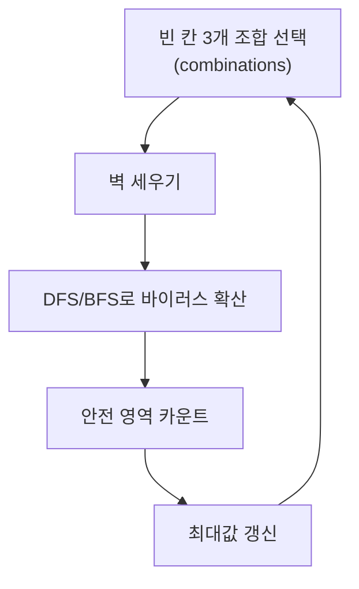
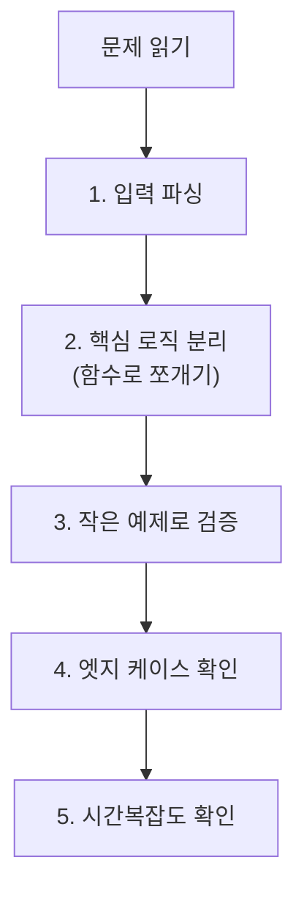

# 시뮬레이션 (Simulation) - 코딩테스트 핵심 정리

## 개념 요약

시뮬레이션은 문제에서 주어진 조건을 그대로 코드로 구현하는 유형입니다.
특별한 알고리즘보다 구현력과 꼼꼼함이 핵심입니다.



## 시뮬레이션 문제의 특징

- 알고리즘보다 구현이 어려운 문제
- 문제 설명이 길고 조건이 복잡함
- 실수하기 쉬운 엣지 케이스가 많음
- 삼성 코테에서 특히 자주 출제

---

## 문제 풀이 패턴

### 패턴 1: 브루트포스 + BFS/DFS (연구소)

#### 14502번 - 연구소

빈 칸 3개에 벽을 세워 바이러스 확산 후 안전 영역을 최대화하는 문제입니다.



```python
from copy import deepcopy
from itertools import combinations
from collections import deque

N, M = map(int, input().split())
graph = []
null_cell = []

for row in range(N):
    row_list = list(map(int, input().split()))
    graph.append(row_list)
    for col in range(M):
        if row_list[col] == 0:
            null_cell.append((row, col))

goto = [(0,1), (0,-1), (1,0), (-1,0)]

max_count = 0
for walls in combinations(null_cell, 3):
    b_graph = deepcopy(graph)

    # 벽 세우기
    for r, c in walls:
        b_graph[r][c] = 1

    # 바이러스 확산 (DFS)
    visited = [[False] * M for _ in range(N)]
    for r in range(N):
        for c in range(M):
            if b_graph[r][c] == 2 and not visited[r][c]:
                stack = [(r, c)]
                visited[r][c] = True
                while stack:
                    cr, cc = stack.pop()
                    for dr, dc in goto:
                        nr, nc = cr + dr, cc + dc
                        if (0 <= nr < N and 0 <= nc < M
                                and not visited[nr][nc] and b_graph[nr][nc] == 0):
                            visited[nr][nc] = True
                            b_graph[nr][nc] = 2
                            stack.append((nr, nc))

    # 안전 영역 카운트
    count = sum(row.count(0) for row in b_graph)
    max_count = max(count, max_count)

print(max_count)
```

> 핵심: `combinations`로 벽 위치 조합 → `deepcopy`로 원본 보존 → BFS/DFS로 확산 → 카운트.

---

### 패턴 2: 톱니바퀴 (연쇄 반응 시뮬레이션)

#### 14891번 - 톱니바퀴

톱니바퀴 회전 시 맞물린 톱니가 다르면 연쇄 회전하는 문제입니다.

```python
from collections import deque

circle = [deque(map(int, list(input().strip()))) for _ in range(4)]
K = int(input())

for _ in range(K):
    n, r = map(int, input().split())
    n -= 1

    # 회전 전에 맞물린 부분 미리 저장
    points = [(c[6], c[2]) for c in circle]  # (왼쪽 맞물림, 오른쪽 맞물림)

    circle[n].rotate(r)

    # 오른쪽으로 전파
    cnt_r = -r
    for i in range(n, 3):
        if points[i][1] != points[i + 1][0]:
            circle[i + 1].rotate(cnt_r)
            cnt_r *= -1
        else:
            break

    # 왼쪽으로 전파
    cnt_l = -r
    for j in range(n, 0, -1):
        if points[j][0] != points[j - 1][1]:
            circle[j - 1].rotate(cnt_l)
            cnt_l *= -1
        else:
            break

total = sum(circle[i][0] * (2 ** i) for i in range(4))
print(total)
```

> 핵심: 회전 전에 맞물린 부분을 미리 저장해야 합니다. 회전 후 비교하면 이미 값이 바뀌어 있습니다.
> `deque.rotate(1)` = 시계방향, `deque.rotate(-1)` = 반시계방향.

---

### 패턴 3: CCTV 감시 (DFS + 방향 조합)

#### 15683번 - 감시

각 CCTV의 방향 조합을 DFS로 탐색하여 사각지대를 최소화하는 문제입니다.

```python
from copy import deepcopy

# CCTV 타입별 가능한 방향 조합
cctv_dir = {
    1: [[0], [1], [2], [3]],
    2: [[1, 3], [0, 2]],
    3: [[0, 1], [1, 2], [2, 3], [3, 0]],
    4: [[3, 0, 1], [0, 1, 2], [1, 2, 3], [2, 3, 0]],
    5: [[0, 1, 2, 3]],
}

# 방향: 상(0), 우(1), 하(2), 좌(3)
goto = [(0, -1), (1, 0), (0, 1), (-1, 0)]

def fill(board, row, col, dirs):
    """한 방향으로 벽(6)을 만날 때까지 채우기"""
    for d in dirs:
        nr, nc = row, col
        while True:
            nc += goto[d][0]
            nr += goto[d][1]
            if not (0 <= nr < N and 0 <= nc < M):
                break
            if board[nr][nc] == 6:
                break
            if board[nr][nc] == 0:
                board[nr][nc] = -1

min_zero = float('inf')

def dfs(board, depth):
    global min_zero
    if depth == len(cctv):
        count = sum(row.count(0) for row in board)
        min_zero = min(min_zero, count)
        return

    row, col, ctype = cctv[depth]
    for dirs in cctv_dir[ctype]:
        copied = deepcopy(board)
        fill(copied, row, col, dirs)
        dfs(copied, depth + 1)

dfs(graph, 0)
print(min_zero)
```

> 핵심: CCTV 타입별 방향 조합을 딕셔너리로 정의하고, DFS로 모든 조합을 탐색합니다.

---

### 패턴 4: 스티커 붙이기 (회전 + 배치)

#### 18808번 - 스티커 붙이기

스티커를 회전하며 노트북에 붙일 수 있는 위치를 찾는 문제입니다.

```python
def rotate(sticker):
    """90도 시계방향 회전"""
    return [list(reversed(row)) for row in zip(*sticker)]

def can_attach(board, sticker, sr, sc):
    """붙일 수 있는지 확인"""
    for r in range(len(sticker)):
        for c in range(len(sticker[0])):
            if sticker[r][c] == 1 and board[sr + r][sc + c] != 0:
                return False
    return True

def attach(board, sticker, sr, sc):
    """실제로 붙이기"""
    for r in range(len(sticker)):
        for c in range(len(sticker[0])):
            if sticker[r][c] == 1:
                board[sr + r][sc + c] = 1

for s in stickers:
    attached = False
    for rot in range(4):
        if attached:
            break
        s = rotate(s) if rot != 0 else s
        sr, sc = len(s), len(s[0])
        if sr > N or sc > M:
            continue
        for r in range(N - sr + 1):
            if attached:
                break
            for c in range(M - sc + 1):
                if can_attach(board, s, r, c):
                    attach(board, s, r, c)
                    attached = True
                    break
```

> 핵심: `zip(*matrix[::-1])`로 90도 회전. 4번 회전 × 모든 위치 시도.

---

### 패턴 5: 뿌요뿌요 (BFS + 중력)

#### 11559번 - Puyo Puyo

같은 색 4개 이상 연결되면 터지고, 빈 공간은 중력으로 채우는 문제입니다.

```python
from collections import deque

goto = [(0,1), (0,-1), (1,0), (-1,0)]

def find_and_destroy(board):
    """같은 색 4개 이상 그룹 찾아서 제거"""
    destroyed = False
    for r in range(12):
        for c in range(6):
            if board[r][c] == '.':
                continue
            # BFS로 같은 색 그룹 찾기
            visited = [[False]*6 for _ in range(12)]
            visited[r][c] = True
            group = [(r, c)]
            q = deque([(r, c)])
            while q:
                cr, cc = q.popleft()
                for dr, dc in goto:
                    nr, nc = cr+dr, cc+dc
                    if (0<=nr<12 and 0<=nc<6 and not visited[nr][nc]
                            and board[nr][nc] == board[r][c]):
                        visited[nr][nc] = True
                        group.append((nr, nc))
                        q.append((nr, nc))
            if len(group) >= 4:
                for gr, gc in group:
                    board[gr][gc] = '.'
                destroyed = True
    return destroyed

def gravity(board):
    """빈 칸 위의 블록을 아래로 떨어뜨리기"""
    for r in range(11, -1, -1):
        for c in range(6):
            if board[r][c] == '.':
                tr = r
                while tr >= 1:
                    board[tr][c] = board[tr-1][c]
                    tr -= 1
                board[0][c] = '.'

chain = 0
while find_and_destroy(board):
    gravity(board)
    chain += 1
print(chain)
```

> 핵심: "터뜨리기 → 중력 → 반복"의 루프. BFS로 그룹을 찾고, 위에서 아래로 떨어뜨립니다.

---

### 패턴 6: 테트로미노 (DFS + 예외 처리)

#### 테트로미노

DFS로 4칸 연결 도형을 탐색하되, ㅗ 모양은 DFS로 만들 수 없어 별도 처리합니다.

```python
N, M = map(int, input().split())
board = [list(map(int, input().split())) for _ in range(N)]
visited = [[False] * M for _ in range(N)]
max_sum = 0

def dfs(r, c, depth, total):
    global max_sum
    if max_sum >= total + 1000 * (3 - depth):   # 가지치기
        return
    if depth == 3:
        max_sum = max(max_sum, total)
        return
    for dr, dc in [(0,1),(0,-1),(1,0),(-1,0)]:
        nr, nc = r + dr, c + dc
        if 0 <= nr < N and 0 <= nc < M and not visited[nr][nc]:
            visited[nr][nc] = True
            dfs(nr, nc, depth + 1, total + board[nr][nc])
            visited[nr][nc] = False

def check_t_shape(r, c):
    """ㅗ 모양 별도 처리: 인접 4칸 중 상위 3개 선택"""
    global max_sum
    adj = []
    for dr, dc in [(0,1),(0,-1),(1,0),(-1,0)]:
        nr, nc = r + dr, c + dc
        if 0 <= nr < N and 0 <= nc < M:
            adj.append(board[nr][nc])
    if len(adj) >= 3:
        adj.sort(reverse=True)
        max_sum = max(max_sum, sum(adj[:3]) + board[r][c])

for r in range(N):
    for c in range(M):
        visited[r][c] = True
        dfs(r, c, 0, board[r][c])
        visited[r][c] = False
        check_t_shape(r, c)

print(max_sum)
```

> 핵심: DFS로 4칸 연결 도형을 탐색하면 ㅗ 모양만 빠집니다.
> ㅗ 모양은 중심점의 인접 4칸 중 값이 큰 3칸을 선택하면 됩니다.

---

## 실전 꿀팁 & 자주 나오는 패턴

### 꿀팁 1: deepcopy vs 슬라이싱 복사

```python
from copy import deepcopy

# deepcopy: 완전한 깊은 복사 (느리지만 안전)
copied = deepcopy(board)

# 슬라이싱: 1차원은 OK, 2차원은 주의
copied = [row[:] for row in board]   # 2차원 얕은 복사 (빠름)
# 3차원 이상은 deepcopy 필수
```

> 시뮬레이션에서 원본 보존이 필요하면 반드시 복사하세요.
> 2차원 배열은 `[row[:] for row in board]`가 deepcopy보다 훨씬 빠릅니다.

### 꿀팁 2: 2차원 배열 90도 회전

```python
# 시계방향 90도
rotated = [list(reversed(row)) for row in zip(*matrix)]

# 반시계방향 90도
rotated = list(zip(*[row[::-1] for row in matrix]))

# 180도
rotated = [row[::-1] for row in matrix[::-1]]
```

### 꿀팁 3: 시뮬레이션 문제 접근 순서



> 시뮬레이션은 한 번에 짜려 하지 말고, 기능별로 함수를 분리하세요.
> `fill()`, `rotate()`, `gravity()`, `check()` 등으로 나누면 디버깅이 쉬워집니다.

### 꿀팁 4: 자주 실수하는 함정들

```python
# 1. deepcopy 누락 → 원본이 변경됨
# 시뮬레이션에서 가장 흔한 버그!

# 2. 회전 후 행/열 크기 바뀜
# 회전 전: (3, 5) → 회전 후: (5, 3)

# 3. 좌표 (x, y) vs (행, 열) 혼동
# 문제에서 (x, y)로 주면 board[y][x]일 수 있음

# 4. 연쇄 반응에서 "동시 처리" vs "순차 처리"
# 톱니바퀴: 회전 전 상태를 미리 저장해야 함
# 뿌요뿌요: 한 턴에 모든 그룹을 동시에 터뜨림

# 5. 중력 처리 방향
# 아래에서 위로 순회해야 올바르게 떨어짐
for r in range(11, -1, -1):   # 아래부터!
```
