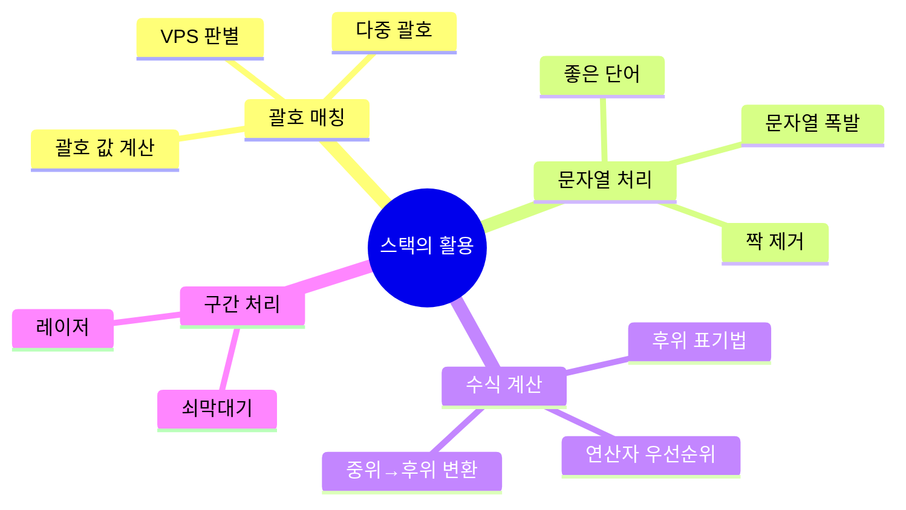
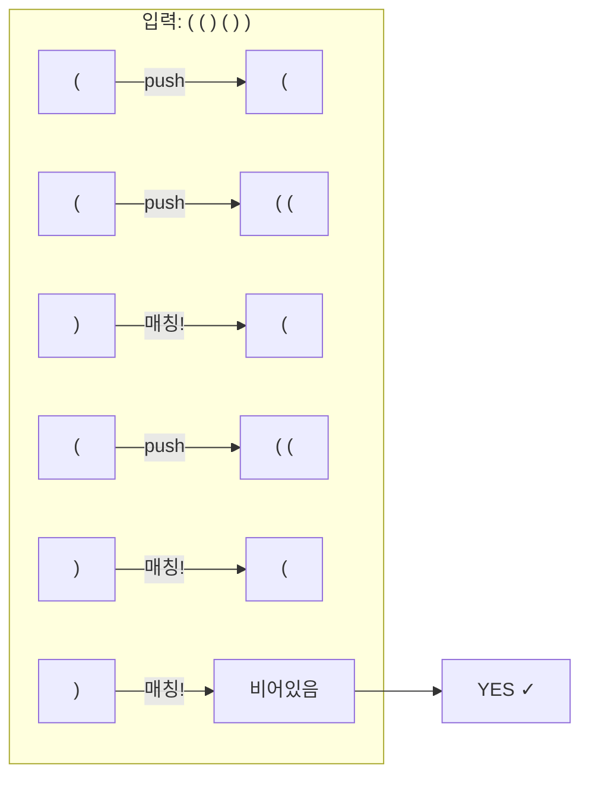
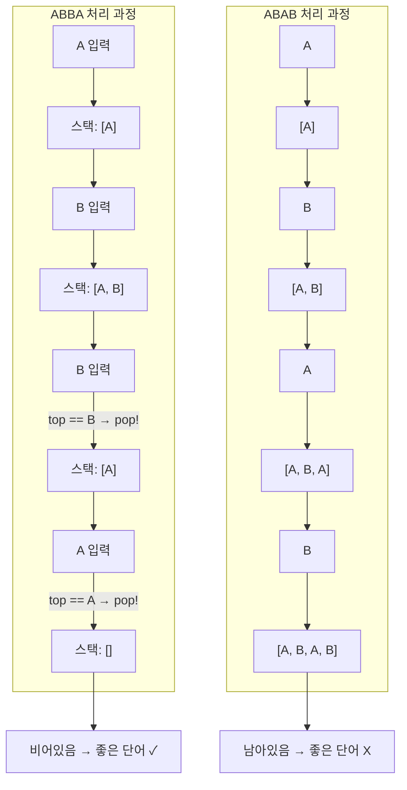
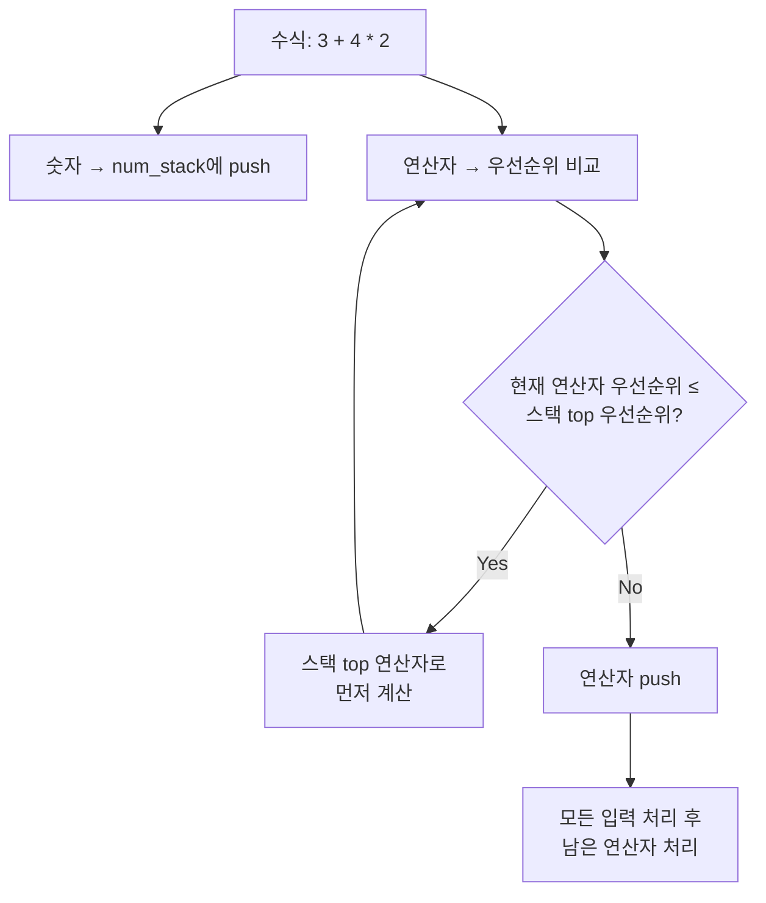
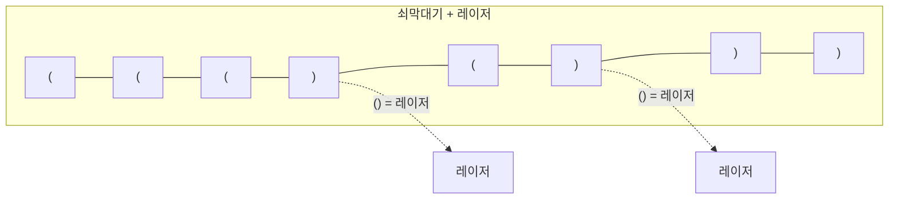
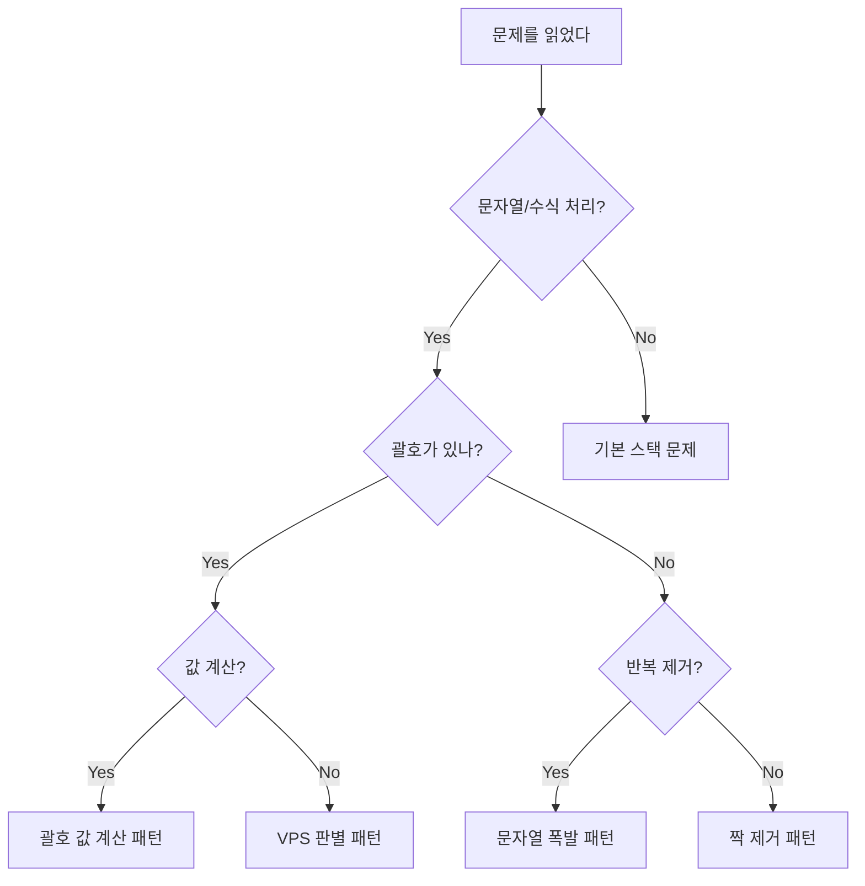

# 스택의 활용 - 코딩테스트 핵심 정리

## 개념 요약

"스택의 활용"은 스택 자료구조를 응용하여 문자열 매칭, 수식 계산, 문자열 처리 등을 해결하는 유형입니다.
기본 스택 문제(push/pop 시뮬레이션)에서 한 단계 더 나아간 응용 패턴들입니다.



## 핵심 원리: "짝이 맞으면 pop, 아니면 push"

스택 활용 문제의 90%는 이 한 줄로 요약됩니다.

```python
for char in s:
    if stack and is_match(stack[-1], char):
        stack.pop()       # 짝이 맞으면 제거
    else:
        stack.append(char)  # 아니면 쌓기
```

---

## 문제 풀이 패턴

### 패턴 1: 괄호 매칭 (VPS 판별)

#### 9012번 - 괄호

주어진 괄호 문자열이 올바른 괄호 문자열(VPS)인지 판별하는 문제입니다.



```python
from collections import deque
import sys
read = sys.stdin.readline

ans = []

for i in range(int(input())):
    s = deque(read().strip())
    stack = deque()

    for ii in range(len(s)):
        if ii > 0 and stack and stack[-1] == "(" and s[ii] == ")":
            stack.pop()
        else:
            stack.append(s[ii])

    ans.append("NO" if stack else "YES")

print("\n".join(ans))
```

> 핵심: `(`를 만나면 push, `)`를 만나면 top이 `(`인지 확인 후 pop.
> 끝났을 때 스택이 비어있으면 YES, 아니면 NO.

---

### 패턴 2: 짝 제거 (좋은 단어)

#### 3986번 - 좋은 단어

같은 글자가 인접하면 쌍으로 제거하여, 모두 제거되면 "좋은 단어"인 문제입니다.



```python
from collections import deque

n = int(input())
answer = 0

for i in range(n):
    s = deque(input())
    ss = deque()

    for ii in range(len(s)):
        if ss and ss[-1] == s[ii]:
            ss.pop()
        else:
            ss.append(s[ii])

    if len(ss) == 0:
        answer += 1

print(answer)
```

> 핵심: 괄호 매칭과 완전히 동일한 원리입니다. `(`/`)` 대신 같은 문자끼리 매칭할 뿐입니다.

---

### 패턴 3: 수식 계산 (연산자 우선순위)

스택 두 개(숫자용, 연산자용)를 사용하여 중위 표기법 수식을 계산하는 패턴입니다.



```python
# 연산자 우선순위
precedence = {'+': 1, '-': 1, '*': 2, '/': 2}

def calculate(a, b, operator):
    if operator == '+': return a + b
    elif operator == '-': return a - b
    elif operator == '*': return a * b
    elif operator == '/': return int(a / b)

num_stack = []
op_stack = []

num_stack.append(nums[0])

for i in range(len(op)):
    current_op = op[i]
    next_num = nums[i + 1]

    # 우선순위가 높거나 같은 연산자를 먼저 계산
    while (op_stack and
           precedence[op_stack[-1]] >= precedence[current_op]):
        operator = op_stack.pop()
        b = num_stack.pop()
        a = num_stack.pop()
        num_stack.append(calculate(a, b, operator))

    op_stack.append(current_op)
    num_stack.append(next_num)

# 남은 연산자 처리
while op_stack:
    operator = op_stack.pop()
    b = num_stack.pop()
    a = num_stack.pop()
    num_stack.append(calculate(a, b, operator))

print(num_stack[0])
```

> 핵심: 스택 2개를 사용합니다. 연산자 스택의 top보다 우선순위가 낮은 연산자가 오면, 먼저 계산합니다.

---

## 실전 꿀팁 & 자주 나오는 패턴

### 꿀팁 1: 괄호 문제 변형 총정리

괄호 문제는 변형이 정말 많지만, 핵심 패턴은 3가지입니다.

| 유형         | 핵심 로직                              | 대표 문제 |
| ------------ | -------------------------------------- | --------- |
| VPS 판별     | `(`→push, `)`→pop, 끝에 비어있으면 YES | 9012      |
| 다중 괄호    | 딕셔너리로 매칭 `{')':'(', ']':'['}`   | 4949      |
| 괄호 값 계산 | 여는 괄호에 곱셈, 닫힐 때 덧셈         | 2504      |
| 쇠막대기     | `()` = 레이저, 나머지 = 막대기         | 10799     |
| 문자열 폭발  | 스택 끝이 폭발 문자열과 같으면 제거    | 9935      |

```python
# 다중 괄호 매칭 (4949 - 균형잡힌 세상)
matching = {')': '(', ']': '['}

def is_balanced(s):
    stack = []
    for c in s:
        if c in '([':
            stack.append(c)
        elif c in ')]':
            if not stack or stack[-1] != matching[c]:
                return False
            stack.pop()
    return len(stack) == 0
```

실제 4949번 풀이 코드:

```python
import sys

while True:
    string = sys.stdin.readline().strip()
    if string == ".":
        break
    error = False
    stack = []
    for char in string:
        if char == "(":
            stack.append(char)
        elif char == "[":
            stack.append(char)
        elif char == ")":
            if not stack or stack.pop() != "(":
                error = True
                break
        elif char == "]":
            if not stack or stack.pop() != "[":
                error = True
                break
    if stack:
        error = True
    print("yes" if not error else "no")
```

> 핵심: `pop()`의 반환값을 바로 비교하면 코드가 간결해집니다.
> `stack.pop() != "("` 한 줄로 꺼내기 + 비교를 동시에 처리.

```python
# 괄호 값 계산 (2504)
# () = 2, [] = 3
# (()) = 2*2 = 4, ([]) = 2*3 = 6
# ()[] = 2+3 = 5

def calc_bracket(s):
    stack = []
    for c in s:
        if c == '(':
            stack.append(c)
        elif c == '[':
            stack.append(c)
        elif c == ')':
            temp = 0
            while stack and stack[-1] != '(':
                temp += stack.pop()
            if not stack:
                return 0
            stack.pop()  # '(' 제거
            stack.append(temp * 2 if temp else 2)
        elif c == ']':
            temp = 0
            while stack and stack[-1] != '[':
                temp += stack.pop()
            if not stack:
                return 0
            stack.pop()  # '[' 제거
            stack.append(temp * 3 if temp else 3)

    if '(' in stack or '[' in stack:
        return 0
    return sum(stack)
```

### 꿀팁 2: 쇠막대기/레이저 문제 패턴



두 가지 풀이 방법이 있습니다:

```python
# 풀이 1: 이전 문자 확인 방식
lazer = list(sys.stdin.readline().strip())
stack = []
count = 0
skip = False

for idx in range(len(lazer)):
    if skip:
        skip = False
        continue
    if idx < len(lazer) - 1 and lazer[idx] + lazer[idx + 1] == "()":
        count += len(stack)    # 레이저 → 현재 막대기 수만큼 조각
        skip = True
    elif lazer[idx] == "(":
        stack.append("(")
    elif stack and stack[-1] == "(" and lazer[idx] == ")":
        count += 1             # 막대기 끝 → 1조각
        stack.pop()
print(count)

# 풀이 2: floor 카운터 방식 (더 직관적)
blankets = list(input().strip())
stack = []
answer = 0
floor = 0

for b in blankets:
    if b == "(":
        floor += 1
        stack.append("(")
    elif b == ")":
        floor -= 1
        if stack[-1] == "(":
            answer += floor    # 레이저: 현재 층수만큼 조각
        else:
            answer += 1        # 막대기 끝
        stack.append(")")
print(answer)
```

> 핵심: `)`를 만났을 때, 바로 앞이 `(`이면 레이저, 아니면 막대기 끝입니다.
> floor 카운터 방식은 스택 대신 깊이를 추적하여 더 직관적입니다.

### 꿀팁 3: 문자열 폭발은 스택이 최적 (9935번 실제 풀이)

```python
import sys
from collections import deque

string = sys.stdin.readline().strip()
boom = sys.stdin.readline().strip()

stack = []

for char in string:
    stack.append(char)
    if len(stack) >= len(boom) and "".join(stack[-len(boom):]) == boom:
        for _ in range(len(boom)):
            stack.pop()

print("".join(stack) if stack else "FRULA")
```

> `del stack[-n:]`을 쓰면 더 빠릅니다:

```python
# 최적화 버전
for char in string:
    stack.append(char)
    if len(stack) >= len(boom):
        if all(stack[-len(boom) + k] == boom[k] for k in range(len(boom))):
            del stack[-len(boom):]   # pop 반복보다 빠름
```

### 꿀팁 4: 후위 표기법 변환 & 계산

코테에서 직접 나오진 않지만, 수식 계산 문제의 기반이 됩니다.

```python
# 중위 → 후위 변환 (Shunting-yard 알고리즘)
# "3 + 4 * 2" → "3 4 2 * +"
def infix_to_postfix(tokens):
    output = []
    op_stack = []
    prec = {'+': 1, '-': 1, '*': 2, '/': 2}

    for token in tokens:
        if token.isdigit():
            output.append(token)
        elif token in prec:
            while (op_stack and op_stack[-1] in prec
                   and prec[op_stack[-1]] >= prec[token]):
                output.append(op_stack.pop())
            op_stack.append(token)
        elif token == '(':
            op_stack.append(token)
        elif token == ')':
            while op_stack[-1] != '(':
                output.append(op_stack.pop())
            op_stack.pop()

    while op_stack:
        output.append(op_stack.pop())
    return output

# 후위 표기법 계산
# "3 4 2 * +" → 3 + (4*2) = 11
def eval_postfix(tokens):
    stack = []
    for token in tokens:
        if token.isdigit():
            stack.append(int(token))
        else:
            b, a = stack.pop(), stack.pop()
            if token == '+': stack.append(a + b)
            elif token == '-': stack.append(a - b)
            elif token == '*': stack.append(a * b)
            elif token == '/': stack.append(int(a / b))
    return stack[0]
```

### 꿀팁 5: 스택 활용 문제 접근 순서



### 꿀팁 6: 자주 실수하는 함정들

```python
# 1. 빈 스택에서 top 접근
if stack and stack[-1] == '(':   # 항상 stack 먼저 체크!

# 2. 괄호 값 계산에서 0 처리
# () 안에 아무것도 없으면 temp = 0 → 기본값 사용
stack.append(temp * 2 if temp else 2)

# 3. 문자열 폭발에서 폭발 문자열 길이 1인 경우
# bomb = "a" 같은 경우도 처리되는지 확인

# 4. 수식 계산에서 나눗셈 방향
# a / b에서 a가 먼저 pop된 것이 아님!
b = stack.pop()   # 나중에 들어간 것이 b
a = stack.pop()   # 먼저 들어간 것이 a
result = a / b    # 순서 주의!

# 5. int(a/b) vs a//b (음수일 때 다름)
int(-7 / 2)       # -3 (0 방향으로 절삭)
-7 // 2           # -4 (내림)
```
