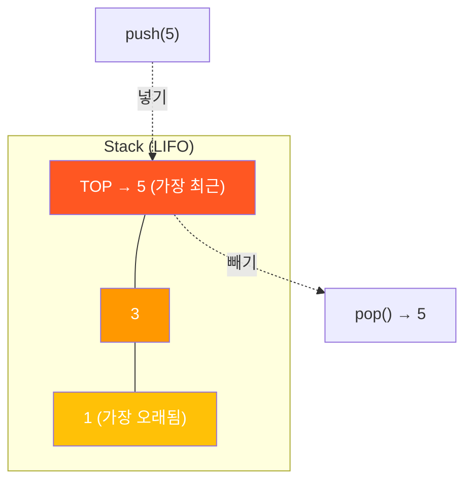
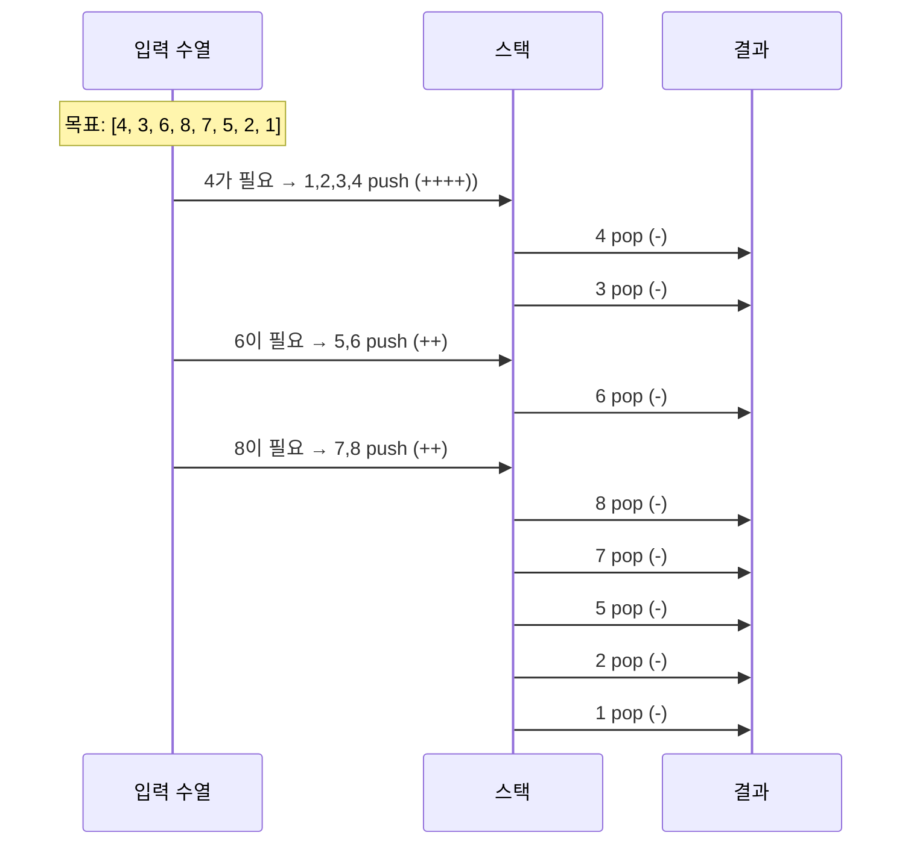
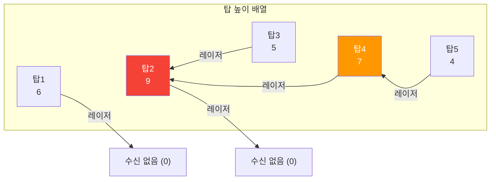
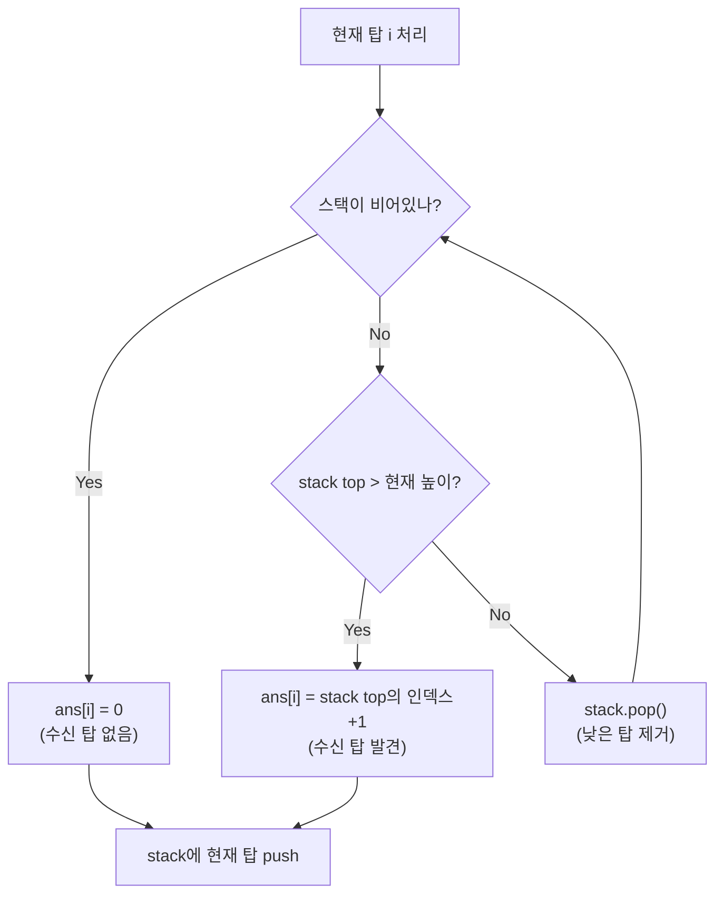
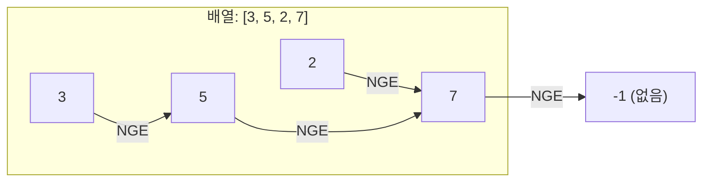
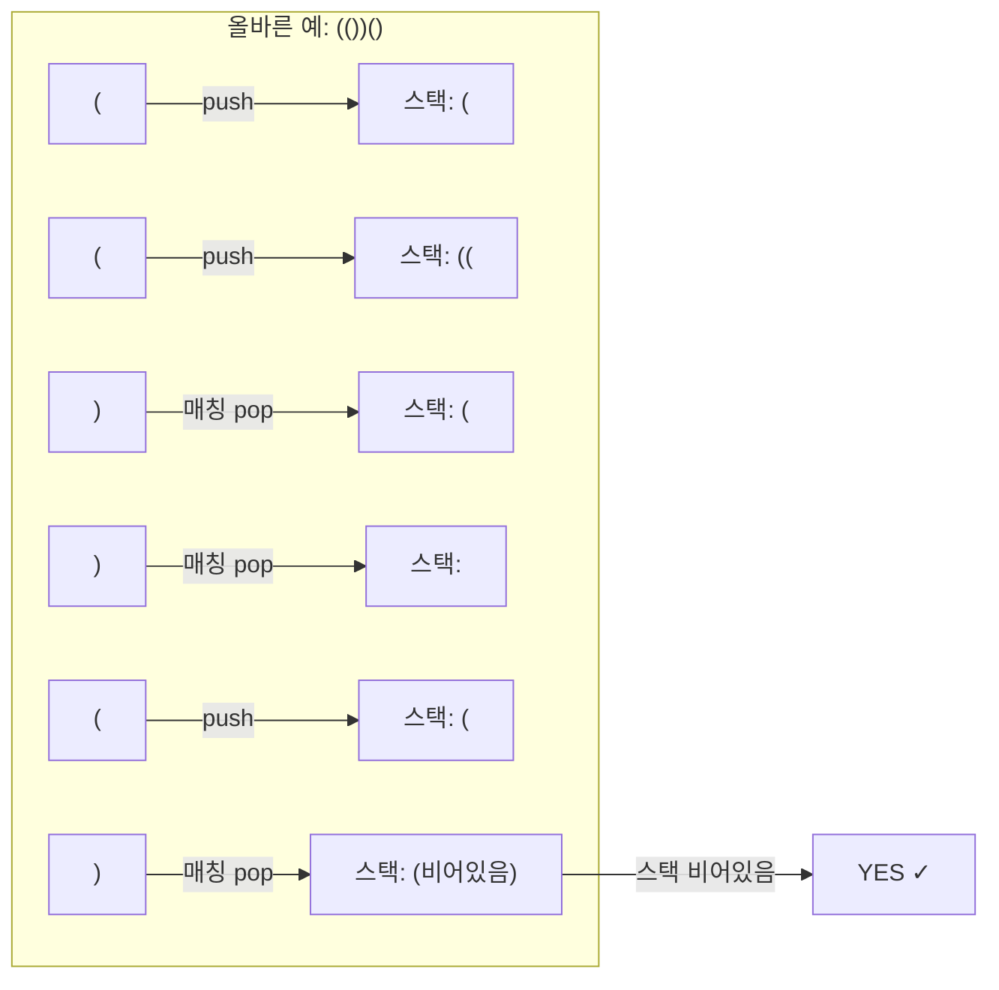
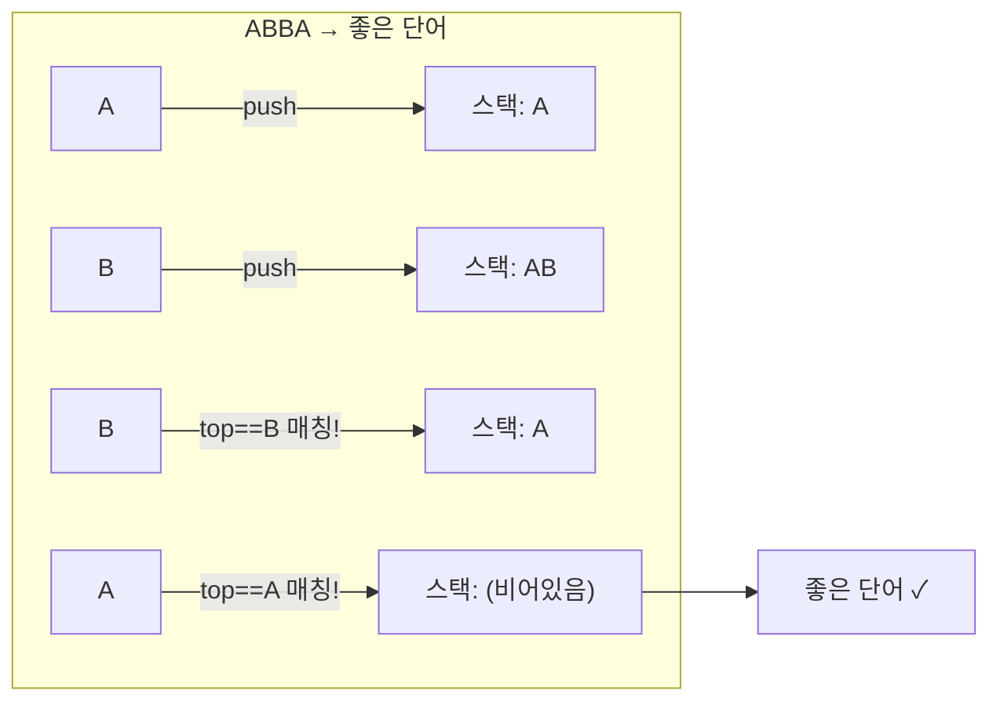
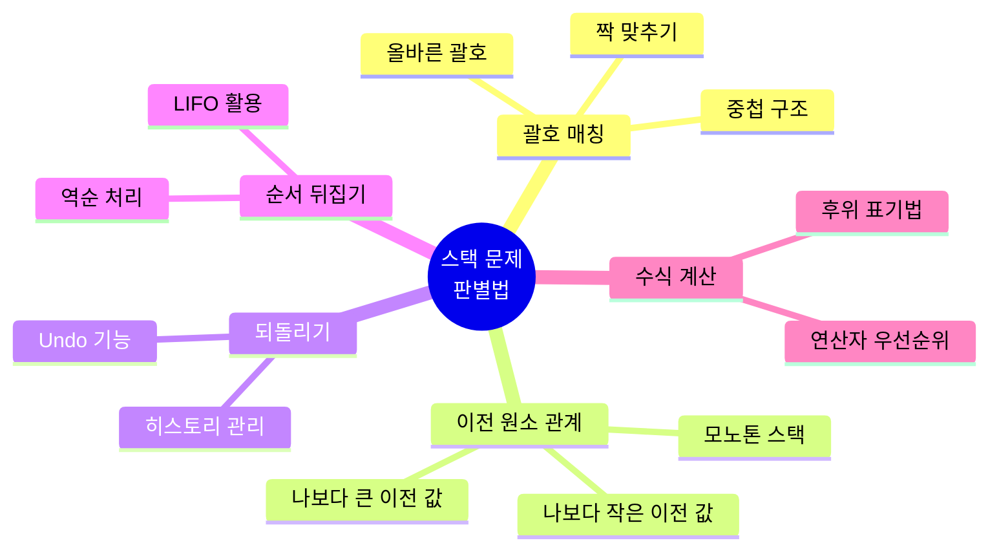
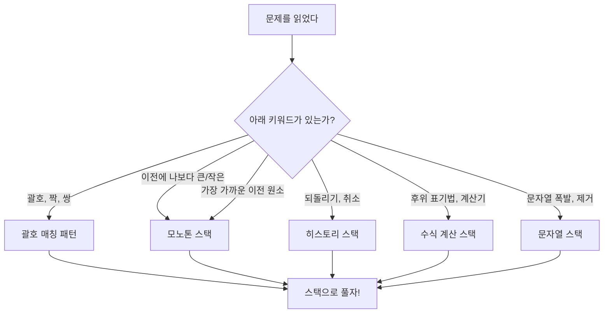

# 스택 (Stack) - 코딩테스트 핵심 정리

## 개념 요약

스택은 LIFO(Last In, First Out) 구조의 자료구조입니다.
마지막에 넣은 데이터가 가장 먼저 나옵니다. 접시 쌓기를 떠올리면 됩니다.



Python에서는 `list`를 스택으로 사용하거나, `collections.deque`를 사용합니다.

```python
# list로 스택 사용
stack = []
stack.append(1)   # push
stack.pop()       # pop → 1

# deque로 스택 사용 (더 빠름)
from collections import deque
stack = deque()
stack.append(1)   # push
stack.pop()       # pop → 1
```

## 시간복잡도

| 연산          | list | deque | 설명         |
| ------------- | ---- | ----- | ------------ |
| push (append) | O(1) | O(1)  | 끝에 추가    |
| pop           | O(1) | O(1)  | 끝에서 제거  |
| top (peek)    | O(1) | O(1)  | `stack[-1]`  |
| 크기 확인     | O(1) | O(1)  | `len(stack)` |
| 비었는지 확인 | O(1) | O(1)  | `if stack:`  |

> deque는 양쪽 끝 연산이 모두 O(1)이라 스택/큐 모두에 적합합니다.

---

## 문제 풀이 패턴

### 패턴 1: 순서대로 push/pop 시뮬레이션

#### 1874번 - 스택 수열

1부터 n까지 순서대로 push하면서, 주어진 수열을 만들 수 있는지 판단하는 문제입니다.



```python
n = int(input())

op = []          # +/- 연산 기록
stack = []
count = 1        # 다음에 push할 숫자

temp = True

for _ in range(n):
    num = int(input())

    # num 이하까지 순서대로 push
    while count <= num:
        stack.append(count)
        op.append("+")
        count += 1

    # top이 원하는 숫자면 pop
    if stack and stack[-1] == num:
        op.append("-")
        stack.pop()
    else:
        temp = False    # 만들 수 없는 수열
        break

if temp:
    print("\n".join(op))
else:
    print("NO")
```

> 핵심: `count` 변수로 다음에 push할 숫자를 추적합니다. 한 번 push한 숫자는 다시 push하지 않습니다.

---

### 패턴 2: 모노톤 스택 (Monotone Stack)

스택에 단조 증가 또는 단조 감소 순서를 유지하면서 원소를 관리하는 기법입니다.
"나보다 큰(작은) 이전 원소 찾기" 류의 문제에 핵심적으로 사용됩니다.

#### 2493번 - 탑

각 탑에서 왼쪽으로 레이저를 쏠 때, 가장 먼저 수신하는 탑의 번호를 구하는 문제입니다.





```python
n = int(input())
top = list(map(int, input().split()))

stack = []       # [인덱스, 높이] 쌍을 저장
ans = [0] * n

for i in range(n):
    # 현재 탑보다 낮은 탑들은 앞으로 절대 수신 못함 → 제거
    while stack:
        if stack[-1][1] > top[i]:
            ans[i] = stack[-1][0] + 1   # 1-indexed
            break
        else:
            stack.pop()

    stack.append([i, top[i]])

print(*ans)
```

> 핵심: 스택에 자기보다 작은 값은 pop하고, 큰 값을 만나면 그것이 답입니다.
> 각 원소는 최대 1번 push, 1번 pop → 전체 O(n).

#### 17298번 - 오큰수 (NGE)

각 원소의 오른쪽에서 가장 가까운 큰 수를 구하는 문제입니다. 모노톤 스택의 대표 문제입니다.



```python
import sys

n = int(input())
arr = list(map(int, sys.stdin.readline().split()))

stack = []          # 아직 NGE를 못 찾은 인덱스들
result = [-1] * n

for i in range(n):
    # 현재 값이 stack top의 값보다 크면 → stack top의 NGE 발견
    while stack and arr[stack[-1]] < arr[i]:
        idx = stack.pop()
        result[idx] = arr[i]
    stack.append(i)

print(*result)
```

> 핵심: 스택에 "아직 답을 못 찾은 인덱스"를 넣어두고, 답을 찾으면 pop합니다.
> 탑(2493)은 왼쪽→오른쪽, 오큰수(17298)는 오른쪽→왼쪽 방향이지만 원리는 동일합니다.

#### 6198번 - 옥상 정원 꾸미기

각 빌딩에서 오른쪽으로 볼 수 있는 빌딩 수의 합을 구하는 문제입니다.

```python
buildings = []
for i in range(int(input())):
    buildings.append(int(input()))

stack = []
result = 0

for b in buildings:
    # 현재 빌딩보다 낮거나 같은 빌딩은 더 이상 볼 수 없음
    while stack and stack[-1] <= b:
        stack.pop()
    stack.append(b)
    result += len(stack) - 1   # 자기 자신 제외

print(result)
```

> 핵심: 스택에 남아있는 빌딩 수 - 1 = 현재 빌딩을 볼 수 있는 빌딩 수입니다.
> 단조 감소 스택을 유지하면서, 스택 크기로 답을 계산하는 변형 패턴입니다.

#### 10828번 - 스택 구현

스택의 기본 연산(push, pop, size, empty, top)을 직접 구현하는 문제입니다.

```python
n = int(input())
stack = []
answer = []

for i in range(n):
    cmd = input().split()
    if cmd[0] == "push":
        stack.append(cmd[1])
    elif cmd[0] == "pop":
        answer.append(stack.pop() if stack else -1)
    elif cmd[0] == "size":
        answer.append(len(stack))
    elif cmd[0] == "empty":
        answer.append(0 if stack else 1)
    elif cmd[0] == "top":
        answer.append(stack[-1] if stack else -1)

print("\n".join(map(str, answer)))
```

> 꿀팁: 출력을 매번 print하지 말고 리스트에 모아서 한 번에 출력하면 시간을 아낄 수 있습니다.

---

### 패턴 3: 괄호 매칭 (스택의 활용)

여는 괄호를 push, 닫는 괄호가 오면 top과 매칭하여 pop하는 패턴입니다.

#### 9012번 - 괄호 (VPS 판별)

주어진 괄호 문자열이 올바른 괄호 문자열(VPS)인지 판별하는 문제입니다.



```python
from collections import deque
import sys
read = sys.stdin.readline

ans = []

for i in range(int(input())):
    s = deque(read().strip())
    stack = deque()

    for ii in range(len(s)):
        # top이 '('이고 현재가 ')'이면 매칭 → pop
        if ii > 0 and stack and stack[-1] == "(" and s[ii] == ")":
            stack.pop()
        else:
            stack.append(s[ii])

    ans.append("NO" if stack else "YES")

print("\n".join(ans))
```

#### 3986번 - 좋은 단어

같은 글자끼리 인접하면 쌍으로 제거하여, 모두 제거되면 "좋은 단어"인 문제입니다.



```python
from collections import deque

n = int(input())
answer = 0

for i in range(n):
    s = deque(input())
    ss = deque()

    for ii in range(len(s)):
        # top과 현재 문자가 같으면 pop (쌍 제거)
        if ss and ss[-1] == s[ii]:
            ss.pop()
        else:
            ss.append(s[ii])

    if len(ss) == 0:
        answer += 1

print(answer)
```

> 핵심: 괄호 매칭과 동일한 원리입니다. "짝이 맞으면 pop, 아니면 push"

---

## 스택 문제 판별법

다음 키워드가 보이면 스택을 떠올리세요:



---

## 주요 라이브러리 & 함수 정리

### collections.deque (스택/큐 겸용)

```python
from collections import deque

stack = deque()

stack.append(1)         # 오른쪽에 추가 (push)
stack.pop()             # 오른쪽에서 제거 (pop)
stack[-1]               # top 확인 (peek)
len(stack)              # 크기
bool(stack)             # 비어있는지 (True/False)

# deque 초기화
stack = deque([1, 2, 3])
stack = deque("ABBA")   # deque(['A', 'B', 'B', 'A'])
```

### list vs deque 스택 성능 비교

```python
# list: append/pop은 O(1)이지만, 내부적으로 리사이징 발생 가능
# deque: 양쪽 끝 연산이 항상 O(1), 메모리 효율적

# 코테에서는 둘 다 사용 가능하지만,
# 큐와 함께 쓸 일이 많으므로 deque에 익숙해지는 것을 추천
```

### 자주 쓰는 스택 패턴 코드

```python
# 1. 비어있는지 확인 후 top 접근 (안전한 패턴)
if stack and stack[-1] == target:
    stack.pop()

# 2. 모노톤 스택 기본 틀
for i in range(n):
    while stack and stack[-1] < arr[i]:
        stack.pop()
    # stack[-1]이 arr[i]보다 큰 가장 가까운 이전 원소
    stack.append(arr[i])

# 3. 괄호 매칭 기본 틀
for char in s:
    if stack and is_matching(stack[-1], char):
        stack.pop()
    else:
        stack.append(char)
# len(stack) == 0이면 모두 매칭 성공
```

### sys.stdin.readline (빠른 입력)

```python
import sys
read = sys.stdin.readline

n = int(read())
s = read().strip()      # 줄바꿈 제거 필수
```

> `readline()`은 끝에 `\n`이 포함되므로, 문자열 처리 시 `.strip()` 필수입니다.

---

## 실전 꿀팁 & 자주 나오는 패턴

### 꿀팁 1: 스택 문제인지 빠르게 판별하는 법

문제를 읽고 아래 중 하나라도 해당되면 스택을 먼저 떠올리세요.



### 꿀팁 2: "가장 가까운 큰 원소" 계열은 전부 모노톤 스택

이 유형은 코테에서 정말 자주 나옵니다. 변형이 많지만 핵심은 동일합니다.

| 문제 유형                          | 스택 유지 방향 | 예시 문제      |
| ---------------------------------- | -------------- | -------------- |
| 오른쪽에서 가장 가까운 큰 수 (NGE) | 단조 감소 스택 | 백준 17298     |
| 왼쪽에서 가장 가까운 큰 수         | 단조 감소 스택 | 백준 2493 (탑) |
| 오큰수, 오등큰수                   | 단조 감소 스택 | 백준 17299     |
| 건물 사이 조망                     | 단조 감소 스택 | 백준 6198      |

```python
# NGE (Next Greater Element) 기본 틀 — 외워두면 변형에 바로 적용 가능
def nge(arr):
    n = len(arr)
    ans = [-1] * n
    stack = []          # 인덱스를 저장

    for i in range(n):
        # 현재 값이 stack top보다 크면 → stack top의 NGE가 현재 값
        while stack and arr[stack[-1]] < arr[i]:
            idx = stack.pop()
            ans[idx] = arr[i]
        stack.append(i)

    return ans
```

> 핵심: 스택에 "아직 답을 못 찾은 인덱스"를 넣어두고, 답을 찾으면 pop합니다.

### 꿀팁 3: 괄호 문제의 변형 패턴 정리

괄호 문제는 단순 VPS 판별 외에도 다양한 변형이 있습니다.

```python
# 변형 1: 여러 종류 괄호 매칭 — (), [], {}
matching = {')': '(', ']': '[', '}': '{'}

def is_valid(s):
    stack = []
    for c in s:
        if c in '([{':
            stack.append(c)
        elif c in ')]}':
            if not stack or stack[-1] != matching[c]:
                return False
            stack.pop()
    return len(stack) == 0

# 변형 2: 괄호 값 계산 — 백준 2504
# () = 2, [] = 3, (()) = 2*2 = 4, ([]) = 2*3 = 6
# 핵심: 곱셈은 안으로 들어갈 때, 덧셈은 닫힐 때

# 변형 3: 쇠막대기 — 백준 10799
# () 연속이면 레이저, 그 외 괄호는 막대기
# 레이저가 나오면 현재 스택 크기만큼 조각 추가
```

### 꿀팁 4: 문자열 폭발/제거 문제는 스택이 정답

문자열에서 특정 패턴을 반복 제거하는 문제는 replace 반복 대신 스택을 쓰면 O(n)에 해결됩니다.

```python
# 백준 9935 - 문자열 폭발
# "mirkovC4teleobiomirkovC4teleobiomirkovC4tele" 에서 "C4" 제거
# replace 반복 → O(n²), 스택 → O(n)

def string_explosion(s, bomb):
    stack = []
    bomb_len = len(bomb)

    for c in s:
        stack.append(c)
        # 스택 끝이 폭발 문자열과 같으면 제거
        if len(stack) >= bomb_len and ''.join(stack[-bomb_len:]) == bomb:
            for _ in range(bomb_len):
                stack.pop()

    return ''.join(stack) if stack else "FRULA"
```

### 꿀팁 5: 스택으로 DFS 구현하기

재귀 DFS가 깊어서 RecursionError가 나면, 스택으로 변환하세요.

```python
import sys
sys.setrecursionlimit(10**6)   # 재귀 제한 늘리기 (임시방편)

# 재귀 DFS
def dfs_recursive(node, visited):
    visited.add(node)
    for next_node in graph[node]:
        if next_node not in visited:
            dfs_recursive(next_node, visited)

# 스택 DFS (재귀 제한 걱정 없음)
def dfs_stack(start):
    stack = [start]
    visited = set()

    while stack:
        node = stack.pop()
        if node in visited:
            continue
        visited.add(node)
        for next_node in graph[node]:
            if next_node not in visited:
                stack.append(next_node)
```

> 핵심: 재귀 = 시스템 스택, 반복 = 명시적 스택. 동작 원리는 동일합니다.
> Python 기본 재귀 제한은 1000이므로, 깊은 탐색에서는 스택 DFS가 안전합니다.

### 꿀팁 6: 스택 두 개로 큐 만들기 (면접 단골)

코테보다는 면접에서 자주 나오지만, 알아두면 좋습니다.

```python
class QueueWithStacks:
    def __init__(self):
        self.in_stack = []
        self.out_stack = []

    def enqueue(self, x):
        self.in_stack.append(x)

    def dequeue(self):
        if not self.out_stack:
            while self.in_stack:
                self.out_stack.append(self.in_stack.pop())
        return self.out_stack.pop()
```

### 꿀팁 7: print 디버깅 대신 스택 상태 추적

스택 문제를 풀다 막히면, 각 단계에서 스택 상태를 출력해보세요.

```python
# 디버깅용 (제출 전에 제거)
for i in range(n):
    # ... 로직 ...
    print(f"i={i}, val={arr[i]}, stack={stack}, ans={ans}")
```

> 스택 문제는 머릿속으로 시뮬레이션하기 어렵습니다.
> 작은 예제로 스택 상태를 직접 그려보는 것이 가장 빠른 이해 방법입니다.

### 꿀팁 8: 자주 실수하는 스택 함정들

```python
# 1. 빈 스택에서 pop/peek 시도
stack[-1]       # IndexError!
stack.pop()     # IndexError!
# 항상 if stack: 체크 먼저

# 2. 스택에 값만 넣을지, (인덱스, 값) 쌍을 넣을지 판단
# 답에 "위치"가 필요하면 → (인덱스, 값) 저장
# 답에 "값"만 필요하면 → 값만 저장

# 3. 모노톤 스택에서 같은 값 처리
# 문제에 따라 같은 값을 pop할지 유지할지 달라짐
# "크다" vs "크거나 같다" 조건을 정확히 읽기

# 4. 1-indexed vs 0-indexed
# 백준 문제는 보통 1-indexed → ans[i] = stack[-1][0] + 1
# 출력 시 인덱스 변환 실수 주의
```

### 꿀팁 9: 같은 값 처리가 까다로운 모노톤 스택 (3015 - 오아시스)

같은 키의 사람이 연속으로 있을 때 쌍의 수를 세는 문제입니다.
모노톤 스택에서 "같은 값"을 어떻게 처리하느냐가 핵심입니다.

```python
# (키, 같은 키 연속 개수) 쌍으로 관리
oasis = [int(input()) for _ in range(int(input()))]
stack = []   # (키, cnt)
result = 0

for o in oasis:
    while stack and stack[-1][0] < o:
        result += stack.pop()[1]

    if not stack:
        stack.append((o, 1))
        continue

    if stack[-1][0] == o:
        cnt = stack.pop()[1]
        result += cnt
        if stack:
            result += 1
        stack.append((o, cnt + 1))
    else:
        stack.append((o, 1))
        result += 1

print(result)
```

> 핵심: 같은 값이 연속되면 개수를 묶어서 관리합니다.
> 모노톤 스택 문제에서 "같은 값" 처리는 가장 흔한 함정이니 주의하세요.

### 꿀팁 10: 시간초과 나는 풀이 vs 정답 풀이 비교

탑(2493) 문제의 시간초과 풀이를 보면, 왜 모노톤 스택이 필요한지 명확해집니다.

```python
# 시간초과 풀이: O(n²) — 매번 왼쪽을 전부 탐색
for idx, val in enumerate(nums):
    temp = nums[:idx]          # 슬라이싱 O(n)
    for i in range(idx):       # 역순 탐색 O(n)
        if temp.pop() > val:
            break

# 정답 풀이: O(n) — 모노톤 스택
for i in range(n):
    while stack and tops[stack[-1]] < tops[i]:
        stack.pop()            # 각 원소 최대 1번 pop
    if stack:
        answer[i] = stack[-1] + 1
    stack.append(i)
```

> 모노톤 스택의 핵심: "어차피 다시 볼 필요 없는 원소"를 미리 제거합니다.
> 각 원소가 최대 1번 push, 1번 pop → 전체 O(n)이 보장됩니다.
