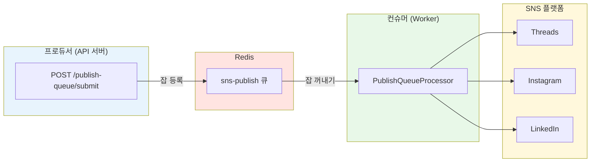
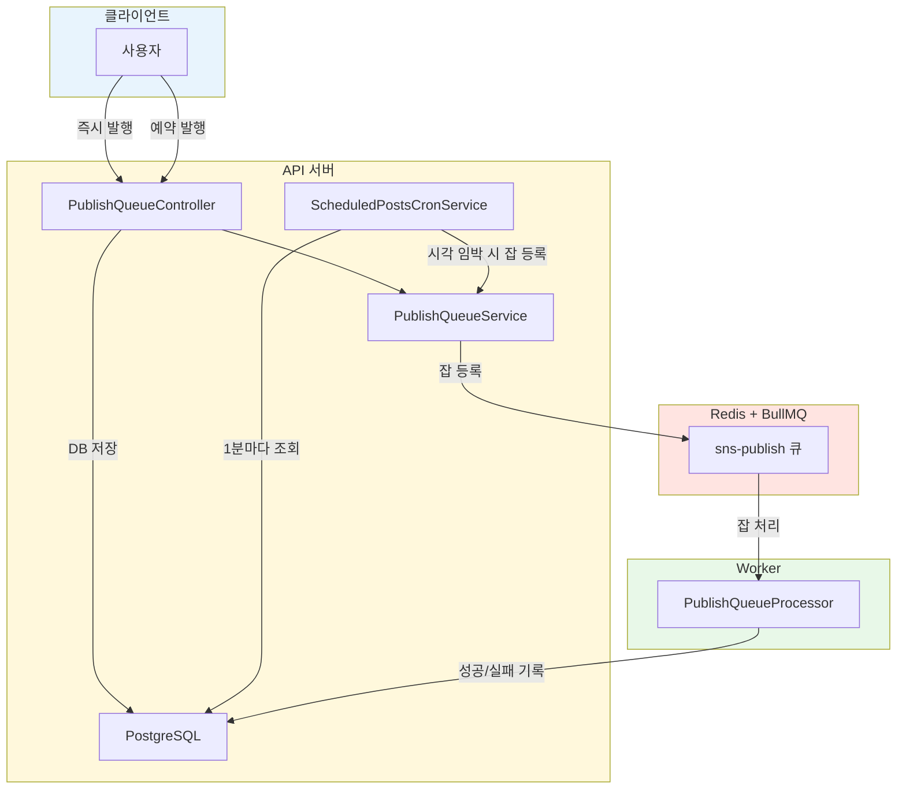
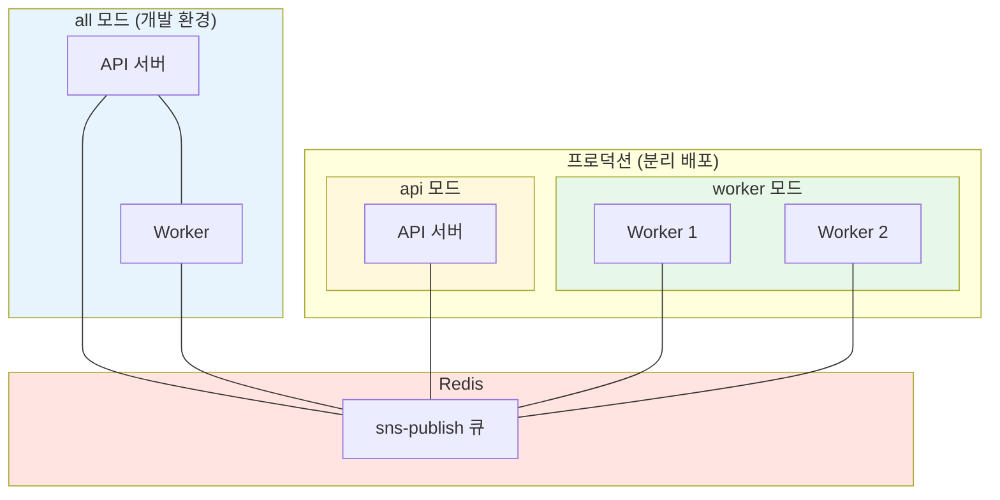

---
title: "[Backend] BullMQ + Redis로 SNS 포스트 발행 큐 구현하기"
description: "NestJS 환경에서 BullMQ와 Redis를 활용해 즉시/예약 발행을 큐 기반으로 처리하고, Worker 모드 분리까지 적용한 과정을 정리합니다."
category: "backend"
tags: ["nestjs", "bullmq", "redis", "queue", "worker", "scheduled-post"]
createdAt: "2026-03-01"
updatedAt: "2026-03-02"
published: true
---

## 왜 만들었나

SNS 자동화 서비스를 만들면서 포스트 발행 기능을 구현해야 했습니다. 처음에는 API 요청이 들어오면 곧바로 SNS API를 호출하는 방식이었는데, 몇 가지 문제가 있었습니다.

사용자가 여러 SNS 계정에 동시에 게시물을 발행하면 API 응답이 느려집니다. Threads, Instagram, LinkedIn 각각의 API를 순차 호출해야 하니 10초 이상 걸리는 경우도 있었습니다. 사용자는 그 시간 동안 게시하기 페이지에 머물러야 했고, 중간에 페이지를 벗어나면 발행이 실패하는 상황이 발생했습니다.

예약 발행도 문제였습니다. Cron으로 매분 DB를 조회해서 발행 시각이 된 게시물을 직접 처리하면, 동시에 수십 건이 몰릴 때 서버에 부하가 집중됩니다.

이 두 가지 문제를 해결하기 위해 큐 기반 아키텍처를 도입했습니다.

---

## BullMQ란

BullMQ는 Node.js 환경에서 사용하는 Redis 기반 메시지 큐 라이브러리입니다. 기존 Bull 라이브러리의 후속 버전으로, TypeScript로 작성되었고 더 나은 성능과 안정성을 제공합니다.

핵심 개념은 세 가지입니다.

- Queue: 잡(Job)을 등록하는 곳. 프로듀서 역할을 합니다.
- Worker: 큐에서 잡을 꺼내 실제 처리를 수행합니다. 컨슈머 역할입니다.
- Job: 처리할 작업 단위. 데이터와 옵션(재시도, 지연 등)을 포함합니다.

Redis를 백엔드 저장소로 사용하기 때문에 서버가 재시작되어도 큐에 등록된 잡이 유실되지 않습니다. 지연 실행(Delayed Job), 자동 재시도, 동시성 제어 같은 기능도 기본 제공됩니다.



---

## 가설

큐를 도입하면 두 가지 문제를 동시에 해결할 수 있다고 판단했습니다.

사용자가 발행 요청을 보내면 서버는 큐에 잡만 등록하고 즉시 응답합니다. 실제 SNS API 호출은 Worker가 비동기로 처리합니다. 사용자는 페이지를 벗어나도 발행이 정상 진행되고, 서버는 Worker의 동시 처리 수를 제한해서 부하를 관리할 수 있습니다.

예약 발행은 BullMQ의 Delayed Job 기능을 활용합니다. 발행 시각까지 남은 시간을 delay로 설정하면, 해당 시각이 되었을 때 Worker가 자동으로 잡을 처리합니다.

---

## 아키텍처

전체 발행 흐름은 즉시 발행과 예약 발행 두 가지로 나뉩니다.



즉시 발행은 요청이 들어오면 큐에 바로 등록합니다. 예약 발행은 DB에 먼저 저장하고, Cron이 1분마다 발행 시각이 5분 이내로 임박한 건을 조회해서 큐에 등록합니다. 이렇게 분리한 이유는 예약 시간 수정이나 취소가 빈번하기 때문입니다. DB에 저장해두면 수정/취소가 간단하고, 큐 등록은 발행 직전에만 수행하면 됩니다.

---

## 구현

### Redis 설정

로컬 개발 환경에서는 Docker Compose로 Redis를 실행합니다.

```yaml
# docker-compose.yml
services:
  redis:
    image: redis:7-alpine
    container_name: sns-automation-redis
    ports:
      - "6379:6379"
    volumes:
      - redis-data:/data
    command: redis-server --appendonly yes
    restart: unless-stopped
    healthcheck:
      test: ["CMD", "redis-cli", "ping"]
      interval: 10s
      timeout: 5s
      retries: 3

volumes:
  redis-data:
```

`appendonly yes` 옵션은 Redis의 AOF(Append Only File) 영속화를 활성화합니다. 서버가 재시작되어도 큐 데이터가 유지됩니다. `healthcheck`는 Redis 컨테이너가 정상 동작하는지 10초 간격으로 `redis-cli ping`을 실행해서 확인합니다. 3회 연속 실패하면 컨테이너를 unhealthy로 표시합니다.

### NestJS BullMQ 연동

AppModule에서 BullMQ를 전역으로 설정합니다. Redis 연결 정보는 환경 변수로 관리합니다.

```typescript
// app.module.ts
@Module({
  imports: [
    BullModule.forRootAsync({
      imports: [ConfigModule],
      useFactory: (configService: ConfigService) => ({
        connection: {
          host: configService.get<string>("REDIS_HOST", "localhost"),
          port: configService.get<number>("REDIS_PORT", 6379),
        },
      }),
      inject: [ConfigService],
    }),
    // ...
  ],
})
export class AppModule {}
```

### 큐 모듈

큐 이름은 상수로 관리합니다. 모듈은 큐 등록(프로듀서)과 잡 처리(컨슈머)를 분리했습니다.

```typescript
// constants.ts
export const PUBLISH_QUEUE_NAME = "sns-publish";
```

```typescript
// publish-queue.module.ts — 프로듀서 모듈
@Module({
  imports: [
    BullModule.registerQueue({ name: PUBLISH_QUEUE_NAME }),
    forwardRef(() => SnsAccountsModule),
    forwardRef(() => ScheduledPostsModule),
    PostHistoriesModule,
    UsageModule,
    NotificationsModule,
  ],
  controllers: [PublishQueueController],
  providers: [PublishQueueService],
  exports: [PublishQueueService, BullModule],
})
export class PublishQueueModule {}
```

프로듀서 모듈에서 `forwardRef`를 사용하는 이유는 `SnsAccountsModule`, `ScheduledPostsModule`과 순환 의존성이 있기 때문입니다. Controller에서 SNS 계정 조회와 예약 발행 DB 저장을 직접 처리하므로 이 모듈들이 필요합니다.

```typescript
// publish-queue-processor.module.ts — 컨슈머 모듈
@Module({
  imports: [
    PublishQueueModule,
    DatabaseModule,
    ThreadsModule,
    InstagramModule,
    LinkedinModule,
    PostHistoriesModule,
    UsageModule,
    NotificationsModule,
    SnsAccountsModule,
  ],
  providers: [PublishQueueProcessor],
})
export class PublishQueueProcessorModule {}
```

프로듀서 모듈은 API 서버에서 항상 필요하고, 컨슈머 모듈은 Worker에서만 필요합니다. 이 분리가 뒤에서 설명할 모드 분리의 기반이 됩니다.

### 잡 등록 (Service)

`PublishQueueService`는 잡을 큐에 등록하고, 잡 상태 조회 및 취소까지 담당합니다. 핵심 로직은 `submitPublishJob` 메서드입니다.

```typescript
// publish-queue.service.ts
@Injectable()
export class PublishQueueService {
  constructor(
    @InjectQueue(PUBLISH_QUEUE_NAME) private readonly publishQueue: Queue
  ) {}

  async submitPublishJob(
    userId: string,
    snsAccountId: string,
    platform: "THREADS" | "INSTAGRAM" | "LINKEDIN",
    content: PublishContent,
    scheduledAt?: string,
    scheduledPostId?: string
  ): Promise<string> {
    const jobData: PublishJobData = {
      userId,
      snsAccountId,
      platform,
      content,
      scheduledPostId,
    };

    const jobOptions: any = {
      attempts: 3,
      backoff: { type: "exponential", delay: 5000 },
      removeOnComplete: { age: 3600, count: 100 },
      removeOnFail: { age: 86400, count: 500 },
    };

    if (scheduledAt) {
      const delayMs = new Date(scheduledAt).getTime() - Date.now();
      if (delayMs > 0) {
        jobOptions.delay = delayMs;
      }
    }

    const job = await this.publishQueue.add("publish", jobData, jobOptions);
    return job.id;
  }
}
```

몇 가지 설정을 짚어보면 다음과 같습니다.

`attempts: 3`과 `backoff: exponential`은 SNS API 호출이 일시적으로 실패했을 때 5초, 10초, 20초 간격으로 재시도합니다. 네트워크 오류나 Rate Limit 같은 일시적 장애에 대응할 수 있습니다.

`removeOnComplete`과 `removeOnFail`은 Redis 메모리 관리를 위한 설정입니다. 완료된 잡은 1시간 또는 100개 초과 시, 실패한 잡은 24시간 또는 500개 초과 시 자동 제거됩니다.

`scheduledAt`이 있으면 현재 시각과의 차이를 `delay`로 설정합니다. BullMQ가 해당 시간이 될 때까지 잡을 지연 상태로 유지하다가 자동으로 처리합니다.

### 잡 상태 조회 및 취소

잡을 큐에 등록한 뒤에도 사용자가 상태를 확인하거나 취소할 수 있어야 합니다. `PublishQueueService`에 조회/취소 메서드를 추가했습니다.

```typescript
// publish-queue.service.ts (계속)

/** 사용자의 활성 잡 목록을 조회한다 (waiting, delayed, active). */
async getActiveJobs(userId: string): Promise<PublishJobInfo[]> {
  const [waiting, delayed, active] = await Promise.all([
    this.publishQueue.getJobs(['waiting'], 0, 100),
    this.publishQueue.getJobs(['delayed'], 0, 100),
    this.publishQueue.getJobs(['active'], 0, 100),
  ]);

  const allJobs = [...waiting, ...delayed, ...active];
  const userJobs = allJobs.filter((job) => job?.data?.userId === userId);
  return Promise.all(userJobs.map((job) => this.toJobInfo(job)));
}

/** 대기 중이거나 처리 중인 잡을 취소한다. */
async cancelJob(userId: string, jobId: string): Promise<void> {
  const job = await this.publishQueue.getJob(jobId);
  if (!job || job.data?.userId !== userId) {
    throw new HttpException({ message: '잡을 찾을 수 없습니다.' }, HttpStatus.NOT_FOUND);
  }

  const state = await job.getState();

  if (state === 'waiting' || state === 'delayed') {
    await job.remove();
    return;
  }

  if (state === 'active') {
    await job.moveToFailed(new Error('사용자가 발행을 취소했습니다.'), job.id, true);
    return;
  }

  throw new HttpException({ message: '취소할 수 없는 상태입니다.' }, HttpStatus.BAD_REQUEST);
}

/** 잡 ID로 잡을 제거한다 (예약 발행 수정/취소 시 사용). */
async removeJob(jobId: string): Promise<void> {
  const job = await this.publishQueue.getJob(jobId);
  if (job) {
    await job.remove();
  }
}
```

`cancelJob`은 잡의 상태에 따라 처리 방식이 다릅니다. `waiting`이나 `delayed` 상태면 큐에서 바로 제거하고, `active` 상태(이미 처리 중)면 `moveToFailed`로 강제 실패 처리합니다. `removeJob`은 예약 발행의 시간 수정이나 취소 시 기존 잡을 제거하는 용도로 사용됩니다.

Controller에서는 이 메서드들을 REST API로 노출합니다.

```typescript
// publish-queue.controller.ts

@Get('jobs')
async getActiveJobs(@Req() req: any): Promise<ActiveJobsResponse> {
  const userId = this.extractUserId(req);
  const jobs = await this.publishQueueService.getActiveJobs(userId);
  return { success: true, jobs };
}

@Get('jobs/:jobId')
async getJobStatus(@Req() req: any, @Param('jobId') jobId: string): Promise<JobStatusResponse> {
  const userId = this.extractUserId(req);
  const job = await this.publishQueueService.getJobStatus(userId, jobId);
  return { success: true, job };
}

@Delete('jobs/:jobId')
async cancelJob(@Req() req: any, @Param('jobId') jobId: string): Promise<CancelJobResponse> {
  const userId = this.extractUserId(req);
  await this.publishQueueService.cancelJob(userId, jobId);
  return { success: true, message: '잡이 취소되었습니다.' };
}
```

또한 Controller의 `submit` 엔드포인트에서 즉시 발행과 예약 발행의 처리 방식이 다릅니다.

```typescript
// publish-queue.controller.ts — submit 메서드

@Post('submit')
async submit(@Req() req: any, @Body() dto: SubmitPublishDto) {
  const userId = this.extractUserId(req);

  // 예약 발행: DB에만 저장 (Cron이 발행 시점에 큐에 등록)
  if (dto.scheduledAt) {
    const result = await this.scheduledPostsService.create(
      userId, dto.snsAccountIds, dto.scheduledAt, dto.content,
    );
    const jobIds = result.posts.map((p: any) => p.id);
    return { success: true, jobIds };
  }

  // 즉시 발행: 큐에만 등록
  const jobIds: string[] = [];
  for (const snsAccountId of dto.snsAccountIds) {
    await this.usageService.checkQuota(userId);
    const account = await this.snsAccountsService.getOwnedAccount(userId, snsAccountId);
    const jobId = await this.publishQueueService.submitPublishJob(
      userId, snsAccountId, account.platform as 'THREADS' | 'INSTAGRAM' | 'LINKEDIN', dto.content,
    );
    jobIds.push(jobId);
  }

  return { success: true, jobIds };
}
```

즉시 발행은 큐에 바로 등록하고, 예약 발행은 `ScheduledPostsService.create()`를 통해 DB에만 저장합니다. 큐 등록은 Cron이 발행 시점에 처리합니다. 이렇게 분리한 덕분에 예약 시간 수정이나 취소가 DB 조작만으로 가능합니다.

### 잡 처리 (Processor)

`PublishQueueProcessor`는 Worker가 실행하는 잡 처리 로직입니다. `@Processor` 데코레이터로 큐 이름과 동시 처리 수를 지정합니다.

```typescript
// publish-queue.processor.ts
@Processor("sns-publish", {
  concurrency: parseInt(process.env.PUBLISH_QUEUE_CONCURRENCY || "5", 10),
})
export class PublishQueueProcessor extends WorkerHost {
  async process(job: Job<PublishJobData>): Promise<any> {
    const { userId, snsAccountId, platform, content, scheduledPostId } =
      job.data;

    // 예약 발행인 경우 상태를 PUBLISHING으로 변경
    if (scheduledPostId) {
      await this.db
        .update(scheduledPosts)
        .set({ status: POST_STATUS.PUBLISHING, updatedAt: new Date() })
        .where(eq(scheduledPosts.id, scheduledPostId));
    }

    // 1. SNS 계정 토큰 조회 및 복호화
    // 2. 토큰 만료 확인 및 갱신
    // 3. 플랫폼별 SNS API 호출
    const externalPostId = await this.publishToSns(
      platform,
      account.platformUserId,
      accessToken,
      content,
      account.scope
    );

    return { externalPostId };
  }

  @OnWorkerEvent("completed")
  async onCompleted(job: Job<PublishJobData>, result: any) {
    const { userId, snsAccountId, platform, content, scheduledPostId } =
      job.data;
    const externalPostId = result?.externalPostId;

    // PostHistory 기록
    await this.postHistoriesService.createHistory({
      userId,
      snsAccountId,
      platform,
      content,
      status: "PUBLISHED",
      publishedAt: new Date(),
      externalPostId,
      retryCount: job.attemptsMade,
      maxRetryCount: 3,
    });

    // 사용량 차감 (즉시/예약 구분)
    const usageCategory = scheduledPostId
      ? USAGE_CATEGORIES.SCHEDULED_POST
      : USAGE_CATEGORIES.IMMEDIATE_POST;
    await this.usageService.trackAction(userId, usageCategory, snsAccountId);

    // 예약 발행인 경우 scheduledPosts 상태를 PUBLISHED로 업데이트
    if (scheduledPostId) {
      await this.db
        .update(scheduledPosts)
        .set({
          status: POST_STATUS.PUBLISHED,
          publishedAt: new Date(),
          externalPostId,
          updatedAt: new Date(),
        })
        .where(eq(scheduledPosts.id, scheduledPostId));
    }

    // 성공 알림 생성
    await this.notificationsService.create(
      userId,
      "PUBLISH_SUCCESS",
      "게시물 발행 성공",
      `${platform} 게시물이 성공적으로 발행되었습니다.`,
      { snsAccountId }
    );
  }

  @OnWorkerEvent("failed")
  async onFailed(job: Job<PublishJobData>, error: Error) {
    // 재시도 중이면 무시 (최종 실패 시에만 처리)
    if (job.attemptsMade < (job.opts?.attempts || 3)) return;

    const { userId, snsAccountId, platform, content, scheduledPostId } =
      job.data;
    const errorMessage = error?.message || "알 수 없는 오류";

    // PostHistory에 에러 기록
    await this.postHistoriesService.createHistory({
      userId,
      snsAccountId,
      platform,
      content,
      status: "FAILED",
      failedAt: new Date(),
      errorMessage,
      retryCount: job.attemptsMade,
      maxRetryCount: 3,
    });

    // 예약 발행인 경우 scheduledPosts 상태를 FAILED로 업데이트
    if (scheduledPostId) {
      await this.db
        .update(scheduledPosts)
        .set({
          status: POST_STATUS.FAILED,
          errorMessage,
          updatedAt: new Date(),
        })
        .where(eq(scheduledPosts.id, scheduledPostId));
    }

    // 실패 알림 생성
    await this.notificationsService.create(
      userId,
      "PUBLISH_FAILED",
      "게시물 발행 실패",
      `${platform} 게시물 발행에 실패했습니다: ${errorMessage}`,
      { snsAccountId }
    );
  }
}
```

`concurrency: 5`는 Worker 하나가 동시에 최대 5개의 잡을 처리한다는 의미입니다. SNS API 호출은 I/O 바운드 작업이라 동시 처리가 효율적이지만, 너무 높이면 Rate Limit에 걸릴 수 있어 5로 설정했습니다. 환경 변수 `PUBLISH_QUEUE_CONCURRENCY`로 조정할 수 있습니다.

`process()` 메서드에서 예약 발행인 경우(`scheduledPostId`가 있을 때) 처리 시작 시 상태를 `PUBLISHING`으로 변경합니다. 이렇게 하면 사용자가 "발행 중" 상태를 확인할 수 있고, Cron이 이미 처리 중인 건을 중복 등록하지 않습니다.

`@OnWorkerEvent('completed')`에서는 `job.data`에서 필요한 값을 꺼내고, 발행 이력(PostHistory) 기록, 사용량 추적, 알림 생성을 순서대로 수행합니다. 사용량 추적 시 즉시 발행(`IMMEDIATE_POST`)과 예약 발행(`SCHEDULED_POST`)을 구분합니다. 예약 발행이 완료되면 `scheduledPosts` 테이블의 상태도 `PUBLISHED`로 업데이트합니다.

`@OnWorkerEvent('failed')`에서는 재시도 중인 경우를 구분해서 최종 실패 시에만 에러를 기록합니다. BullMQ v4+에서는 `failed` 이벤트가 매 재시도 실패마다 발생하므로, `job.attemptsMade < job.opts.attempts` 조건으로 최종 실패만 필터링합니다. 예약 발행이 최종 실패하면 `scheduledPosts` 상태도 `FAILED`로 업데이트합니다.

### 예약 발행 Cron

예약 발행은 DB와 큐를 조합해서 처리합니다. 사용자가 예약 요청을 보내면 DB에만 저장하고, Cron이 발행 시각 임박 시 큐에 등록합니다.

```typescript
// scheduled-posts-cron.service.ts
@Injectable()
export class ScheduledPostsCronService {
  @Cron(CronExpression.EVERY_MINUTE)
  async handleScheduledPosts() {
    const now = new Date();
    const fiveMinutesLater = new Date(now.getTime() + 5 * 60 * 1000);

    // 발행 시각이 5분 이내이고, 아직 큐에 등록되지 않은 건 조회
    const pendingPosts = await this.db
      .select()
      .from(scheduledPosts)
      .where(
        and(
          eq(scheduledPosts.status, POST_STATUS.SCHEDULED),
          lte(scheduledPosts.scheduledAt, fiveMinutesLater),
          isNull(scheduledPosts.jobId)
        )
      );

    for (const post of pendingPosts) {
      // 발행 시각까지 남은 시간 계산 (이미 지났으면 즉시 발행)
      const scheduledTime = new Date(post.scheduledAt).getTime();
      const delayMs = Math.max(0, scheduledTime - Date.now());
      const scheduledAt =
        delayMs > 0 ? new Date(post.scheduledAt).toISOString() : undefined;

      const jobId = await this.publishQueueService.submitPublishJob(
        post.userId,
        post.snsAccountId,
        post.platform,
        post.content,
        scheduledAt,
        post.id
      );

      // jobId를 DB에 저장하여 중복 등록 방지
      await this.db
        .update(scheduledPosts)
        .set({ jobId, updatedAt: new Date() })
        .where(eq(scheduledPosts.id, post.id));
    }
  }
}
```

`jobId`를 DB에 저장하는 이유는 중복 등록 방지입니다. Cron이 1분마다 실행되므로, 이미 큐에 등록된 건은 `isNull(scheduledPosts.jobId)` 조건으로 걸러냅니다.

Cron에서 `delayMs`를 계산할 때 `Math.max(0, ...)`을 사용하는 이유는, 발행 시각이 이미 지난 경우(예: 서버 다운 후 복구)에도 즉시 발행되도록 하기 위해서입니다. `delayMs`가 0이면 `scheduledAt`을 `undefined`로 전달해서 Delayed Job이 아닌 즉시 처리 잡으로 등록합니다.

### 예약 발행 수정/취소

예약 발행의 수정이나 취소 시에는 이미 큐에 등록된 잡도 함께 처리해야 합니다. `ScheduledPostsService`에서 이를 담당합니다.

```typescript
// scheduled-posts.service.ts

/** 예약 수정 (발행 전에만 가능) */
async update(userId: string, postId: string, data: { scheduledAt?: string; content?: PostContent }) {
  const post = await this.getOwnedPost(userId, postId);

  if (post.status !== POST_STATUS.SCHEDULED) {
    throw new HttpException({ message: '예약 상태인 게시물만 수정할 수 있습니다.' }, HttpStatus.BAD_REQUEST);
  }

  // DB 업데이트
  const updated = await this.db
    .update(scheduledPosts)
    .set({ ...data, updatedAt: new Date() })
    .where(eq(scheduledPosts.id, postId))
    .returning();

  // 예약 시간이 변경되고 이미 큐에 등록된 잡이 있으면 제거
  // Cron이 새 시간 기준으로 재등록
  if (data.scheduledAt && post.jobId) {
    await this.publishQueueService.removeJob(post.jobId);
    await this.db
      .update(scheduledPosts)
      .set({ jobId: null })
      .where(eq(scheduledPosts.id, postId));
  }

  return { success: true, post: updated[0] };
}

/** 예약 취소 (발행 전에만 가능) */
async cancel(userId: string, postId: string) {
  const post = await this.getOwnedPost(userId, postId);

  if (post.status !== POST_STATUS.SCHEDULED) {
    throw new HttpException({ message: '예약 상태인 게시물만 취소할 수 있습니다.' }, HttpStatus.BAD_REQUEST);
  }

  await this.db
    .update(scheduledPosts)
    .set({ status: POST_STATUS.CANCELLED, updatedAt: new Date() })
    .where(eq(scheduledPosts.id, postId));

  // 큐에 등록된 잡도 제거
  if (post.jobId) {
    await this.publishQueueService.removeJob(post.jobId);
  }

  return { success: true };
}
```

예약 시간을 수정하면 기존 잡을 `removeJob`으로 제거하고 `jobId`를 null로 초기화합니다. 그러면 다음 Cron 실행 시 새 시간 기준으로 잡이 재등록됩니다. 취소 시에도 DB 상태를 `CANCELLED`로 변경하면서 큐의 잡도 함께 제거합니다.

---

## Worker / API / All 모드 분리

서비스가 성장하면 API 서버와 Worker를 별도 프로세스로 분리해야 할 수 있습니다. 동일 코드베이스에서 환경 변수 하나로 실행 모드를 전환할 수 있도록 구성했습니다.

```
APP_MODE=all     # API + Worker 모두 실행 (기본값, 개발 환경)
APP_MODE=api     # API 서버만 실행 (Worker 미실행)
APP_MODE=worker  # Worker만 실행 (HTTP 서버 미실행)
```

### AppModule 조건부 로딩

```typescript
// app.module.ts
const appMode = process.env.APP_MODE || "all";

// 워커 모드가 아닐 때만 로드하는 API 모듈들
const apiModules =
  appMode !== "worker"
    ? [
        AuthModule,
        ImagesModule,
        VideosModule,
        AutomationModule,
        DraftPostsModule,
        InsightsModule,
        PolarWebhookModule,
        CardNewsModule,
        PostAIModule,
        CustomTonesModule,
        AdminModule,
      ]
    : [];

// API 모드가 아닐 때만 로드하는 워커 모듈
const workerModules = appMode !== "api" ? [PublishQueueProcessorModule] : [];

@Module({
  imports: [
    ConfigModule.forRoot({ isGlobal: true }),
    BullModule.forRootAsync({
      imports: [ConfigModule],
      useFactory: (configService: ConfigService) => ({
        connection: {
          host: configService.get<string>("REDIS_HOST", "localhost"),
          port: configService.get<number>("REDIS_PORT", 6379),
        },
      }),
      inject: [ConfigService],
    }),
    ScheduleModule.forRoot(),
    // 공통 모듈 (모든 모드에서 필요)
    DatabaseModule,
    CacheModule,
    PlanConfigModule,
    UsageModule,
    ThreadsModule,
    InstagramModule,
    LinkedinModule,
    SnsAccountsModule,
    ScheduledPostsModule,
    PostHistoriesModule,
    NotificationsModule,
    PublishQueueModule,
    // 조건부 모듈
    ...apiModules,
    ...workerModules,
  ],
  controllers: appMode !== "worker" ? [AppController] : [],
  providers: appMode !== "worker" ? [AppService] : [],
})
export class AppModule {}
```

`PublishQueueModule`(프로듀서)은 모든 모드에서 로드됩니다. API 서버는 잡을 등록해야 하고, Worker도 큐 연결이 필요하기 때문입니다. `PublishQueueProcessorModule`(컨슈머)은 `api` 모드에서만 제외됩니다.

### main.ts 분기

```typescript
// main.ts
async function bootstrap() {
  const app = await NestFactory.create(AppModule, { rawBody: true });
  const appMode = process.env.APP_MODE || "all";

  if (appMode === "worker") {
    // 워커 모드: HTTP 서버 없이 NestJS 앱만 초기화
    await app.init();
    logger.log("Worker mode started (no HTTP server)");
  } else {
    // API 또는 All 모드: HTTP 서버 실행
    await app.listen(port);
  }
}
```

Worker 모드에서는 `app.init()`만 호출합니다. HTTP 서버를 띄우지 않고 NestJS의 DI 컨테이너만 초기화하면, BullMQ Worker가 자동으로 큐를 구독하고 잡을 처리합니다.

### 모드별 실행 구성



개발 환경에서는 `all` 모드로 하나의 프로세스에서 모두 실행합니다. 프로덕션에서는 API 서버와 Worker를 별도 컨테이너로 분리 배포할 수 있습니다. Worker를 여러 인스턴스로 스케일 아웃하면 처리량을 늘릴 수 있고, Redis가 잡 분배를 자동으로 처리합니다.

---

## 효과

큐 도입 후 사용자 경험이 눈에 띄게 개선되었습니다. 발행 요청의 API 응답 시간이 수 초에서 수백 밀리초로 줄었습니다. 사용자는 게시하기 버튼을 누르면 즉시 다른 작업을 할 수 있고, 발행 결과는 알림으로 확인합니다.

서버 측에서는 동시 처리 수를 제한해서 SNS API Rate Limit에 걸리는 빈도가 줄었습니다. 실패 시 자동 재시도(exponential backoff)로 일시적 장애에도 안정적으로 대응합니다. 예약 발행의 수정/취소도 DB 기반으로 처리하니 큐 상태를 직접 조작할 필요가 없어졌습니다.

모드 분리는 아직 프로덕션에서 활용하지 않고 있지만, 트래픽이 늘어나면 Worker만 별도로 스케일 아웃할 수 있는 구조가 준비되어 있습니다.

---

## 마치며

BullMQ + Redis 조합은 Node.js 환경에서 비동기 작업 처리에 적합한 선택입니다. NestJS의 `@nestjs/bullmq` 패키지가 DI와 데코레이터 기반 통합을 잘 지원해서 구현 난이도도 높지 않았습니다. 큐 기반 아키텍처는 SNS 발행뿐 아니라 이메일 발송, 이미지 처리, 데이터 동기화 같은 비동기 작업에도 동일하게 적용할 수 있습니다.
