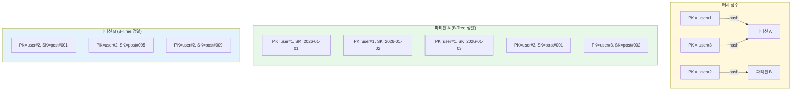
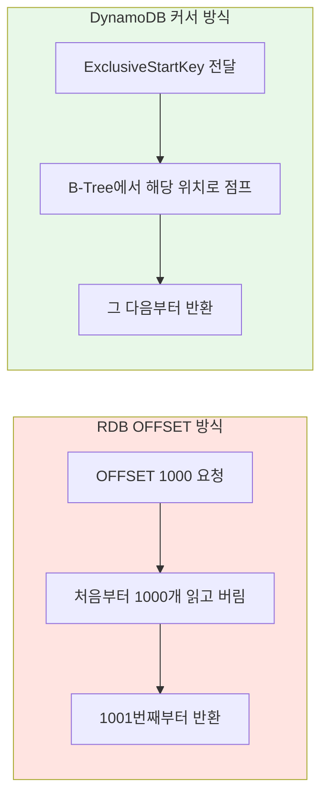

## DynamoDB의 페이지네이션

RDB에서는 `LIMIT`/`OFFSET`으로 페이지네이션을 구현합니다. 3페이지로 바로 이동하거나, 전체 페이지 수를 표시하는 것도 가능합니다. DynamoDB에서는 이런 방식이 원천적으로 불가능합니다. 그 이유는 DynamoDB의 데이터 저장 구조에 있습니다.

---

## 데이터 저장 구조: Partition Key와 Sort Key

DynamoDB 테이블의 키는 두 가지로 구성됩니다.

- Partition Key (PK): 데이터가 어느 파티션(노드)에 저장될지 결정
- Sort Key (SK): 같은 파티션 안에서 데이터의 정렬 순서를 결정

PK는 해시 함수를 거쳐 물리적 파티션에 매핑됩니다. 같은 PK를 가진 항목들은 동일한 파티션에 저장되고, SK 기준으로 B-Tree에 정렬된 상태를 유지합니다.



PK가 해시 기반이기 때문에 파티션 간에는 순서가 없습니다. `user#1`이 `user#2`보다 앞에 있다는 보장이 없습니다. 정렬은 같은 PK 내부에서만 SK 기준으로 보장됩니다.

---

## OFFSET 기반 페이지네이션이 불가능한 이유

RDB의 `OFFSET`은 "정렬된 전체 결과에서 N번째부터 잘라줘"라는 연산입니다.

```sql
-- RDB: 전체 데이터에서 41번째~60번째 항목
SELECT * FROM posts ORDER BY created_at DESC LIMIT 20 OFFSET 40;
```

DynamoDB에서 이 연산이 불가능한 이유는 세 가지입니다.

첫째, 데이터가 여러 파티션에 분산되어 있어서 "전체 데이터에서 41번째"라는 개념 자체가 존재하지 않습니다. 어떤 파티션에 몇 개가 있는지 합산하려면 전체를 스캔해야 하고, 이는 분산 DB의 확장성을 무너뜨립니다.

둘째, `Scan`이나 `Query` 결과는 1MB 단위로 잘려서 반환됩니다. 한 번의 호출로 전체 결과를 받을 수 없습니다.

셋째, 전체 항목 수(`total count`)를 효율적으로 알 수 없어서 "총 15페이지 중 3페이지" 같은 UI를 만들기 어렵습니다.

---

## 커서 기반 페이지네이션

DynamoDB는 `LastEvaluatedKey`를 커서로 사용하는 페이지네이션만 지원합니다.

```python
# 첫 페이지 요청
response = table.query(
    KeyConditionExpression=Key('pk').eq('user#123'),
    Limit=20
)

items = response['Items']
next_cursor = response.get('LastEvaluatedKey')

# 다음 페이지 요청
if next_cursor:
    response = table.query(
        KeyConditionExpression=Key('pk').eq('user#123'),
        ExclusiveStartKey=next_cursor,
        Limit=20
    )
```

`LastEvaluatedKey`는 단순한 숫자가 아니라 실제 데이터의 물리적 위치를 가리키는 포인터입니다. 해당 파티션의 B-Tree 인덱스에서 그 키 위치로 바로 점프하기 때문에, 1페이지든 100페이지든 동일한 성능을 보장합니다.

---

## RDB OFFSET vs DynamoDB 커서 비교



| 항목                | RDB OFFSET      | DynamoDB 커서     |
| ------------------- | --------------- | ----------------- |
| 임의 페이지 점프    | ✅ 가능         | ❌ 불가능         |
| 전체 페이지 수 표시 | ✅ COUNT로 가능 | ❌ 비효율적       |
| 뒤쪽 페이지 성능    | ❌ 느려짐       | ✅ 일정           |
| 이전 페이지 이동    | ✅ OFFSET 변경  | ❌ 커서 보관 필요 |

RDB에서도 데이터가 많아지면 `OFFSET`이 커질수록 성능이 떨어지는 문제가 있습니다. 이 경우 RDB에서도 커서 기반(keyset) 페이지네이션을 사용합니다.

```sql
-- RDB 커서 기반 페이지네이션
SELECT * FROM posts
WHERE created_at < '2026-03-25T10:00:00'
ORDER BY created_at DESC
LIMIT 20;
```

---

## Query vs Scan에서의 커서 차이

커서의 의미는 `Query`와 `Scan`에서 다릅니다.

`Query`는 하나의 PK 내에서 SK 순서대로 데이터를 읽습니다. B-Tree에 이미 정렬된 상태이므로 커서가 논리적인 "다음 순서"를 가리킵니다. 별도의 정렬 연산이 필요 없습니다.

`Scan`은 전체 테이블을 훑는 연산입니다. 파티션 간에는 정해진 순서가 없기 때문에, `LastEvaluatedKey`는 "여기까지 읽었다"는 물리적 위치 표시일 뿐 논리적 정렬 순서를 보장하지 않습니다.

```python
# Query: PK 내에서 SK 정렬 보장
response = table.query(
    KeyConditionExpression=Key('pk').eq('electronics'),
    ScanIndexForward=True,  # SK 오름차순 (False면 내림차순)
    Limit=20
)

# Scan: 정렬 보장 없음, 단순 체크포인트
response = table.scan(Limit=20)
```

---

## 전체 데이터 정렬이 필요한 경우

동일한 PK 내에서만 정렬이 가능하다는 제약 때문에, "전체 제품을 가격순으로 정렬"하려면 GSI(Global Secondary Index)와 고정 PK 패턴을 조합해야 합니다.

### 카테고리별 가격순 정렬

카테고리를 GSI의 PK로, 가격을 SK로 설정하면 카테고리 내에서 가격순 조회가 가능합니다.

```
메인 테이블:
PK = "PRODUCT#001", SK = "METADATA"
{ name: "키보드", category: "electronics", price: 50000 }

GSI (CategoryPriceIndex):
PK = "electronics"    ← 카테고리를 PK로
SK = 50000             ← 가격을 SK로
```

```python
table.query(
    IndexName='CategoryPriceIndex',
    KeyConditionExpression=Key('GSI_PK').eq('electronics'),
    ScanIndexForward=True,
    Limit=20
)
```

### 전체 제품 정렬

카테고리 구분 없이 전체를 정렬하려면 고정값 PK를 사용합니다.

```
GSI (AllProductsPriceIndex):
PK = "ALL_PRODUCTS"    ← 모든 제품이 같은 PK
SK = 50000              ← 가격
```

이 패턴은 데이터가 많아지면 하나의 파티션에 부하가 집중되는 핫 파티션 문제가 발생합니다. 이 경우 PK를 `ALL_PRODUCTS#1`, `ALL_PRODUCTS#2`처럼 샤딩하고, 각 샤드를 병렬로 Query한 뒤 애플리케이션에서 머지해야 합니다.

다양한 정렬 기준(가격순, 인기순, 최신순)이 필요하면 정렬 기준마다 GSI를 만들어야 합니다. 조회 패턴이 다양하고 자주 바뀌는 서비스라면 ElasticSearch 같은 검색 엔진을 함께 사용하는 것이 현실적입니다.

---

## 마치며

DynamoDB에서 OFFSET 기반 페이지네이션이 불가능한 이유는 데이터가 PK 해시 기준으로 분산 저장되어 "전체 순서"라는 개념이 존재하지 않기 때문입니다. 커서 기반 페이지네이션은 B-Tree 인덱스를 활용해 일정한 성능을 보장하지만, 임의 페이지 점프나 전체 페이지 수 표시는 지원하지 않습니다. DynamoDB를 사용할 때는 테이블 설계 시점에 조회 패턴을 미리 결정하는 것이 핵심입니다.
