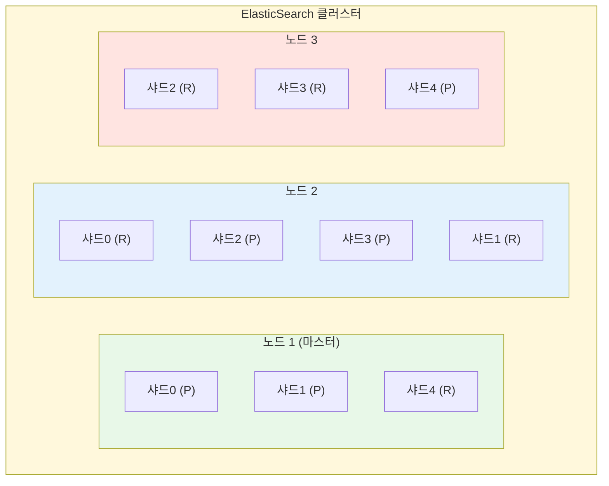
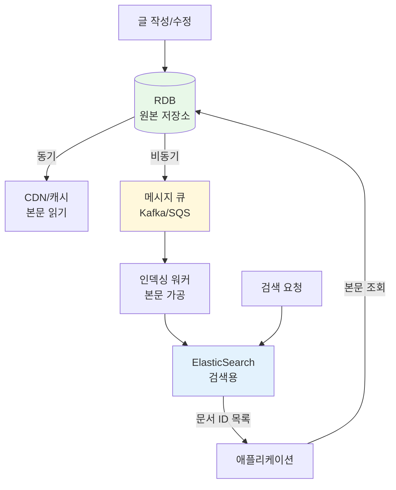

## ElasticSearch란

ElasticSearch는 검색과 분석에 특화된 분산 저장소입니다. RDB나 DynamoDB가 "이 키에 해당하는 데이터를 가져와"라는 연산에 최적화되어 있다면, ElasticSearch는 "어떤 데이터가 있는지 모르는 상태에서 찾는 것"에 최적화되어 있습니다. 이 글에서는 ElasticSearch의 내부 동작 원리와 대용량 텍스트 데이터를 다룰 때의 운영 전략을 정리합니다.

---

## 역인덱스 (Inverted Index)

ElasticSearch의 핵심 자료구조는 역인덱스입니다. 일반적인 DB가 "문서 → 단어" 방향으로 저장한다면, ElasticSearch는 "단어 → 문서" 방향으로 저장합니다.

```
일반 DB (Forward Index):
문서1 → ["삼성", "갤럭시", "스마트폰"]
문서2 → ["애플", "아이폰", "스마트폰"]
문서3 → ["삼성", "노트북", "갤럭시북"]

ElasticSearch (Inverted Index):
"삼성"     → [문서1, 문서3]
"스마트폰"  → [문서1, 문서2]
"갤럭시"   → [문서1]
"애플"     → [문서2]
"노트북"   → [문서3]
```

"삼성"을 검색하면 전체 문서를 스캔할 필요 없이, 역인덱스에서 바로 [문서1, 문서3]을 찾아냅니다. 이것이 전문 검색(Full-Text Search)이 빠른 이유입니다.

문서가 저장될 때 내부적으로 두 가지가 동시에 일어납니다.

```json
PUT /products/_doc/1
{
  "name": "삼성 갤럭시 S25",
  "category": "스마트폰",
  "price": 1200000,
  "description": "AI 기능이 탑재된 최신 스마트폰",
  "tags": ["삼성", "5G", "AI"]
}
```

1. 원본 문서가 `_source`에 저장됩니다. 검색 결과를 반환할 때 사용됩니다.
2. 필드별로 역인덱스가 생성됩니다. `name`, `description`, `tags` 각각에 대해 별도의 역인덱스가 만들어집니다.

---

## 텍스트 분석 파이프라인 (Analyzer)

문서가 역인덱스에 들어가기 전에 Analyzer를 거칩니다. Analyzer는 세 단계로 구성됩니다.


Character Filter는 HTML 태그나 특수문자를 정리합니다. Tokenizer는 텍스트를 토큰 단위로 분리합니다. Token Filter는 소문자 변환, 불용어 제거, 동의어 처리 등을 수행합니다.

이 과정 덕분에 "Running"을 검색해도 "run"이 포함된 문서를 찾을 수 있습니다. 한국어의 경우 nori 형태소 분석기를 사용하면 "스마트폰을" → "스마트폰"으로 분리해줍니다.

```json
PUT /products
{
  "settings": {
    "analysis": {
      "analyzer": {
        "korean": {
          "type": "custom",
          "tokenizer": "nori_tokenizer"
        }
      }
    }
  }
}
```

---

## 검색 쿼리

ElasticSearch의 쿼리는 크게 두 종류로 나뉩니다.

### Query Context

"얼마나 관련 있는가"를 점수로 매깁니다. TF-IDF, BM25 같은 알고리즘으로 관련도를 계산하고, 점수가 높은 순서대로 결과를 정렬합니다.

```json
{
  "query": {
    "match": {
      "description": "AI 스마트폰"
    }
  }
}
```

### Filter Context

"조건에 맞는가 아닌가"를 판단합니다. Yes/No만 판단하기 때문에 점수 계산이 없고, 결과를 캐싱할 수 있어서 더 빠릅니다.

```json
{
  "query": {
    "bool": {
      "filter": [
        { "term": { "category": "스마트폰" } },
        { "range": { "price": { "lte": 1500000 } } }
      ]
    }
  }
}
```

### 실무에서의 조합

실제 서비스에서는 두 가지를 조합합니다. 쇼핑몰 검색 결과 페이지가 이런 구조입니다.

```json
{
  "query": {
    "bool": {
      "must": [{ "match": { "description": "AI 카메라" } }],
      "filter": [
        { "term": { "category": "스마트폰" } },
        { "range": { "price": { "gte": 500000, "lte": 1500000 } } }
      ]
    }
  },
  "sort": [{ "_score": "desc" }, { "price": "asc" }],
  "from": 0,
  "size": 20
}
```

이 쿼리는 "스마트폰 카테고리에서 50만~150만원 사이, AI 카메라 관련도순으로 20개"를 의미합니다. `must`에서 관련도 점수를 계산하고, `filter`에서 조건을 걸러냅니다.

---

## Aggregation (집계)

검색 결과를 그룹핑해서 통계를 내는 기능입니다. 쇼핑몰 좌측에 있는 필터 UI가 이 기능으로 만들어집니다.

```json
{
  "query": { "match": { "description": "스마트폰" } },
  "aggs": {
    "브랜드별": {
      "terms": { "field": "brand" }
    },
    "가격대별": {
      "histogram": { "field": "price", "interval": 500000 }
    },
    "평균가격": {
      "avg": { "field": "price" }
    }
  }
}
```

결과로 "삼성 45개, 애플 38개, LG 12개" 같은 브랜드별 카운트와 "0~50만 10개, 50~100만 35개" 같은 가격대별 분포, 평균가격 등을 한 번의 쿼리로 받을 수 있습니다.

---

## 분산 아키텍처

ElasticSearch는 데이터를 샤드 단위로 분산 저장합니다. 각 샤드는 독립적인 Lucene 인덱스입니다.



P는 Primary 샤드, R은 Replica 샤드입니다. 검색 요청이 들어오면 코디네이터 노드가 모든 샤드에 병렬로 검색을 요청하고, 각 샤드가 로컬에서 검색한 상위 N개 결과를 반환합니다. 코디네이터가 이를 합쳐서 최종 정렬 후 반환합니다.

노드가 죽으면 해당 노드의 Replica가 Primary로 승격되어 자동 복구됩니다.

---

## RDB, DynamoDB와의 비교

| 항목          | RDB                   | DynamoDB            | ElasticSearch             |
| ------------- | --------------------- | ------------------- | ------------------------- |
| 데이터 모델   | 테이블/행/열          | Key-Value/Document  | JSON Document             |
| 검색 방식     | SQL (WHERE, LIKE)     | PK 기반 Query       | 역인덱스 기반 전문 검색   |
| 정렬          | ORDER BY (유연)       | SK 기준 (PK 내부만) | \_score, 필드 기준 (유연) |
| 페이지네이션  | OFFSET/커서 모두 가능 | 커서만 가능         | from/size, search_after   |
| 트랜잭션      | ✅ ACID 보장          | ✅ 제한적 지원      | ❌ 없음                   |
| 전문 검색     | ❌ LIKE는 느림        | ❌ 지원 안 함       | ✅ 핵심 기능              |
| 집계/분석     | GROUP BY              | ❌ 제한적           | ✅ Aggregation            |
| 쓰기 성능     | 보통                  | ✅ 빠름             | ❌ 역인덱스 구축 비용     |
| 확장성        | 수직 확장 위주        | ✅ 수평 확장        | ✅ 수평 확장              |
| 데이터 정합성 | ✅ 강함               | ✅ 강함             | ❌ 준실시간 (1초 지연)    |

각 저장소는 역할이 다릅니다. RDB는 정합성이 중요한 트랜잭션 처리에, DynamoDB는 PK를 알고 있을 때 빠른 읽기/쓰기에, ElasticSearch는 텍스트 검색과 분석에 적합합니다.

---

## 대용량 텍스트 운영 전략

블로그 본문처럼 긴 텍스트를 ElasticSearch에 넣으면 역인덱스가 크게 늘어납니다. 실무에서는 몇 가지 전략으로 이를 관리합니다.

### 원본 본문 저장 제외

역인덱스(검색용)만 만들고 원본 본문은 저장하지 않는 방식입니다. 검색은 되지만 결과에서 본문 원문은 반환되지 않습니다. 본문 표시는 원본 DB에서 가져옵니다.

```json
PUT /blog_posts
{
  "mappings": {
    "_source": {
      "excludes": ["body"]
    },
    "properties": {
      "title":   { "type": "text", "analyzer": "nori" },
      "body":    { "type": "text", "analyzer": "nori" },
      "author":  { "type": "keyword" },
      "created": { "type": "date" }
    }
  }
}
```

### 인덱싱 범위 축소

본문 전체 대신 앞부분이나 요약만 인덱싱하는 방식입니다. 역인덱스 크기가 크게 줄어들고, 대부분의 블로그 검색에서는 제목과 앞부분으로 충분합니다.

```python
def index_blog_post(post):
    doc = {
        "title": post.title,
        "summary": post.body[:500],  # 앞부분 500자만
        "tags": post.tags,
        "author": post.author,
        "created": post.created_at
    }
    es.index(index="blog_posts", id=post.id, body=doc)
```

### 인덱스 수명 관리 (ILM)

시간이 지나면 검색 빈도가 줄어드는 데이터는 단계별로 리소스를 조절합니다.


```json
PUT _ilm/policy/blog_policy
{
  "policy": {
    "phases": {
      "hot": {
        "actions": {
          "rollover": { "max_size": "50GB", "max_age": "30d" }
        }
      },
      "warm": {
        "min_age": "30d",
        "actions": {
          "shrink": { "number_of_shards": 1 },
          "forcemerge": { "max_num_segments": 1 }
        }
      },
      "cold": {
        "min_age": "180d",
        "actions": {
          "allocate": { "number_of_replicas": 0 }
        }
      },
      "delete": {
        "min_age": "730d",
        "actions": { "delete": {} }
      }
    }
  }
}
```

Warm 단계에서 `forcemerge`로 세그먼트를 합치면 저장 공간이 절약됩니다. Cold 단계에서 Replica를 0으로 줄이면 리소스를 더 아낄 수 있습니다.

---

## 실전 아키텍처: 원본 DB + ElasticSearch 조합

ElasticSearch는 트랜잭션이 없고 데이터 유실 가능성이 있어서 원본 저장소로는 적합하지 않습니다. 원본 데이터는 RDB나 DynamoDB에 두고, 검색용 데이터만 ElasticSearch에 동기화하는 구조가 일반적입니다.



비동기로 인덱싱하는 이유는 글 저장 시점에 ElasticSearch 인덱싱까지 기다리면 사용자 응답이 느려지기 때문입니다. 큐에 넣고 워커가 처리하면 글 저장은 빠르게 끝나고, 검색 반영은 수 초 내에 됩니다.

---

## ElasticSearch의 약점

- 쓰기 성능: 역인덱스 구축 비용 때문에 DynamoDB나 RDB보다 쓰기가 느립니다.
- 트랜잭션 없음: 문서 간 원자적 업데이트가 불가능합니다.
- 데이터 정합성: 준실시간이라 쓰기 직후 바로 검색이 안 될 수 있습니다. 기본 refresh interval은 1초입니다.
- 운영 복잡도: 클러스터 관리, 샤드 밸런싱, 메모리 튜닝 등 신경 쓸 부분이 많습니다.
- 저장 비용: 역인덱스와 원본을 함께 저장하기 때문에 원본 데이터 대비 저장 공간을 많이 사용합니다.

---

## 마치며

ElasticSearch의 핵심은 역인덱스 구조를 통한 빠른 전문 검색과 유연한 집계 기능입니다. 다만 트랜잭션이 없고 쓰기 비용이 높기 때문에 원본 저장소로는 적합하지 않습니다. RDB나 DynamoDB를 메인 저장소로 두고, 검색과 분석이 필요한 부분에 ElasticSearch를 보조 저장소로 조합하는 것이 실무에서의 일반적인 패턴입니다.
