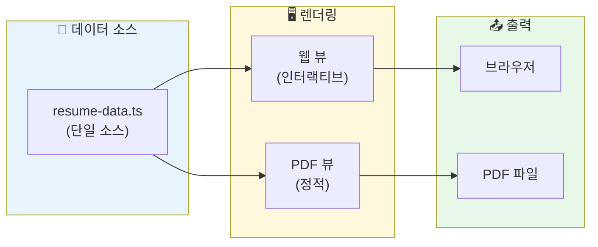
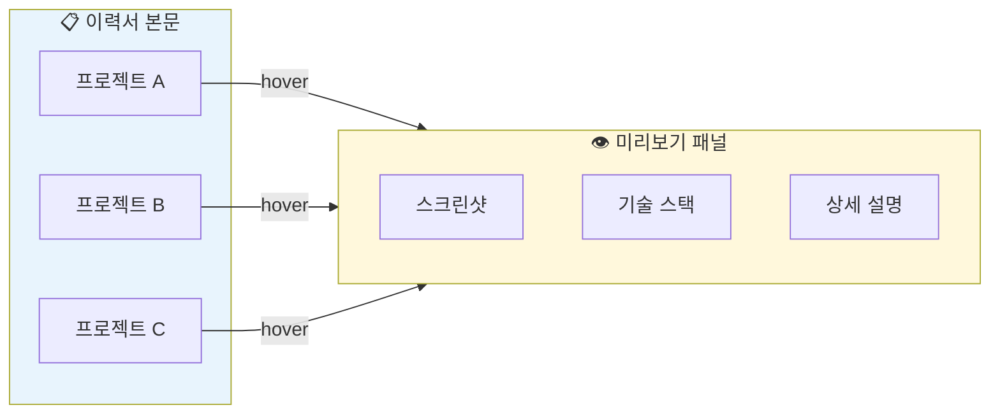

## 정보

URL: https://resume.itjustbong.com/

---

## 왜 만들었나

이력서를 작성할 때마다 반복되는 작업이 있었습니다. Word나 Notion에서 내용을 수정하고, PDF로 내보내고, 포맷이 깨지면 다시 조정하는 과정입니다. 프로젝트 설명을 추가할 때마다 레이아웃이 틀어지는 것도 번거로웠습니다.

웹 기반 이력서를 만들면 몇 가지 장점이 있습니다.

- URL 하나로 이력서 공유 가능
- 코드로 관리하니 버전 관리가 쉬움
- 인터랙티브 요소 추가 가능 (프로젝트 미리보기 등)
- 일관된 스타일로 PDF 생성

단순히 정적인 이력서가 아니라, 프로젝트를 클릭하면 미리보기가 뜨고, 버튼 하나로 PDF를 생성할 수 있는 인터랙티브 이력서를 목표로 했습니다.

## 가설

React 컴포넌트로 이력서를 구성하고, 동일한 데이터 소스에서 웹 뷰와 PDF를 모두 생성한다면 내용 수정 시 두 버전이 자동으로 동기화될 것입니다. 프로젝트 섹션에 hover/click 인터랙션을 추가하면 채용 담당자에게 더 가독성 있게 정보를 전달할 수 있을 것이라 예상했습니다.



## 기술 스택

| 영역 | 기술 | 선택 이유 |
|---|---|---|
| 프레임워크 | Next.js 15 (App Router) | SSR, 빠른 초기 로딩 |
| 스타일링 | Tailwind CSS + shadcn/ui | 일관된 디자인 시스템 |
| PDF 생성 | @react-pdf/renderer | React 컴포넌트로 PDF 생성 |
| 상태 관리 | React useState | 프로젝트 미리보기 패널 제어 |
| 배포 | Vercel | 자동 배포, 빠른 CDN |

## 핵심 기능

### 1. 프로젝트 미리보기 패널

프로젝트 항목에 마우스를 올리면 우측에 미리보기 패널이 나타납니다. 프로젝트 스크린샷, 기술 스택, 주요 기능을 한눈에 확인할 수 있습니다.



구현은 간단합니다. 프로젝트 항목에 `onMouseEnter` 이벤트를 걸고, 선택된 프로젝트 정보를 상태로 관리합니다.

```typescript
// projects-section.tsx
const [selectedProject, setSelectedProject] = useState<Project | null>(null);

return (
  <div className="flex">
    <div className="flex-1">
      {projects.map((project) => (
        <div
          key={project.id}
          onMouseEnter={() => setSelectedProject(project)}
          onMouseLeave={() => setSelectedProject(null)}
          className="cursor-pointer hover:bg-muted/50 transition-colors"
        >
          <h3>{project.title}</h3>
          <p>{project.summary}</p>
        </div>
      ))}
    </div>
    
    {selectedProject && (
      <ProjectPreviewPanel project={selectedProject} />
    )}
  </div>
);
```

미리보기 패널은 고정 위치에 표시되며, 프로젝트 스크린샷과 상세 정보를 보여줍니다.

```typescript
// project-preview-panel.tsx
export function ProjectPreviewPanel({ project }: { project: Project }) {
  return (
    <div className="w-80 border-l p-4 sticky top-0">
      <Image
        src={project.thumbnail}
        alt={project.title}
        width={300}
        height={200}
        className="rounded-lg"
      />
      <h4 className="mt-4 font-semibold">{project.title}</h4>
      <p className="text-sm text-muted-foreground">{project.description}</p>
      
      <div className="mt-4 flex flex-wrap gap-1">
        {project.techStack.map((tech) => (
          <Badge key={tech} variant="secondary">{tech}</Badge>
        ))}
      </div>
      
      {project.url && (
        <a href={project.url} target="_blank" className="mt-4 block">
          사이트 방문 →
        </a>
      )}
    </div>
  );
}
```

### 2. PDF 생성 기능

@react-pdf/renderer를 사용해 React 컴포넌트로 PDF를 생성합니다. 웹 뷰와 동일한 데이터 소스를 사용하므로 내용이 항상 동기화됩니다.

```typescript
// pdf-generator.ts
import { Document, Page, Text, View, StyleSheet, pdf } from '@react-pdf/renderer';

const styles = StyleSheet.create({
  page: {
    padding: 30,
    fontFamily: 'Pretendard',
  },
  section: {
    marginBottom: 10,
  },
  title: {
    fontSize: 24,
    fontWeight: 'bold',
    marginBottom: 10,
  },
  // ...
});

function ResumeDocument({ data }: { data: ResumeData }) {
  return (
    <Document>
      <Page size="A4" style={styles.page}>
        <View style={styles.section}>
          <Text style={styles.title}>{data.name}</Text>
          <Text>{data.title}</Text>
        </View>
        
        <View style={styles.section}>
          <Text style={styles.sectionTitle}>경력</Text>
          {data.experiences.map((exp) => (
            <View key={exp.id}>
              <Text style={styles.company}>{exp.company}</Text>
              <Text style={styles.period}>{exp.period}</Text>
              <Text>{exp.description}</Text>
            </View>
          ))}
        </View>
        
        {/* 프로젝트, 학력 등 */}
      </Page>
    </Document>
  );
}
```

PDF 다운로드 버튼을 클릭하면 클라이언트에서 PDF를 생성하고 다운로드합니다.

```typescript
// pdf-download-button.tsx
export function PDFDownloadButton({ resumeData }: { resumeData: ResumeData }) {
  const [isGenerating, setIsGenerating] = useState(false);

  const handleDownload = async () => {
    setIsGenerating(true);
    
    const blob = await pdf(<ResumeDocument data={resumeData} />).toBlob();
    const url = URL.createObjectURL(blob);
    
    const link = document.createElement('a');
    link.href = url;
    link.download = `${resumeData.name}_이력서.pdf`;
    link.click();
    
    URL.revokeObjectURL(url);
    setIsGenerating(false);
  };

  return (
    <Button onClick={handleDownload} disabled={isGenerating}>
      {isGenerating ? '생성 중...' : 'PDF 다운로드'}
    </Button>
  );
}
```

### 3. 단일 데이터 소스

이력서 데이터는 TypeScript 파일 하나에서 관리합니다. 웹 뷰와 PDF 모두 이 데이터를 참조합니다.

```typescript
// lib/resume-data.ts
export interface ResumeData {
  name: string;
  title: string;
  contact: {
    email: string;
    github: string;
    blog: string;
  };
  experiences: Experience[];
  projects: Project[];
  education: Education[];
  skills: Skill[];
}

export const resumeData: ResumeData = {
  name: 'itjustbong',
  title: 'Frontend Developer',
  contact: {
    email: 'contact@itjustbong.com',
    github: 'https://github.com/itjustbong',
    blog: 'https://log.itjustbong.com',
  },
  experiences: [
    {
      id: 'exp-1',
      company: '회사명',
      position: '프론트엔드 개발자',
      period: '2023.01 - 현재',
      description: '...',
      achievements: ['...'],
    },
    // ...
  ],
  projects: [
    {
      id: 'proj-1',
      title: '기관 투자자 포트폴리오 분석 플랫폼',
      summary: 'SEC 13F 데이터 기반 고래 투자자 추적',
      description: '...',
      techStack: ['NestJS', 'Next.js', 'PostgreSQL', 'Redis'],
      thumbnail: '/projects/whales-wallet.png',
      url: 'https://www.whales-wallet.com',
    },
    // ...
  ],
  // ...
};
```

데이터를 수정하면 웹 뷰와 PDF가 동시에 업데이트됩니다. 별도로 동기화할 필요가 없습니다.

### 4. 반응형 레이아웃

데스크톱에서는 프로젝트 미리보기 패널이 우측에 표시되고, 모바일에서는 프로젝트를 탭하면 모달로 상세 정보가 나타납니다.

```typescript
// projects-section.tsx
const isMobile = useMediaQuery('(max-width: 768px)');

return (
  <>
    <div className="space-y-4">
      {projects.map((project) => (
        <div
          key={project.id}
          onClick={() => isMobile && setModalProject(project)}
          onMouseEnter={() => !isMobile && setSelectedProject(project)}
          onMouseLeave={() => !isMobile && setSelectedProject(null)}
        >
          {/* 프로젝트 내용 */}
        </div>
      ))}
    </div>

    {/* 데스크톱: 사이드 패널 */}
    {!isMobile && selectedProject && (
      <ProjectPreviewPanel project={selectedProject} />
    )}

    {/* 모바일: 모달 */}
    {isMobile && modalProject && (
      <ProjectModal 
        project={modalProject} 
        onClose={() => setModalProject(null)} 
      />
    )}
  </>
);
```

## 프로젝트 구조

```
apps/resume/
├── app/
│   ├── layout.tsx
│   └── page.tsx
├── components/
│   ├── resume/
│   │   ├── resume-header.tsx
│   │   ├── experience-section.tsx
│   │   ├── projects-section.tsx
│   │   ├── project-preview-panel.tsx
│   │   ├── education-section.tsx
│   │   ├── tech-stack-section.tsx
│   │   ├── pdf-download-button.tsx
│   │   └── pdf-resume-content.tsx
│   └── ui/
│       └── ... (shadcn/ui 컴포넌트)
├── lib/
│   ├── resume-data.ts
│   ├── pdf-generator.ts
│   └── utils.ts
└── public/
    └── projects/
        └── ... (프로젝트 스크린샷)
```

## 효과

| 항목 | 결과 |
|---|---|
| 이력서 수정 | 코드 한 곳만 수정하면 웹/PDF 동시 반영 |
| 공유 | URL 하나로 이력서 공유 가능 |
| 프로젝트 소개 | 미리보기 패널로 상세 정보 제공 |
| PDF 생성 | 버튼 클릭으로 즉시 다운로드 |

채용 담당자 입장에서 프로젝트 항목에 마우스를 올리면 스크린샷과 기술 스택을 바로 확인할 수 있어 정보 전달이 효율적입니다. PDF가 필요한 경우에도 별도 작업 없이 다운로드 버튼만 누르면 됩니다.

## 개선 예정 사항

몇 가지 추가하고 싶은 기능이 있습니다.

- 다국어 지원 (한국어/영어 전환)
- 테마 커스터마이징 (색상, 폰트 선택)
- 프로젝트 필터링 (기술 스택별, 기간별)
- 방문자 분석 (어떤 프로젝트가 관심을 받는지)

## 마치며

웹 기반 이력서는 단순히 문서를 온라인에 올리는 것 이상의 가치가 있습니다. 인터랙티브 요소를 추가해 더 풍부한 정보를 전달할 수 있고, 코드로 관리하니 버전 관리와 수정이 편합니다. @react-pdf/renderer 덕분에 동일한 데이터로 웹 뷰와 PDF를 모두 생성할 수 있어 유지보수 부담도 줄었습니다.
