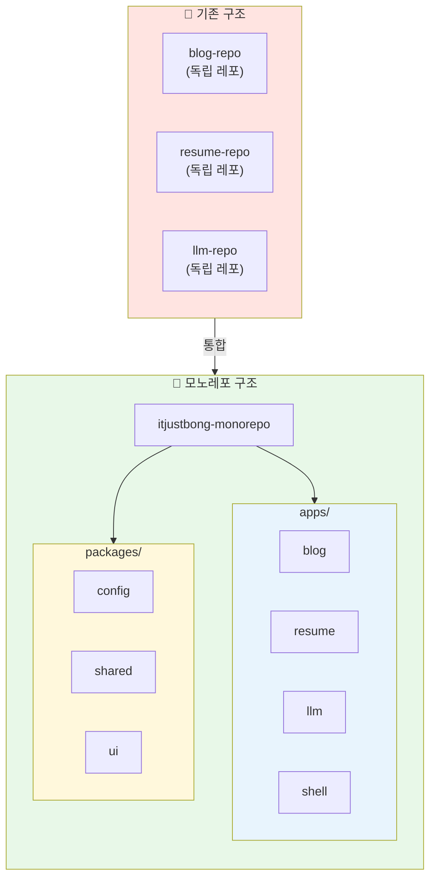
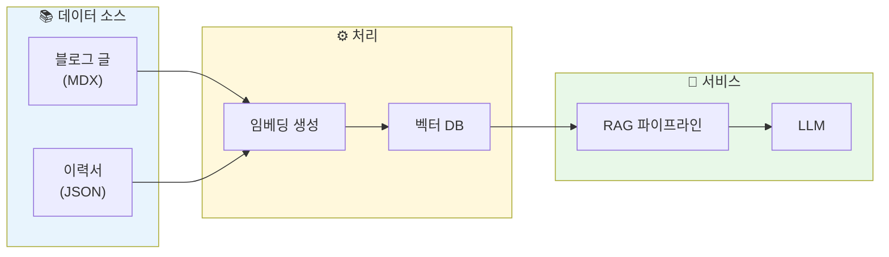
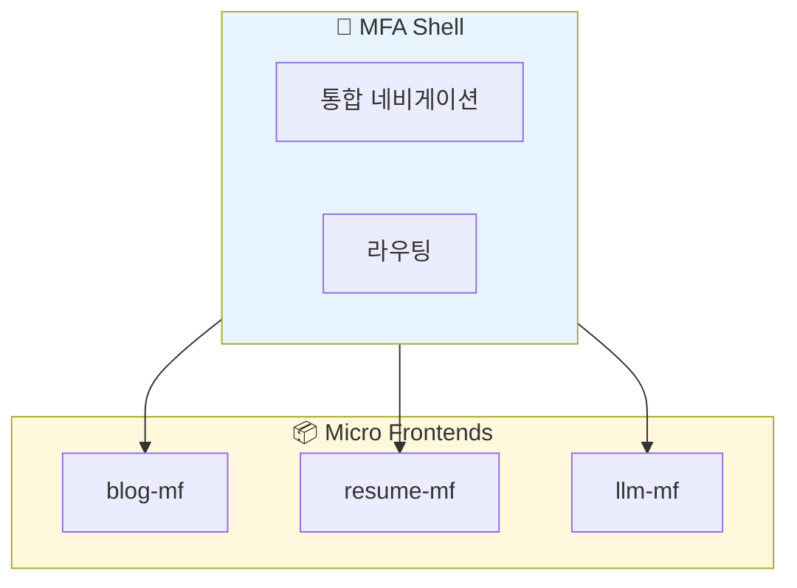

## 왜 전환했나

처음에는 단순히 기술 블로그 하나만 운영했습니다. Next.js와 MDX로 만든 정적 블로그였고, 별도의 데이터베이스 없이 파일 시스템만으로 콘텐츠를 관리하는 구조였습니다.

블로그를 운영하다 보니 itjustbong이라는 이름 아래 여러 페이지를 만들고 싶어졌습니다. 이력서 웹사이트도 필요했습니다.

마침 RAG(Retrieval-Augmented Generation)를 직접 구현해보고 싶다는 생각도 있었는데, 적당한 도메인을 찾지 못하고 있었습니다. 그러다 내가 작성한 블로그 글과 이력서 데이터를 활용하면 되겠다는 생각이 들었습니다. "이 사람 기술 스택이 뭐야?", "Docker 관련 글 요약해줘" 같은 질문에 답하는 챗봇을 만들면 RAG 학습도 되고 사용자는 적어서 비용은 아낄 수 있지만 기본적인 기능을 체험해볼 수 있는 실용적인(?) 서비스도 되니까요.

이렇게 블로그, 이력서, LLM 서비스가 하나씩 늘어나다 보니 itjustbong 관련 프로젝트를 전부 하나의 레포에서 관리하고 싶은 니즈가 생겼습니다. 각각 별도의 레포지토리로 관리할 수도 있었지만, 하나의 레포에서 공용 컴포넌트 등을 활용하는 것이 효율적이라고 판단하여 모노레포로 전환을 결정했습니다.

## 가설

Turborepo와 pnpm workspace를 활용하면 여러 프로젝트를 하나의 레포지토리에서 효율적으로 관리할 수 있을 것입니다. 공통 설정과 패키지를 공유하면서도 각 프로젝트의 독립적인 배포가 가능할 것이라 예상했습니다.



## 모노레포 구조

전환 후 프로젝트 구조는 다음과 같습니다.

```
itjustbong-monorepo/
├── apps/
│   ├── blog/         # 기술 블로그 (Next.js)
│   ├── resume/       # 이력서 웹사이트 (Next.js)
│   ├── llm/          # RAG LLM 서비스 (개발 예정)
│   └── shell/        # MFA Shell (개발 예정)
├── packages/
│   ├── config/       # 공유 설정 (ESLint, TypeScript, Tailwind)
│   ├── shared/       # 공유 타입 및 유틸리티
│   └── ui/           # 공유 UI 컴포넌트
├── turbo.json
├── pnpm-workspace.yaml
└── package.json
```

### apps 디렉토리

실제 배포되는 애플리케이션들이 위치합니다. 각 앱은 독립적으로 빌드되고 배포됩니다.

| 앱 | 설명 | 상태 |
|---|---|---|
| blog | MDX 기반 기술 블로그 | 운영 중 |
| resume | 인터랙티브 이력서 | 운영 중 |
| llm | 블로그/이력서 기반 RAG 챗봇 | 개발 예정 |
| shell | MFA 통합 Shell | 개발 예정 |

### packages 디렉토리

앱들이 공유하는 설정과 코드가 위치합니다.

```typescript
// packages/shared/src/types.ts
export interface BaseMetadata {
  title: string;
  description: string;
  createdAt: string;
  updatedAt?: string;
}

// packages/shared/src/utils.ts
export function formatDate(date: string): string {
  return new Date(date).toLocaleDateString('ko-KR', {
    year: 'numeric',
    month: 'long',
    day: 'numeric',
  });
}
```

## Turborepo 설정

Turborepo는 모노레포의 빌드 시스템을 담당합니다. 태스크 간 의존성을 정의하고, 캐싱을 통해 빌드 속도를 최적화합니다.

```json
// turbo.json
{
  "$schema": "https://turbo.build/schema.json",
  "tasks": {
    "build": {
      "dependsOn": ["^build"],
      "outputs": [".next/**", "!.next/cache/**"]
    },
    "dev": {
      "cache": false,
      "persistent": true
    },
    "lint": {
      "dependsOn": ["^lint"]
    }
  }
}
```

`dependsOn: ["^build"]`는 현재 패키지가 의존하는 패키지들의 build 태스크가 먼저 실행되어야 함을 의미합니다. 예를 들어 blog 앱이 shared 패키지를 의존하면, shared의 빌드가 완료된 후 blog 빌드가 시작됩니다.

### pnpm workspace

pnpm workspace를 통해 패키지 간 의존성을 관리합니다.

```yaml
# pnpm-workspace.yaml
packages:
  - "apps/*"
  - "packages/*"
```

앱에서 내부 패키지를 사용할 때는 `workspace:*` 프로토콜을 사용합니다.

```json
// apps/blog/package.json
{
  "dependencies": {
    "@repo/shared": "workspace:*",
    "@repo/ui": "workspace:*"
  }
}
```

## 공유 설정 패키지

ESLint, TypeScript, Tailwind 설정을 packages/config에서 관리합니다. 각 앱은 이 설정을 확장해서 사용합니다.

```javascript
// packages/config/eslint/base.js
module.exports = {
  extends: ['next/core-web-vitals', 'next/typescript'],
  rules: {
    // 공통 규칙
  },
};
```

```json
// packages/config/typescript/base.json
{
  "compilerOptions": {
    "strict": true,
    "esModuleInterop": true,
    "skipLibCheck": true,
    "forceConsistentCasingInFileNames": true
  }
}
```

앱에서는 이 설정을 확장합니다.

```javascript
// apps/blog/eslint.config.mjs
import baseConfig from '@repo/config/eslint/base';

export default [...baseConfig];
```

## 앞으로 추가될 기능

### RAG LLM 서비스

블로그 글과 이력서 데이터를 벡터 DB에 저장하고, 사용자 질문에 맞는 컨텍스트를 검색해 LLM에 전달하는 RAG 파이프라인을 구축할 예정입니다.



"이 사람의 기술 스택이 뭐야?", "Docker 관련 글 요약해줘" 같은 질문에 답변할 수 있는 챗봇을 목표로 합니다.

### MFA Shell

Micro Frontend Architecture를 적용한 Shell 앱입니다. 블로그, 이력서, LLM 서비스를 하나의 통합된 인터페이스에서 제공합니다.



Module Federation이나 iframe 기반 통합을 검토 중입니다. 각 마이크로 프론트엔드는 독립적으로 배포 가능하면서도 Shell을 통해 일관된 사용자 경험을 제공할 예정입니다.

## 효과

모노레포 전환 후 몇 가지 개선점이 있었습니다.

| 항목 | 개선 내용 |
|---|---|
| 설정 관리 | ESLint, TypeScript 설정을 한 곳에서 관리 |
| 코드 재사용 | 공통 유틸리티와 타입을 패키지로 공유 |
| 의존성 관리 | pnpm workspace로 버전 일관성 유지 |
| 빌드 속도 | Turborepo 캐싱으로 변경된 부분만 빌드 |

아직 LLM과 Shell 앱은 개발 전이지만, 모노레포 구조 덕분에 새 프로젝트를 추가하는 것이 간단해졌습니다. apps 디렉토리에 새 앱을 만들고 공유 패키지를 의존성으로 추가하면 됩니다.

## 마치며

단일 블로그 레포에서 시작해 개인 프로젝트 전체를 관리하는 모노레포로 전환했습니다. Turborepo와 pnpm workspace 조합은 여러 Next.js 앱을 관리하기에 적합했습니다. 앞으로 RAG LLM 서비스와 MFA Shell을 추가하면서 모노레포의 장점을 더 활용할 계획입니다.
