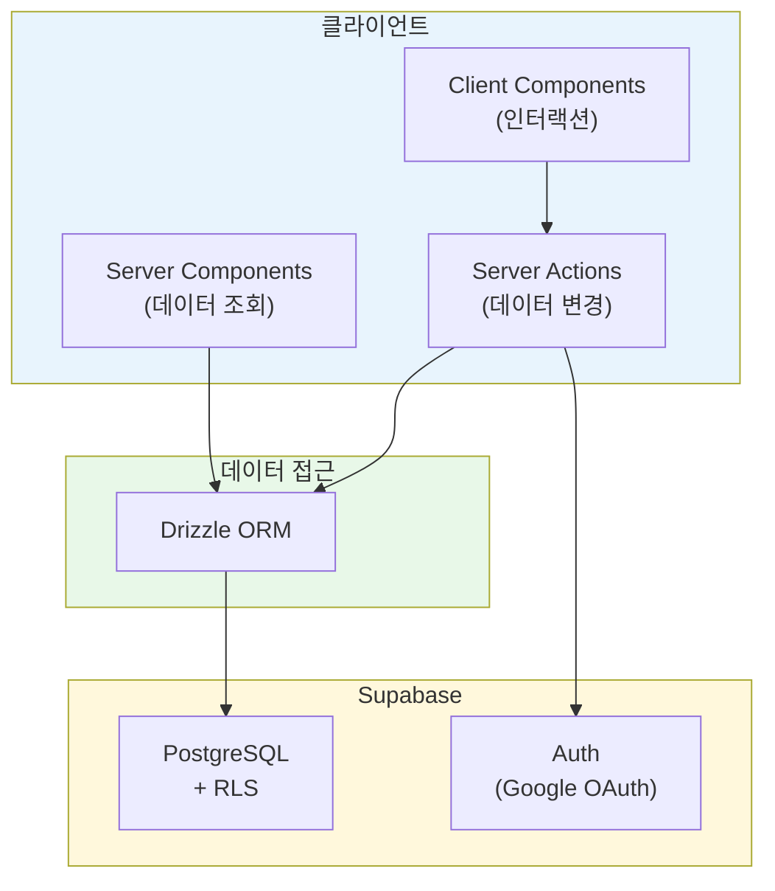
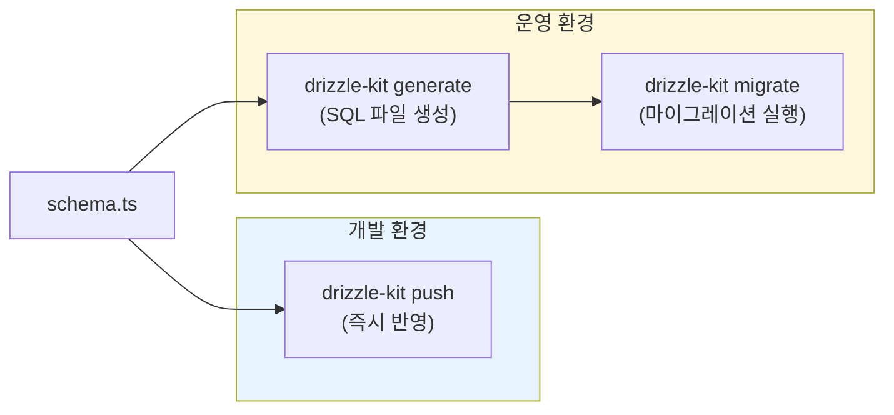
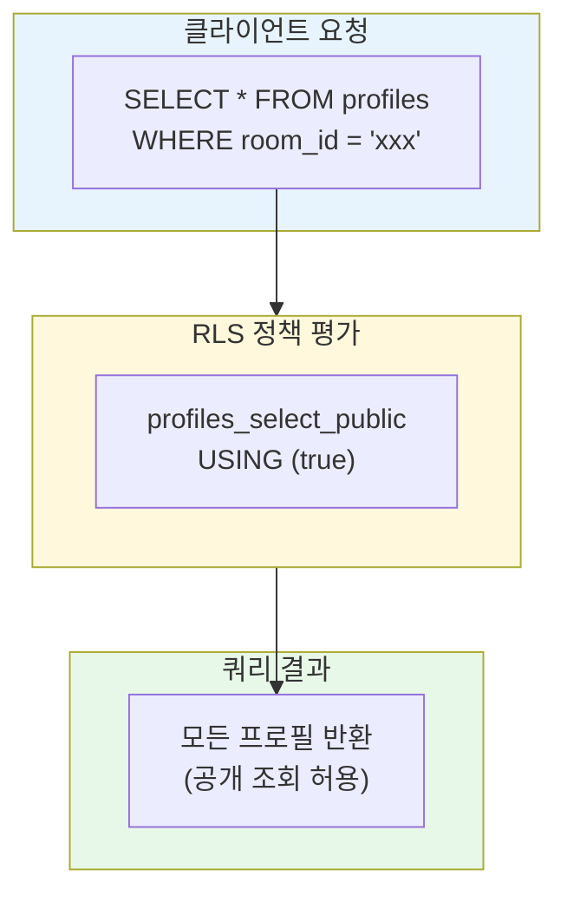
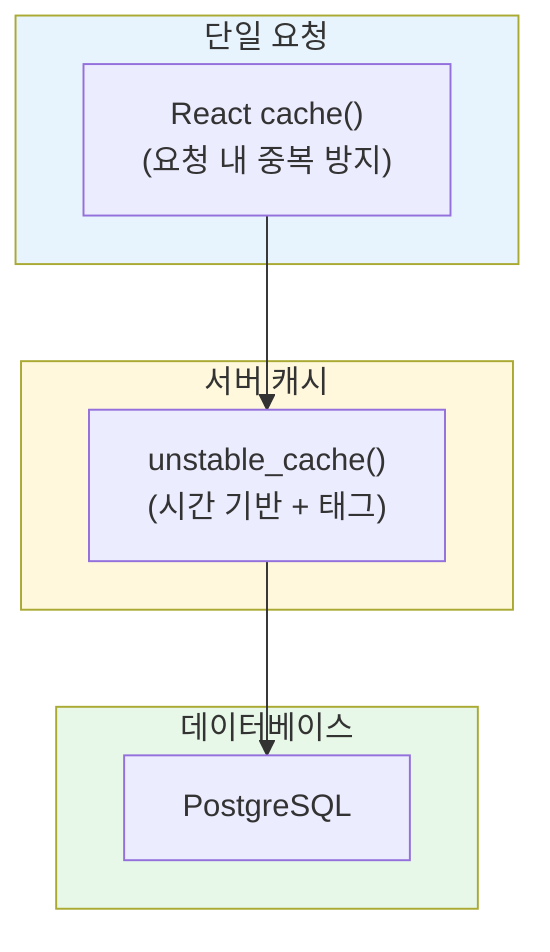
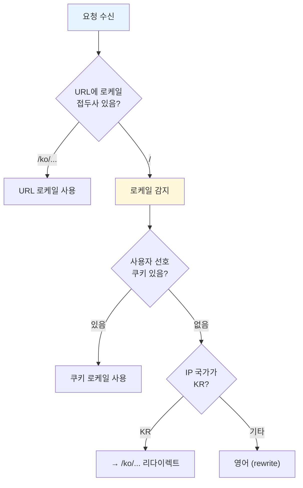
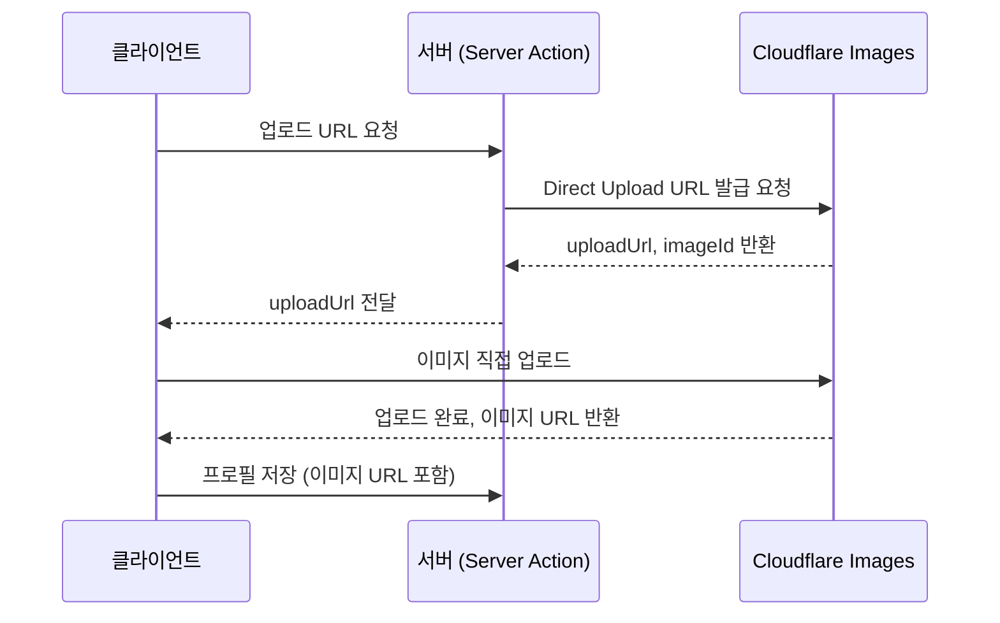

## 정보

URL: https://lemmeblinddate.com/

---

## 왜 만들었나

기존 데이팅 앱들은 대부분 알고리즘 기반 매칭을 제공합니다. 프로필 사진과 짧은 소개글만으로 상대를 판단해야 하고, 실제로 만나보면 기대와 다른 경우가 많습니다.

반면 지인 소개는 다릅니다. 소개해주는 사람이 양쪽을 알고 있으니 어느 정도 검증이 됩니다. 문제는 소개팅을 주선하려면 연락처를 주고받고, 사진을 공유하고, 일정을 조율하는 과정이 번거롭다는 점입니다.

이 서비스는 그 중간 지점을 노렸습니다. 방장이 "방"을 만들고 주변 지인들의 프로필을 모읍니다. 관심 있는 사람이 프로필을 보고 방장에게 직접 연락해서 소개를 요청하는 구조입니다. 앱 내 매칭이나 채팅 기능은 없습니다. 소개팅의 본질인 "지인 네트워크 기반 연결"에만 집중했습니다.

## 가설

Next.js App Router의 서버 컴포넌트와 Server Actions를 활용하면 별도 API 서버 없이 풀스택 애플리케이션을 구현할 수 있습니다. Supabase의 Auth, PostgreSQL, RLS를 조합하면 인증과 데이터 보안을 효율적으로 처리할 수 있을 것이라 예상했습니다.



## 기술 스택

| 영역 | 기술 | 선택 이유 |
|---|---|---|
| 프레임워크 | Next.js 15 (App Router) | 서버 컴포넌트, Server Actions |
| 스타일링 | Tailwind CSS | 모바일 퍼스트 반응형 |
| 인증 | Supabase Auth | Google OAuth, 세션 관리 |
| 데이터베이스 | Supabase PostgreSQL | RLS, 관리형 서비스 |
| ORM | Drizzle ORM | 타입 안전, 경량 |
| 다국어 | next-intl | App Router 지원 |
| 이미지 | Cloudflare Images | Direct Upload |
| 배포 | Docker + Vercel | 컨테이너화 |

---

## Drizzle ORM 선택 이유

ORM을 선택할 때 Prisma와 Drizzle을 비교했습니다.

### Prisma vs Drizzle 비교

| 항목 | Prisma | Drizzle |
|---|---|---|
| 번들 크기 | 무거움 (Rust 엔진 포함) | 경량 (순수 TypeScript) |
| 스키마 정의 | `.prisma` 파일 (DSL) | TypeScript 코드 |
| 타입 생성 | `prisma generate` 필요 | 스키마에서 자동 추론 |
| 마이그레이션 | `prisma migrate` | `drizzle-kit push/generate` |
| SQL 친화성 | 추상화 레벨 높음 | SQL에 가까운 API |

Prisma는 강력한 기능을 제공하지만, 별도의 스키마 파일과 코드 생성 단계가 필요합니다. Drizzle은 TypeScript 코드로 스키마를 정의하고, 타입이 자동으로 추론됩니다. 서버리스 환경에서 콜드 스타트 시간도 Drizzle이 유리합니다.

### Drizzle 스키마 정의

스키마는 TypeScript로 작성합니다. `pgTable` 함수로 테이블을 정의하고, 컬럼 타입과 제약 조건을 지정합니다.

```typescript
// db/schema.ts
import {
  pgTable,
  uuid,
  text,
  integer,
  jsonb,
  timestamp,
} from "drizzle-orm/pg-core";
import { relations } from "drizzle-orm";

export const users = pgTable("users", {
  id: uuid("id").primaryKey(),
  email: text("email").notNull(),
  name: text("name"),
  role: text("role", { enum: ["user", "admin"] }).default("user").notNull(),
  createdAt: timestamp("created_at", { withTimezone: true }).defaultNow().notNull(),
});

export const rooms = pgTable("rooms", {
  id: uuid("id").primaryKey().defaultRandom(),
  name: text("name").notNull(),
  passwordHash: text("password_hash").notNull(),
  slug: text("slug").notNull().unique(),
  creatorId: uuid("creator_id").notNull().references(() => users.id),
  createdAt: timestamp("created_at", { withTimezone: true }).defaultNow().notNull(),
  updatedAt: timestamp("updated_at", { withTimezone: true }).defaultNow().notNull(),
});

export const profiles = pgTable("profiles", {
  id: uuid("id").primaryKey().defaultRandom(),
  roomId: uuid("room_id").notNull().references(() => rooms.id, { onDelete: "cascade" }),
  userId: uuid("user_id").notNull().references(() => users.id),
  name: text("name").notNull(),
  gender: text("gender", { enum: ["male", "female"] }).notNull(),
  photos: jsonb("photos").$type<string[]>().default([]),
  // ... 기타 필드
});
```

`$type<T>()`를 사용하면 JSONB 컬럼의 타입을 명시할 수 있습니다. `photos` 필드는 `string[]` 타입으로 추론됩니다.

### 관계 정의

Drizzle의 `relations` 함수로 테이블 간 관계를 정의합니다. 이 관계는 쿼리 시 자동 조인에 활용됩니다.

```typescript
export const roomsRelations = relations(rooms, ({ one, many }) => ({
  creator: one(users, { fields: [rooms.creatorId], references: [users.id] }),
  profiles: many(profiles),
}));

export const profilesRelations = relations(profiles, ({ one }) => ({
  room: one(rooms, { fields: [profiles.roomId], references: [rooms.id] }),
  user: one(users, { fields: [profiles.userId], references: [users.id] }),
}));
```


### 타입 추론

스키마에서 타입을 자동으로 추론할 수 있습니다. Prisma처럼 별도의 generate 명령이 필요 없습니다.

```typescript
// 스키마에서 타입 추론
export type User = typeof users.$inferSelect;
export type NewUser = typeof users.$inferInsert;
export type Room = typeof rooms.$inferSelect;
export type Profile = typeof profiles.$inferSelect;
```

### db push vs migration

Drizzle Kit은 두 가지 스키마 동기화 방식을 제공합니다.



`db push`는 스키마 변경을 즉시 데이터베이스에 반영합니다. 개발 중 빠른 이터레이션에 유용합니다. 운영 환경에서는 `generate`로 SQL 마이그레이션 파일을 생성하고, `migrate`로 적용하는 것이 안전합니다.

```bash
# 개발: 스키마 변경 즉시 반영
pnpm drizzle-kit push

# 운영: 마이그레이션 파일 생성 후 적용
pnpm drizzle-kit generate
pnpm drizzle-kit migrate
```

### Drizzle 설정

`drizzle.config.ts`에서 데이터베이스 연결과 스키마 경로를 설정합니다.

```typescript
// drizzle.config.ts
import { config } from "dotenv";
import { defineConfig } from "drizzle-kit";

config({ path: ".env.local" });

export default defineConfig({
  schema: "./db/schema.ts",
  out: "./drizzle",
  dialect: "postgresql",
  dbCredentials: {
    url: process.env.DATABASE_URL!,
  },
  verbose: true,
  strict: true,
});
```

---

## Next.js 서버 컴포넌트 활용

App Router의 서버 컴포넌트는 기본값입니다. 컴포넌트에서 직접 데이터베이스를 조회할 수 있습니다.


### 서버 컴포넌트에서 데이터 조회

별도의 API 엔드포인트 없이 컴포넌트에서 직접 DB를 조회합니다.

```typescript
// app/[locale]/rooms/[slug]/page.tsx
import { notFound } from "next/navigation";
import { getRoom, getProfilesByRoom } from "@/lib/cache";
import { createClient } from "@/lib/supabase/server";

export default async function RoomPage({ params }: { params: Promise<{ slug: string }> }) {
  const { slug } = await params;
  const room = await getRoom(slug);

  if (!room) {
    notFound();
  }

  const profileList = await getProfilesByRoom(room.id);

  // 현재 사용자가 방장인지 확인
  const supabase = await createClient();
  const { data: { user } } = await supabase.auth.getUser();
  const isCreator = user?.id === room.creatorId;

  return (
    <RoomContent
      profiles={profileList}
      slug={slug}
      roomName={room.name}
      isCreator={isCreator}
    />
  );
}
```

`async/await`로 데이터를 가져오고, 조건에 따라 다른 UI를 렌더링합니다. 클라이언트에 불필요한 데이터가 전송되지 않습니다.

### 마이 페이지 예시

사용자별 데이터를 서버에서 조회하고 렌더링합니다.

```typescript
// app/[locale]/my/page.tsx
import { redirect } from "next/navigation";
import { createClient } from "@/lib/supabase/server";
import { getUserRoomCount, getUserProfileCount } from "@/lib/cache";

export default async function MyPage() {
  const supabase = await createClient();
  const { data: { user } } = await supabase.auth.getUser();

  if (!user) {
    redirect("/login?from=/my");
  }

  const [roomCount, profileCount] = await Promise.all([
    getUserRoomCount(user.id),
    getUserProfileCount(user.id),
  ]);

  return (
    <div>
      <h1>{user.user_metadata?.full_name}</h1>
      <p>생성한 방: {roomCount}개</p>
      <p>등록한 프로필: {profileCount}개</p>
    </div>
  );
}
```

`Promise.all`로 병렬 조회하여 응답 시간을 단축합니다.

---

## Server Actions로 데이터 변경

Server Actions는 폼 제출과 데이터 변경을 처리합니다. `'use server'` 지시어로 서버에서만 실행되는 함수를 정의합니다.


### Server Action 구조

```typescript
// actions/rooms.ts
"use server";

import { eq, count } from "drizzle-orm";
import { nanoid } from "nanoid";
import { db, rooms, users } from "@/db";
import { createClient } from "@/lib/supabase/server";
import { createRoomSchema } from "@/lib/validations";
import { invalidateOnRoomChange } from "@/lib/cache";

export type ActionResult<T = void> = 
  | { success: true; data: T }
  | { success: false; error: string };

export async function createRoom(formData: FormData): Promise<ActionResult<{ slug: string }>> {
  // 1. 인증 확인
  const supabase = await createClient();
  const { data: { user } } = await supabase.auth.getUser();

  if (!user) {
    return { success: false, error: "로그인이 필요합니다" };
  }

  // 2. 입력값 파싱 및 검증
  const rawData = {
    name: formData.get("name") as string,
    password: formData.get("password") as string,
  };

  const parsed = createRoomSchema.safeParse(rawData);
  if (!parsed.success) {
    const errors = parsed.error.flatten().fieldErrors;
    const firstError = Object.values(errors).flat()[0];
    return { success: false, error: firstError || "입력값을 확인해주세요" };
  }

  // 3. 비즈니스 로직 (방 개수 제한)
  const [existingRoomCount] = await db
    .select({ count: count() })
    .from(rooms)
    .where(eq(rooms.creatorId, user.id));

  if (existingRoomCount.count >= 1) {
    return { success: false, error: "계정당 1개의 방만 생성할 수 있습니다" };
  }

  // 4. 데이터 저장
  const slug = nanoid(10);
  const [newRoom] = await db
    .insert(rooms)
    .values({
      name: parsed.data.name,
      passwordHash: parsed.data.password,
      slug,
      creatorId: user.id,
    })
    .returning();

  // 5. 캐시 무효화
  await invalidateOnRoomChange();

  return { success: true, data: { slug: newRoom.slug } };
}
```

Server Action의 일반적인 흐름입니다. 인증 확인 → Zod 검증 → 비즈니스 로직 → DB 저장 → 캐시 무효화 순서로 진행합니다.

### 클라이언트에서 Server Action 호출

```typescript
// 클라이언트 컴포넌트에서 폼 제출
"use client";

import { useActionState } from "react";
import { createRoom } from "@/actions/rooms";

export function CreateRoomForm() {
  const [state, formAction, isPending] = useActionState(createRoom, null);

  return (
    <form action={formAction}>
      <input name="name" placeholder="방 이름" required />
      <input name="password" type="password" placeholder="비밀번호" required />
      <button type="submit" disabled={isPending}>
        {isPending ? "생성 중..." : "방 만들기"}
      </button>
      {state?.error && <p className="text-red-500">{state.error}</p>}
    </form>
  );
}
```

`useActionState` 훅으로 Server Action의 상태를 관리합니다. 로딩 상태와 에러 메시지를 쉽게 처리할 수 있습니다.

---

## Supabase 활용


Supabase는 Auth, PostgreSQL, Storage를 통합 제공하는 BaaS입니다. 이 프로젝트에서는 Auth와 PostgreSQL을 사용합니다.

### Supabase 클라이언트 설정

Next.js App Router에서는 서버/클라이언트 환경에 따라 다른 클라이언트를 사용합니다.

```typescript
// lib/supabase/server.ts - Server Components, Server Actions용
import { createServerClient } from "@supabase/ssr";
import { cookies } from "next/headers";

export async function createClient() {
  const cookieStore = await cookies();

  return createServerClient(
    process.env.NEXT_PUBLIC_SUPABASE_URL!,
    process.env.NEXT_PUBLIC_SUPABASE_ANON_KEY!,
    {
      cookies: {
        getAll() {
          return cookieStore.getAll();
        },
        setAll(cookiesToSet) {
          try {
            cookiesToSet.forEach(({ name, value, options }) =>
              cookieStore.set(name, value, options)
            );
          } catch {
            // Server Component에서 호출된 경우 무시
          }
        },
      },
    }
  );
}
```

```typescript
// lib/supabase/client.ts - Client Components용
"use client";

import { createBrowserClient } from "@supabase/ssr";

export function createClient() {
  return createBrowserClient(
    process.env.NEXT_PUBLIC_SUPABASE_URL!,
    process.env.NEXT_PUBLIC_SUPABASE_ANON_KEY!
  );
}
```

`@supabase/ssr` 패키지는 쿠키 기반 세션 관리를 제공합니다. 서버에서는 `cookies()` API로 쿠키를 읽고 씁니다.

### Google OAuth 인증

Supabase Auth로 Google 로그인을 구현합니다.

```typescript
// 로그인 버튼 클릭 시
const supabase = createClient();
await supabase.auth.signInWithOAuth({
  provider: "google",
  options: {
    redirectTo: `${window.location.origin}/auth/callback`,
  },
});
```

OAuth 콜백에서 세션을 교환합니다.

```typescript
// app/auth/callback/route.ts
import { NextResponse } from "next/server";
import { createClient } from "@/lib/supabase/server";

export async function GET(request: Request) {
  const { searchParams, origin } = new URL(request.url);
  const code = searchParams.get("code");
  const next = searchParams.get("next") ?? "/";

  if (code) {
    const supabase = await createClient();
    const { error } = await supabase.auth.exchangeCodeForSession(code);
    if (!error) {
      return NextResponse.redirect(`${origin}${next}`);
    }
  }

  return NextResponse.redirect(`${origin}/login?error=auth_failed`);
}
```

---

## Supabase RLS (Row Level Security)

RLS는 데이터베이스 수준에서 행 단위 접근 제어를 적용합니다. 애플리케이션 코드에서 권한 검사를 누락해도 DB에서 차단됩니다.


### RLS 동작 원리



RLS 정책은 각 행에 대해 `USING` 절의 조건을 평가합니다. 조건이 `true`인 행만 결과에 포함됩니다.

### RLS 정책 설계

이 서비스의 접근 제어 요구사항입니다.

| 테이블 | SELECT | INSERT | UPDATE | DELETE |
|---|---|---|---|---|
| rooms | 모두 허용 | 로그인 사용자 | 방장만 | 방장만 |
| profiles | 모두 허용 | 로그인 사용자 | 본인 또는 방장 | 본인 또는 방장 |

SQL로 정책을 정의합니다.

```sql
-- rooms 테이블 RLS
ALTER TABLE rooms ENABLE ROW LEVEL SECURITY;

-- 모든 사용자가 방 조회 가능 (비로그인 포함)
CREATE POLICY "rooms_select_public" ON rooms
  FOR SELECT USING (true);

-- 로그인한 사용자만 방 생성 가능
CREATE POLICY "rooms_insert_auth" ON rooms
  FOR INSERT WITH CHECK (auth.uid() = creator_id);

-- 방장만 자신의 방 수정 가능
CREATE POLICY "rooms_update_owner" ON rooms
  FOR UPDATE USING (auth.uid() = creator_id);

-- 방장만 자신의 방 삭제 가능
CREATE POLICY "rooms_delete_owner" ON rooms
  FOR DELETE USING (auth.uid() = creator_id);
```

`auth.uid()`는 Supabase가 제공하는 함수로, 현재 인증된 사용자의 ID를 반환합니다.

### 복잡한 정책: 본인 또는 방장

프로필 수정/삭제는 등록자 본인 또는 방장만 가능합니다. 서브쿼리로 방장 여부를 확인합니다.

```sql
-- 등록자 본인 또는 방장만 프로필 수정 가능
CREATE POLICY "profiles_update_owner_or_admin" ON profiles
  FOR UPDATE USING (
    auth.uid() = user_id
    OR auth.uid() = (SELECT creator_id FROM rooms WHERE id = room_id)
  );

-- 등록자 본인 또는 방장만 프로필 삭제 가능
CREATE POLICY "profiles_delete_owner_or_admin" ON profiles
  FOR DELETE USING (
    auth.uid() = user_id
    OR auth.uid() = (SELECT creator_id FROM rooms WHERE id = room_id)
  );
```

### RLS와 애플리케이션 코드의 이중 검증

RLS가 있어도 애플리케이션에서 권한 검사를 하는 것이 좋습니다. 에러 메시지를 사용자 친화적으로 제공할 수 있고, RLS 정책 변경 시 영향을 최소화합니다.

```typescript
// actions/profiles.ts
export async function updateProfile(profileId: string, formData: FormData) {
  const supabase = await createClient();
  const { data: { user } } = await supabase.auth.getUser();

  if (!user) {
    return { success: false, error: "로그인이 필요합니다" };
  }

  // 프로필 조회
  const [profile] = await db
    .select({ userId: profiles.userId, roomId: profiles.roomId })
    .from(profiles)
    .where(eq(profiles.id, profileId));

  // 방장 확인
  const [room] = await db
    .select({ creatorId: rooms.creatorId })
    .from(rooms)
    .where(eq(rooms.id, profile.roomId));

  // 권한 확인: 등록자 본인 또는 방장
  const isOwner = profile.userId === user.id;
  const isRoomCreator = room?.creatorId === user.id;

  if (!isOwner && !isRoomCreator) {
    return { success: false, error: "수정 권한이 없습니다" };
  }

  // ... 수정 로직
}
```

---

## Next.js 캐싱 전략


Next.js App Router는 여러 레벨의 캐싱을 제공합니다. 이 프로젝트에서는 React `cache()`와 `unstable_cache()`를 조합해서 사용합니다.

### 캐싱 레이어 구조



### React cache() - 요청 내 중복 방지

동일한 요청 내에서 같은 함수를 여러 번 호출해도 한 번만 실행됩니다.

```typescript
// lib/cache/rooms.ts
import { cache } from "react";

export const getRoom = cache(async (slug: string) => {
  return getCachedRoom(slug);
});
```

예를 들어 레이아웃과 페이지에서 모두 `getRoom(slug)`를 호출해도 DB 쿼리는 한 번만 실행됩니다.

### unstable_cache() - 시간 기반 캐싱

`unstable_cache()`는 결과를 서버에 캐싱하고, 지정된 시간이 지나면 재검증합니다.

```typescript
import { unstable_cache } from "next/cache";

const getCachedRoom = unstable_cache(
  async (slug: string) => {
    const [room] = await db
      .select({
        id: rooms.id,
        name: rooms.name,
        slug: rooms.slug,
        creatorId: rooms.creatorId,
      })
      .from(rooms)
      .where(eq(rooms.slug, slug));

    return room || null;
  },
  ["room-by-slug"],           // 캐시 키
  { revalidate: 60, tags: ["rooms"] }  // 60초 후 재검증, 태그로 무효화
);
```

### 태그 기반 캐시 무효화

데이터가 변경되면 관련 캐시를 무효화합니다.

```typescript
// lib/cache/invalidate.ts
"use server";

import { revalidateTag } from "next/cache";

// 방 생성/수정/삭제 시 호출
export async function invalidateOnRoomChange() {
  revalidateTag("rooms", { expire: 0 });
  revalidateTag("user-rooms", { expire: 0 });
}

// 프로필 생성/수정/삭제 시 호출
export async function invalidateOnProfileChange() {
  revalidateTag("profiles", { expire: 0 });
  revalidateTag("user-profiles", { expire: 0 });
}
```

Server Action에서 데이터 변경 후 캐시를 무효화합니다.

```typescript
// actions/rooms.ts
export async function createRoom(formData: FormData) {
  // ... 방 생성 로직

  // 캐시 무효화
  await invalidateOnRoomChange();

  return { success: true, data: { slug: newRoom.slug } };
}
```

### 캐시 함수 조합

두 캐시를 조합하면 요청 내 중복 방지와 서버 캐싱을 모두 활용할 수 있습니다.

```typescript
// lib/cache/profiles.ts
import { cache } from "react";
import { unstable_cache } from "next/cache";

// 외부에 노출되는 함수 - React cache로 래핑
export const getProfilesByRoom = cache(async (roomId: string) => {
  return getCachedProfilesByRoom(roomId);
});

// 내부 함수 - unstable_cache로 서버 캐싱
const getCachedProfilesByRoom = unstable_cache(
  async (roomId: string) => {
    return db
      .select({
        id: profiles.id,
        name: profiles.name,
        gender: profiles.gender,
        photos: profiles.photos,
      })
      .from(profiles)
      .where(eq(profiles.roomId, roomId));
  },
  ["profiles-by-room"],
  { revalidate: 30, tags: ["profiles"] }
);
```

---

## i18n 다국어 지원


next-intl을 사용해서 한국어/영어 다국어를 지원합니다. IP 주소 기반으로 기본 언어를 자동 설정하는 기능도 구현했습니다.

### 라우팅 설정

```typescript
// i18n/routing.ts
import { defineRouting } from "next-intl/routing";

export const routing = defineRouting({
  locales: ["ko", "en"],
  defaultLocale: "en",
  localePrefix: "as-needed", // 기본 로케일(en)은 URL에 prefix 없음
});
```

`localePrefix: "as-needed"` 설정으로 기본 로케일(영어)은 `/rooms/abc` 형태로, 한국어는 `/ko/rooms/abc` 형태로 URL이 구성됩니다.

### IP 기반 로케일 감지

미들웨어에서 사용자의 IP 주소를 기반으로 국가를 감지하고, 한국이면 한국어를 기본값으로 설정합니다.

```typescript
// middleware.ts
function detectLocale(request: NextRequest): string {
  // 1순위: 사용자가 직접 설정한 언어 선호
  const userPreference = request.cookies.get("user-locale-preference")?.value;
  if (userPreference && locales.includes(userPreference)) {
    return userPreference;
  }

  // 2순위: IP 기반 지역 감지 (Vercel, Cloudflare 등에서 제공)
  const country =
    request.headers.get("x-vercel-ip-country") ||
    request.headers.get("cf-ipcountry");
  if (country === "KR") {
    return "ko";
  }

  // 3순위: 기본값 영어
  return "en";
}
```

Vercel은 `x-vercel-ip-country`, Cloudflare는 `cf-ipcountry` 헤더로 국가 코드를 제공합니다.

### 로케일 감지 흐름



### 미들웨어 구현

```typescript
// middleware.ts
export async function middleware(request: NextRequest) {
  const { pathname } = request.nextUrl;
  const pathLocale = getPathLocale(pathname);

  // URL에 기본 로케일 접두사가 있으면 제거 (/en/... → /...)
  if (pathLocale === defaultLocale) {
    const url = request.nextUrl.clone();
    url.pathname = stripLocalePrefix(pathname);
    return NextResponse.redirect(url);
  }

  // URL에 비기본 로케일 접두사가 있으면 그대로 진행 (/ko/...)
  if (pathLocale) {
    request.cookies.set("NEXT_LOCALE", pathLocale);
    return updateSession(request);
  }

  // URL에 로케일 접두사가 없으면 감지
  const detectedLocale = detectLocale(request);

  // 비기본 로케일이 감지되면 리다이렉트
  if (detectedLocale !== defaultLocale) {
    const url = request.nextUrl.clone();
    url.pathname = `/${detectedLocale}${pathname}`;
    return NextResponse.redirect(url);
  }

  // 기본 로케일: rewrite로 [locale] 세그먼트 설정
  const url = request.nextUrl.clone();
  url.pathname = `/${defaultLocale}${pathname}`;
  return NextResponse.rewrite(url);
}
```

### 언어 전환 컴포넌트

사용자가 언어를 수동으로 변경하면 쿠키에 저장합니다.

```typescript
// components/LocaleSwitcher.tsx
"use client";

import { useRouter, usePathname } from "next/navigation";
import Cookies from "js-cookie";

export function LocaleSwitcher() {
  const router = useRouter();
  const pathname = usePathname();

  const switchLocale = (newLocale: string) => {
    // 사용자 선호 저장
    Cookies.set("user-locale-preference", newLocale, { expires: 365 });
    
    // 새 로케일로 이동
    const newPath = newLocale === "en" 
      ? pathname.replace(/^\/ko/, "") 
      : `/ko${pathname}`;
    router.push(newPath);
  };

  return (
    <button onClick={() => switchLocale(/* 토글 */)}>
      🌐
    </button>
  );
}
```

---

## 기타 기술적 포인트


### Cloudflare Images Direct Upload

이미지 업로드는 서버를 거치지 않고 클라이언트에서 Cloudflare로 직접 전송합니다. 서버 부하를 줄이고 업로드 속도를 높입니다.



```typescript
// actions/images.ts
export async function getDirectUploadUrl(): Promise<ActionResult<{ uploadUrl: string; imageId: string }>> {
  const response = await fetch(
    `https://api.cloudflare.com/client/v4/accounts/${CLOUDFLARE_ACCOUNT_ID}/images/v2/direct_upload`,
    {
      method: "POST",
      headers: {
        Authorization: `Bearer ${CLOUDFLARE_API_TOKEN}`,
      },
    }
  );

  const data = await response.json();
  return {
    success: true,
    data: {
      uploadUrl: data.result.uploadURL,
      imageId: data.result.id,
    },
  };
}
```

### Zod 스키마 검증

모든 입력값은 Zod로 검증합니다. 타입 안전성과 런타임 검증을 동시에 확보합니다.

```typescript
// lib/validations/profile.ts
import { z } from "zod";

export const createProfileSchema = z.object({
  name: z.string().min(1, "이름을 입력해주세요"),
  gender: z.enum(["male", "female"], {
    errorMap: () => ({ message: "성별을 선택해주세요" }),
  }),
  birthYear: z.number().int().min(1950).max(2010).nullable(),
  height: z.number().int().min(100).max(250).nullable(),
  occupation: z.string().max(50).nullable(),
  idealType: z.string().max(500).nullable(),
  photos: z.array(z.string().url()).max(3, "사진은 최대 3장까지 등록 가능합니다"),
});

export type CreateProfileInput = z.infer<typeof createProfileSchema>;
```

### 동적 OG 메타 태그

각 페이지에서 `generateMetadata` 함수로 동적 메타 태그를 생성합니다.

```typescript
// app/[locale]/rooms/[slug]/page.tsx
export async function generateMetadata({ params }: RoomPageProps): Promise<Metadata> {
  const { slug } = await params;
  const room = await getRoom(slug);

  if (!room) {
    return { title: "방을 찾을 수 없습니다" };
  }

  const profileList = await getProfilesByRoom(room.id);
  const description = `${room.name} - ${profileList.length}명의 프로필이 등록되어 있습니다.`;

  return {
    title: room.name,
    description,
    openGraph: {
      title: room.name,
      description,
      type: "website",
      images: [{ url: "/og_image.png", width: 1200, height: 630 }],
    },
  };
}
```

---

## 프로젝트 구조

```
friend-intro-rooms/
├── app/
│   ├── [locale]/
│   │   ├── page.tsx              # 메인 페이지
│   │   ├── login/page.tsx        # 로그인
│   │   ├── my/page.tsx           # 마이 페이지
│   │   └── rooms/
│   │       ├── new/page.tsx      # 방 생성
│   │       └── [slug]/
│   │           ├── page.tsx      # 방 상세
│   │           ├── register/     # 프로필 등록
│   │           └── admin/        # 관리자
│   └── auth/callback/route.ts    # OAuth 콜백
├── actions/                      # Server Actions
│   ├── auth.ts
│   ├── rooms.ts
│   ├── profiles.ts
│   └── images.ts
├── db/
│   ├── schema.ts                 # Drizzle 스키마
│   └── index.ts                  # DB 클라이언트
├── lib/
│   ├── cache/                    # 캐시 함수
│   ├── supabase/                 # Supabase 클라이언트
│   └── validations/              # Zod 스키마
├── i18n/                         # 다국어 설정
├── messages/                     # 번역 파일
│   ├── ko.json
│   └── en.json
└── drizzle/                      # 마이그레이션 파일
```

---

## 효과

| 항목 | 결과 |
|---|---|
| API 서버 | 불필요 (Server Actions로 대체) |
| 타입 안전성 | Drizzle + Zod로 E2E 타입 보장 |
| 보안 | RLS + 애플리케이션 이중 검증 |
| 성능 | 캐싱 레이어로 DB 부하 감소 |
| 다국어 | IP 기반 자동 감지 + 수동 전환 |

Server Actions와 서버 컴포넌트 조합으로 별도 API 서버 없이 풀스택 애플리케이션을 구현했습니다. Drizzle ORM은 Prisma보다 가볍고 TypeScript 친화적이어서 개발 경험이 좋았습니다. Supabase RLS는 데이터베이스 수준 보안을 제공해서 실수로 권한 검사를 누락해도 안전합니다.

## 마치며

이 프로젝트는 Next.js App Router의 새로운 패턴들을 실험하는 좋은 기회였습니다. 서버 컴포넌트에서 직접 DB를 조회하고, Server Actions로 데이터를 변경하는 방식은 기존 API Routes 방식보다 코드량이 줄고 타입 안전성이 높아집니다. Supabase와 Drizzle 조합도 관리형 서비스의 편리함과 ORM의 타입 안전성을 모두 누릴 수 있어서 만족스러웠습니다.
