# Expo 빌드 종류 완벽 가이드

Expo를 사용하여 React Native 앱을 개발할 때 다양한 빌드 방식이 있습니다. 이 문서에서는 각 빌드 방식의 차이점, 사용 시나리오, 그리고 선택 가이드를 자세히 설명합니다.

<Toc>
1. [빌드 종류 개요](#빌드-종류-개요)
2. [Expo Go](#1-expo-go)
3. [Development Build](#2-development-build-개발-빌드)
4. [Prebuild](#3-prebuild)
5. [Preview Build](#4-preview-build)
6. [Production Build](#5-production-build)
7. [빌드 비교 요약](#빌드-비교-요약)
8. [빌드 선택 가이드](#빌드-선택-가이드)
9. [개발 워크플로우 정리](#개발-워크플로우-정리)
10. [추가 팁](#추가-팁)
</Toc>

---

## 빌드 종류 개요

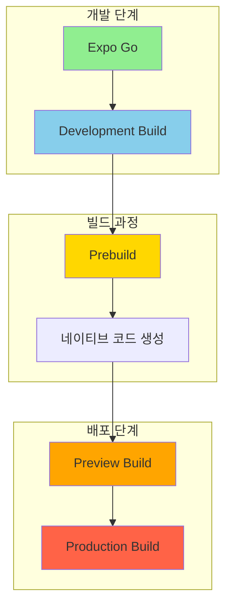

---

## 1. Expo Go

### 개념

Expo Go는 Expo 팀이 만들어서 App Store와 Google Play에 이미 배포해 놓은 **샌드박스 앱**입니다. 별도의 빌드 없이 바로 앱을 실행해볼 수 있습니다.

### 비유로 이해하기 🏠

> Expo Go는 **모델하우스**와 같습니다.
>
> - 이미 지어진 집(앱)에서 가구 배치(JavaScript 코드)만 바꿔볼 수 있음
> - 벽을 허물거나 새 방을 만드는 것(네이티브 코드 수정)은 불가능

### 특징

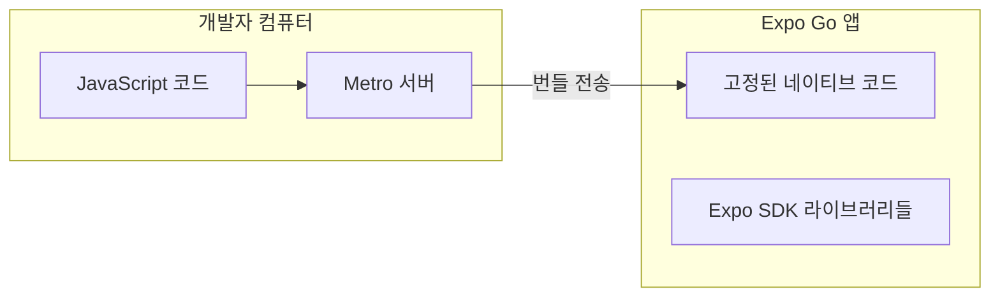

| 항목                           | 내용                                 |
| ------------------------------ | ------------------------------------ |
| **Metro 서버**                 | ✅ 사용 (필수)                       |
| **네이티브 코드 수정**         | ❌ 불가능                            |
| **커스텀 네이티브 라이브러리** | ❌ 불가능                            |
| **빌드 필요**                  | ❌ 불필요                            |
| **설치 방법**                  | App Store / Google Play에서 다운로드 |
| **사용 가능한 라이브러리**     | Expo SDK에 포함된 것만               |

### 장점과 단점

**장점:**

- 🚀 즉시 시작 가능 (빌드 시간 0)
- 📱 QR 코드로 바로 테스트
- 🎓 학습 및 프로토타이핑에 최적

**단점:**

- 🔒 네이티브 코드 수정 불가
- 📦 Expo SDK에 없는 라이브러리 사용 불가
- 🏪 스토어 배포 불가

### 사용 예시

```bash
# 프로젝트 생성
npx create-expo-app my-app

# Metro 서버 시작
cd my-app
npx expo start

# Expo Go 앱에서 QR 코드 스캔
```

---

## 2. Development Build (개발 빌드)

### 개념

Development Build는 **나만의 Expo Go**를 만드는 것입니다. `expo-dev-client` 라이브러리를 포함한 디버그 빌드로, Expo Go의 제한 없이 모든 네이티브 기능을 사용할 수 있습니다.

### 비유로 이해하기 🏗️

> Development Build는 **내 땅에 직접 짓는 집**과 같습니다.
>
> - 원하는 대로 방을 추가하고 (네이티브 라이브러리 추가)
> - 구조를 변경할 수 있음 (네이티브 코드 수정)
> - 하지만 아직 공사 중이라 디버깅 도구가 있음

### 특징

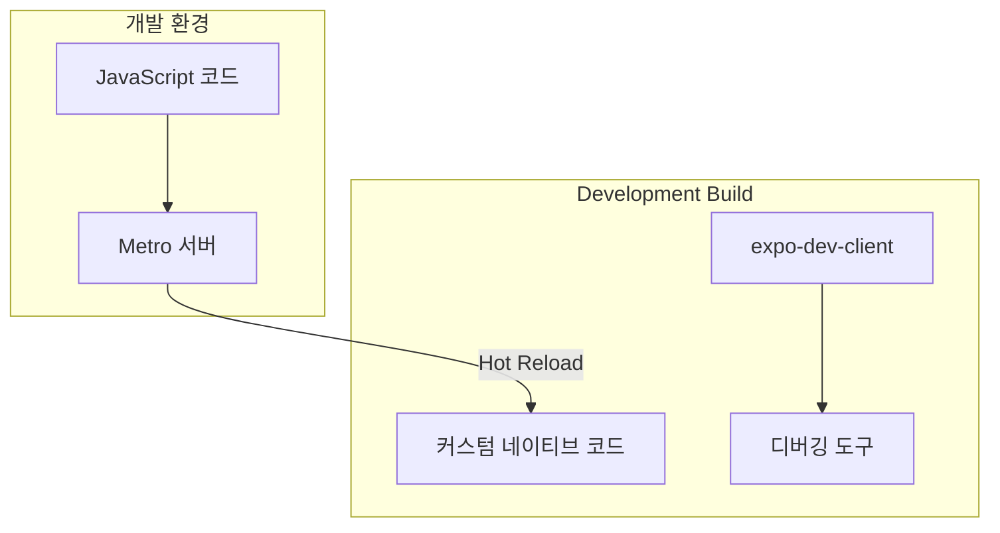

| 항목                           | 내용                       |
| ------------------------------ | -------------------------- |
| **Metro 서버**                 | ✅ 사용 (필수)             |
| **네이티브 코드 수정**         | ✅ 가능                    |
| **커스텀 네이티브 라이브러리** | ✅ 가능                    |
| **빌드 필요**                  | ✅ 필요 (네이티브 변경 시) |
| **디버깅 도구**                | ✅ 포함                    |
| **스토어 배포**                | ❌ 불가 (디버그 빌드)      |

### Expo Go vs Development Build

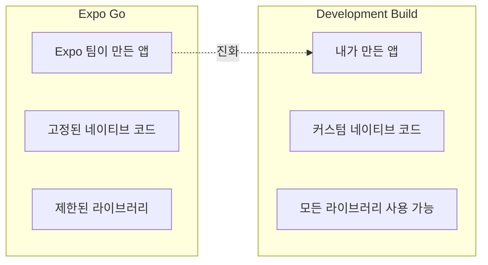

### 설정 방법

```bash
# expo-dev-client 설치
npx expo install expo-dev-client

# 개발 빌드 생성 (EAS 사용)
eas build --profile development --platform ios
eas build --profile development --platform android

# 또는 로컬에서 빌드
npx expo run:ios
npx expo run:android
```

### eas.json 설정 예시

```json
{
  "build": {
    "development": {
      "developmentClient": true,
      "distribution": "internal",
      "ios": {
        "simulator": true
      }
    }
  }
}
```

---

## 3. Prebuild

### 개념

Prebuild는 **네이티브 코드를 자동 생성**하는 Expo의 핵심 기능입니다. `app.json` 설정과 config plugin을 기반으로 `android/`와 `ios/` 폴더를 생성합니다.

### 비유로 이해하기 📐

> Prebuild는 **설계도(app.json)를 실제 건물 골조(네이티브 코드)로 변환**하는 과정입니다.
>
> - 설계도만 관리하면 됨 (app.json, config plugins)
> - 골조는 언제든 다시 생성 가능
> - 직접 골조를 수정하면 다음 생성 시 덮어씌워질 수 있음

### Prebuild 프로세스

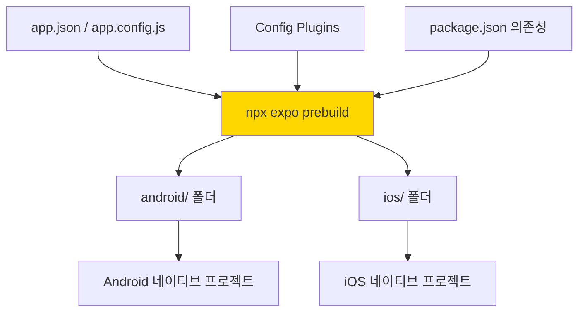

### 특징

| 항목           | 내용                                |
| -------------- | ----------------------------------- |
| **Metro 서버** | ❌ 직접 사용 안 함 (빌드 준비 단계) |
| **목적**       | 네이티브 프로젝트 파일 생성         |
| **실행 시점**  | 빌드 전, 네이티브 설정 변경 시      |
| **결과물**     | `android/`, `ios/` 폴더             |

### 사용 방법

```bash
# 기본 prebuild (기존 파일 위에 덮어쓰기)
npx expo prebuild

# 클린 prebuild (기존 폴더 삭제 후 새로 생성)
npx expo prebuild --clean

# 특정 플랫폼만
npx expo prebuild --platform ios
npx expo prebuild --platform android
```

### Prebuild가 필요한 경우

1. **네이티브 라이브러리 추가/제거 시**

   ```bash
   npx expo install react-native-firebase
   npx expo prebuild --clean
   ```

2. **app.json 네이티브 설정 변경 시**

   - 앱 아이콘, 스플래시 스크린 변경
   - 권한 설정 변경
   - 번들 ID 변경

3. **Expo SDK 업그레이드 시**
   ```bash
   npx expo install expo@latest
   npx expo prebuild --clean
   ```

### Config Plugin 예시

```javascript
// app.config.js
export default {
  expo: {
    name: "My App",
    plugins: [
      [
        "expo-camera",
        {
          cameraPermission: "카메라 접근이 필요합니다.",
        },
      ],
      [
        "expo-location",
        {
          locationAlwaysAndWhenInUsePermission: "위치 정보가 필요합니다.",
        },
      ],
    ],
  },
};
```

---

## 4. Preview Build

### 개념

Preview Build는 **내부 테스트용 빌드**입니다. 실제 앱처럼 동작하지만 스토어에 배포하기 전 팀원들과 테스트하기 위한 용도입니다.

### 비유로 이해하기 🏠

> Preview Build는 **완공 전 내부 점검**과 같습니다.
>
> - 실제 거주할 수 있는 상태 (앱 실행 가능)
> - 하지만 아직 입주 전 (스토어 배포 전)
> - 관계자들만 들어가서 확인 (내부 테스터)

### 특징

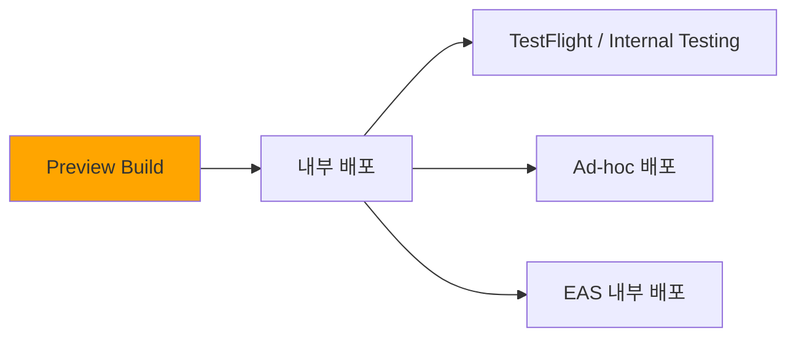

| 항목            | 내용                      |
| --------------- | ------------------------- |
| **Metro 서버**  | ❌ 사용 안 함 (번들 내장) |
| **디버깅 도구** | ❌ 제거됨                 |
| **코드 최적화** | ⚠️ 부분적                 |
| **배포 대상**   | 내부 테스터               |
| **스토어 배포** | ❌ 불가                   |

### eas.json 설정

```json
{
  "build": {
    "preview": {
      "distribution": "internal",
      "channel": "preview",
      "ios": {
        "simulator": false
      },
      "android": {
        "buildType": "apk"
      }
    }
  }
}
```

### 빌드 명령어

```bash
# Preview 빌드 생성
eas build --profile preview --platform ios
eas build --profile preview --platform android

# 또는 둘 다
eas build --profile preview --platform all
```

---

## 5. Production Build

### 개념

Production Build는 **스토어 배포용 최종 빌드**입니다. 모든 최적화가 적용되고, 코드 서명이 완료된 릴리즈 빌드입니다.

### 비유로 이해하기 🏢

> Production Build는 **완공된 건물의 준공 검사 완료 상태**입니다.
>
> - 모든 마감 완료 (최적화)
> - 사용 승인 완료 (코드 서명)
> - 입주 가능 (스토어 배포)

### 특징

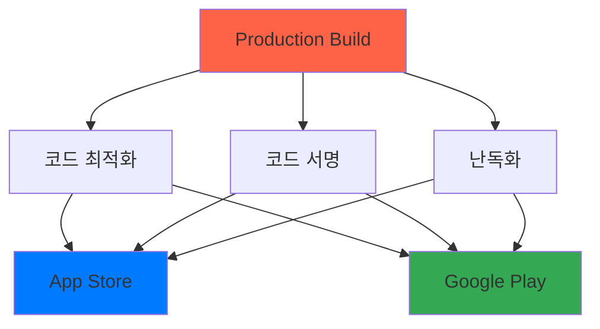

| 항목            | 내용                      |
| --------------- | ------------------------- |
| **Metro 서버**  | ❌ 사용 안 함 (번들 내장) |
| **디버깅 도구** | ❌ 완전 제거              |
| **코드 최적화** | ✅ 완전 최적화            |
| **코드 난독화** | ✅ 적용                   |
| **코드 서명**   | ✅ 필수                   |
| **스토어 배포** | ✅ 가능                   |

### eas.json 설정

```json
{
  "build": {
    "production": {
      "distribution": "store",
      "channel": "production",
      "ios": {
        "resourceClass": "m-medium"
      },
      "android": {
        "buildType": "app-bundle"
      }
    }
  }
}
```

### 빌드 및 제출

```bash
# Production 빌드 생성
eas build --profile production --platform ios
eas build --profile production --platform android

# 스토어에 제출
eas submit --platform ios
eas submit --platform android
```

---

## 빌드 비교 요약

### 전체 비교표

| 특성              | Expo Go         | Development Build | Preview Build | Production Build |
| ----------------- | --------------- | ----------------- | ------------- | ---------------- |
| **Metro 서버**    | ✅ 필수         | ✅ 필수           | ❌ 불필요     | ❌ 불필요        |
| **빌드 필요**     | ❌              | ✅                | ✅            | ✅               |
| **네이티브 수정** | ❌              | ✅                | ✅            | ✅               |
| **디버깅 도구**   | ✅              | ✅                | ❌            | ❌               |
| **Hot Reload**    | ✅              | ✅                | ❌            | ❌               |
| **코드 최적화**   | ❌              | ❌                | ⚠️ 부분       | ✅ 완전          |
| **스토어 배포**   | ❌              | ❌                | ❌            | ✅               |
| **사용 목적**     | 학습/프로토타입 | 개발              | 내부 테스트   | 배포             |

### 개발 흐름도

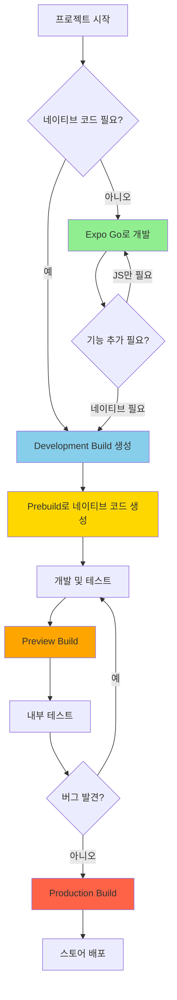

---

## 빌드 선택 가이드

### 상황별 추천

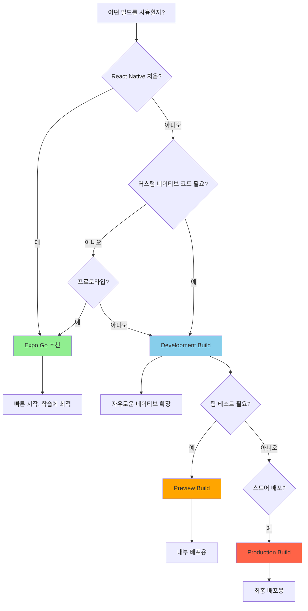

### 체크리스트

**Expo Go를 선택하세요 if:**

- [ ] React Native를 처음 배우는 중
- [ ] 빠른 프로토타이핑이 필요
- [ ] Expo SDK 라이브러리만 사용
- [ ] 스토어 배포 계획 없음

**Development Build를 선택하세요 if:**

- [ ] 커스텀 네이티브 라이브러리 필요 (예: react-native-firebase)
- [ ] 네이티브 코드 수정 필요
- [ ] 실제 프로덕션 앱 개발 중
- [ ] Hot Reload로 빠른 개발 필요

**Preview Build를 선택하세요 if:**

- [ ] QA 팀에게 테스트 배포 필요
- [ ] 스토어 배포 전 내부 검증 필요
- [ ] 실제 디바이스에서 성능 테스트 필요

**Production Build를 선택하세요 if:**

- [ ] App Store / Google Play 배포 준비 완료
- [ ] 모든 기능 테스트 완료
- [ ] 최종 사용자에게 배포할 준비 완료

---

## 개발 워크플로우 정리

### 네이티브 코드가 필요 없는 경우

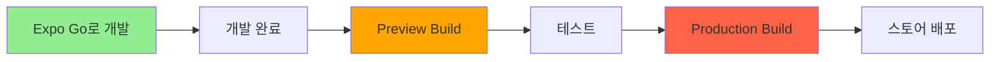

이 경우 **Expo Go만으로 개발**하다가 배포 시점에 Preview/Production 빌드를 하면 됩니다!

### 네이티브 코드가 필요한 경우

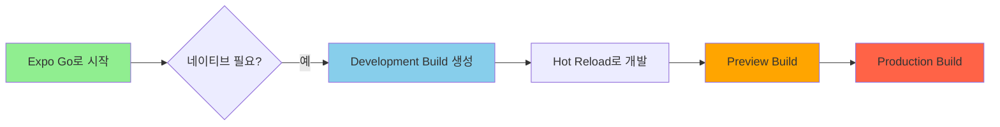

네이티브 라이브러리가 필요해지면 **Development Build를 한 번 생성**하고, 이후에는 Hot Reload로 계속 개발합니다!

---

## 추가 팁

### EAS Update 활용

Development Build와 Preview/Production Build 모두 EAS Update를 통해 JavaScript 코드를 OTA(Over-The-Air)로 업데이트할 수 있습니다.

```bash
# 업데이트 발행
eas update --branch preview --message "버그 수정"
```

### 로컬 빌드 vs EAS 빌드

| 방식          | 장점                    | 단점                 |
| ------------- | ----------------------- | -------------------- |
| **로컬 빌드** | 빠름, 무료              | 환경 설정 필요       |
| **EAS 빌드**  | 환경 설정 불필요, CI/CD | 빌드 시간, 유료 플랜 |

```bash
# 로컬 빌드
npx expo run:ios
npx expo run:android

# EAS 빌드
eas build --platform ios
eas build --platform android
```

---

## 마무리

Expo의 다양한 빌드 옵션은 개발 단계에 따라 최적의 워크플로우를 제공합니다:

1. **Expo Go**: 빠른 시작과 학습
2. **Development Build**: 자유로운 개발 환경
3. **Prebuild**: 네이티브 코드 자동 생성
4. **Preview Build**: 내부 테스트
5. **Production Build**: 최종 배포

프로젝트의 요구사항과 개발 단계에 맞는 빌드 방식을 선택하여 효율적인 개발을 진행하세요! 🚀
